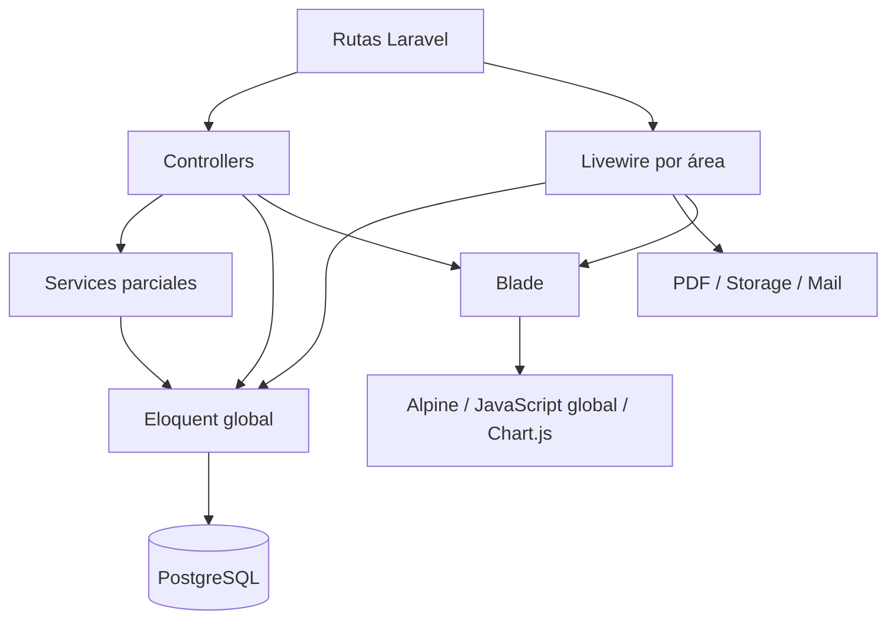

# Arquitectura AS-IS

## Evidencia de la revisión

Repositorio observado el 2026-09-09. composer.lock: Laravel v13.9.0, Jetstream v5.5.2, Livewire v4.3.0. composer.json: PHP ^8.3; entorno CLI con pdo_pgsql y pdo_sqlite. Frontend declarado: Tailwind ^3.4, Alpine ^3.15, Chart.js ^4.5, GSAP, AOS, Three y Vite ^8. No dependencias Vue/Inertia en package.json.

| Inventario | Archivos |
|---|---:|
| Models | 46 |
| Livewire, incluyendo parciales PHP | 71 |
| Controllers, incluyendo base | 28 |
| Form Requests | 17 |
| Services | 14 |
| Migraciones | 60 |
| resources/views, incluye artefactos .bak | 312 |
| JavaScript | 5 |
| Archivos tests, incluye TestCase | 18 |

El inventario nominal se adjunta en 12/15; los números miden archivos, no pantallas o pruebas exitosas. No se encontraron carpetas de Policies o Events de aplicación en el inventario; hay un Job de envío documental y Actions de Fortify/Jetstream, no una capa Application del dominio.

## MVC y capas reales

Controllers como AdultoMayorAdministracionMedicacionController reciben un FormRequest y persisten por Eloquent; el patrón MVC existe, aunque no está separada la operación transaccional. AdultoMayorController delega listado y parte del CRUD a AdultoMayorService, pero show carga múltiples colecciones completas y también contiene reportes y cambios de estado. UsuarioController realiza creación, credenciales, roles, archivos, auditoría y caché.

Livewire es una interfaz del servidor válida. El problema está en PreadmisionWizard::confirmarPreadmision, que coordina validación, asignación de enfermero, creación documental, PDF y correo, y en UsuariosPanel, que combina identidad, relaciones familiares, permisos, formularios, exportación y archivos.

No se debe mover todo ese código a un único ResidentService. La unidad de extracción es el caso de uso con sus invariantes y pruebas.

## Modelos y comportamiento

AdultoMayor contiene fundamentalmente relaciones, más generación de código y auditoría; tener numerosas relaciones no lo convierte por sí solo en God Model. Sí mezcla identidad, ingreso, alergias, consentimiento y cama en fillable. User combina autenticación, identidad y pertenencia institucional. EvaluacionGeriatrica::booted y sus setters mantienen nombres equivalentes y mezclan nivel de alerta con estado de evaluación. Es deuda de compatibilidad, no un servicio de dominio bien delimitado.

El trait GeneraCodigo consulta el mayor código y verifica existencia antes de insertar. Esa comprobación no serializa dos procesos concurrentes. Además AdultoMayor y EvaluacionGeriatrica tienen sus propios hooks de generación, con prefijos/longitudes distintos a los del trait.

## Rutas, perfiles y módulos incompletos

routes/web.php contiene recursos HTTP, páginas Livewire y múltiples alias al dashboard. Medicina y psicología carecen de permission middleware uniforme en sus grupos; algunas clases, como FichaClinicaIntegradaPanel::mount, sí restringen por nombre de rol. No afirmar que todas esas páginas estén abiertas: la protección está distribuida y exige comprobación por endpoint y método Livewire.

Fisioterapia, nutrición y varias páginas psicológicas remiten a DashboardController::index. Son navegación/placeholder, no evidencia de funcionalidades terminadas. Existen tres perspectivas de expediente: general, médica y enfermería. Deben converger en una composición única con permisos y lectura contextual.

## Discrepancias documentales

AGENTS.md describe MySQL y protección por permiso en cada subruta. .env declara pgsql y la conexión READ ONLY confirmó PostgreSQL 18.4; las rutas no cumplen esa uniformidad. También menciona seeders de especialidades/cargos que no aparecen como archivos actuales. La documentación histórica se conserva como antecedente, no como fuente de verdad del estado actual.
