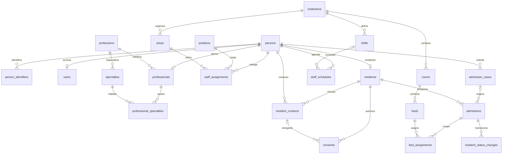
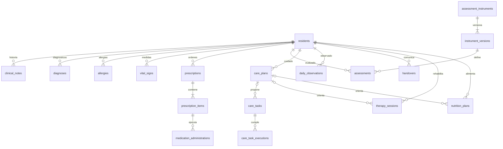
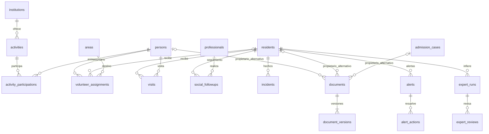

# ERD lógico TO-BE

Los diagramas separan grupos para legibilidad. El catálogo completo de 51 tablas funcionales y restricciones está en 10; los diagramas no omiten la necesidad de FK explícitas ni implican aprobación del DDL. id es PK salvo pivotes. Un enlace opcional se representa con o|/o{.

Las FK de autoría/revisión apuntan a users (salvo professional_id explícito) y se omiten gráficamente para evitar cruces. documents tiene exactamente uno de sus tres propietarios, no tres simultáneos. Los profesionales de sesiones también se enlazan a professionals. Una prescripción borrador puede temporalmente tener cero ítems; la cardinalidad mínima de uno aplica al firmar y se valida transaccionalmente. Los índices temporales no se deducen del dibujo: véase 10.

No crear tablas expediente, dashboard ni timeline para copiar todas las relaciones. Estas son composiciones de lectura. No duplicar resident_id en medication_administrations: se obtiene de prescription_items → prescriptions.
