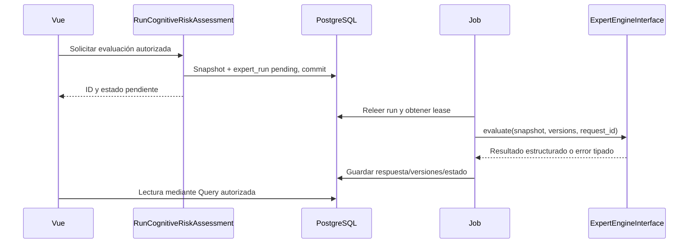

# Integración futura del sistema experto

## Puerto justificado

ExpertEngineInterface está justificada porque existe una frontera externa prevista y se necesita probar sin Python. No se crea una interfaz por cada servicio interno. Clinical/Assessment no conocen FastAPI, AHP o Mamdani. RunCognitiveRiskAssessment coordina; ExpertInputSnapshotQuery produce datos; ExpertEngineInterface recibe un contrato; PythonExpertEngineAdapter implementa HTTP más adelante.

La última lectura representa acceso a través de Laravel, nunca conexión directa del navegador a BD. Puerto inicial fake/local con fixtures versionadas; no confundir un fake con un motor clínicamente validado.

## Contrato conceptual

Solicitud: request_id, schema_version, pseudonymous_subject_id, snapshot_hash, data_cutoff_at, features con valor/unidad/fecha/fuente, missing_features, instrument_versions y engine/rules_version solicitadas. No enviar nombres, documentos, correo o fotos si no son necesarios para inferir.

Respuesta: request_id, schema_version, engine_version, rules_version, input_hash, status, resultado/riesgo, explicación estructurada, reglas activadas o contribuciones disponibles, limitaciones, missing_features y duración. «Confianza» solo si el método la define y valida; no inventar probabilidad a partir de un puntaje difuso. Rechazar campos/rangos inválidos y versión no soportada.

Estados: pending → running → completed/failed; completed puede marcarse stale si cambió el input; revisión accepted/rejected/needs_more_data es otra entidad, no sobrescribe el resultado. Timeouts, reintentos limitados con backoff, lease para workers duplicados y clave idempotente. La caída del motor no bloquea consultas ni cuidados.

## Trazabilidad y revisión humana

expert_runs conserva snapshot exacto, hashes, versiones de instrumentos/motor/reglas, resultado y error tipado. expert_reviews conserva autor, decisión, fecha y motivo. Reevaluar crea un run nuevo. La validación nunca modifica el snapshot anterior. Solicitar Action de seguimiento/alerta es una decisión separada, autorizada y trazable.

No diagnosticar Alzheimer ni prescribir automáticamente desde el score experto. La comparación de AHP/Mamdani, umbrales, sensibilidad/especificidad y validación profesional pertenecen al protocolo de investigación. Esta propuesta es arquitectónica, no valida el método clínico.

## Integración FastAPI futura

Adaptador HTTP con URL configurada, autenticación servicio-a-servicio, TLS donde corresponda, timeout finito, payload limitado y sin exponer el servicio al navegador. Python no escribe directamente en tablas Laravel. Desplegar como proceso separado únicamente cuando el motor lo necesite; el sistema de negocio sigue siendo un monolito.

Pruebas: contrato fake, payload incompleto, unidades incorrectas, respuesta fuera de schema, timeout, duplicación del Job, resultado tardío, acceso sin permiso y revisión ajena. Comparar resultados con fixtures aprobadas por profesional. Visión artificial es una integración futura diferente con consentimiento y evaluación propios; no añadir dependencias ni diseñar captura de video ahora.
