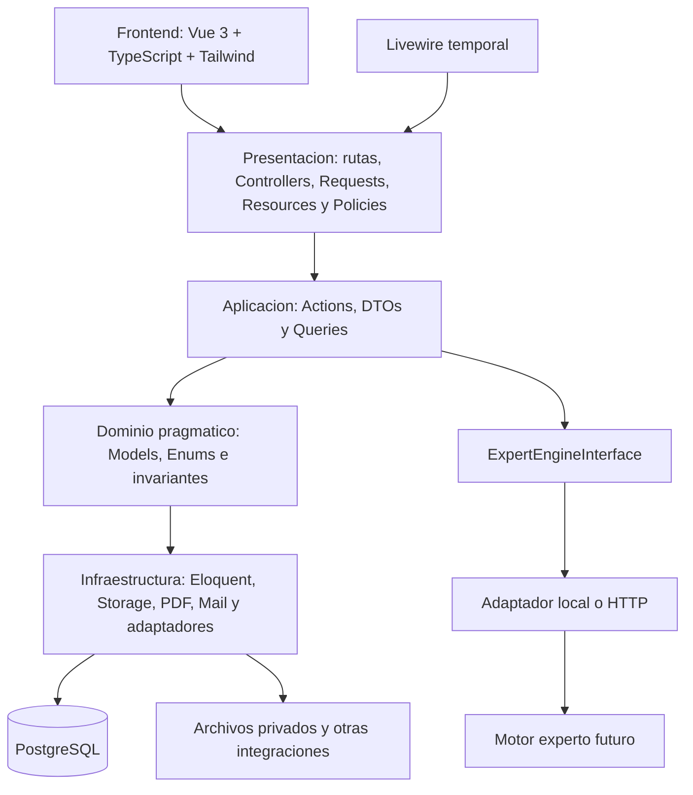
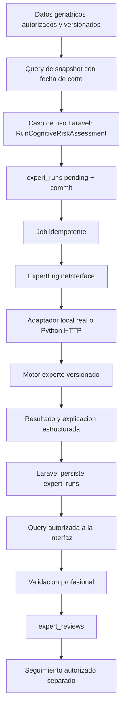

# 1. DICTAMEN GENERAL

**RememberMind — paquete autónomo para revisión arquitectónica externa.** Fecha: 2026-09-09. Estado: **PROPUESTA NO APROBADA**. Consolida los **21 documentos originales, 00–20**, leídos para esta revisión; la numeración comienza en cero. No modifica ni reemplaza esos documentos. No autoriza implementación, migración de datos, instalación, despliegue o envío del paquete.

La recomendación central es **conservar Laravel y PostgreSQL, introducir límites modulares y casos de uso explícitos, y modernizar la presentación de forma incremental**. El proyecto puede evolucionar sin reescritura total. La plataforma geriátrica completa es considerablemente mayor que un MVP de investigación individual; este paquete separa sus alcances en la sección 13.

## Estado actual y calidad de la evidencia

Según la auditoría original: monolito Laravel v13.9.0, Jetstream v5.5.2 y Livewire v4.3.0 según composer.lock; PHP ^8.3 declarado; Tailwind 3, Alpine, Chart.js, GSAP, AOS y Three en frontend. El entorno conectado fue identificado como PostgreSQL 18.4, con 61 tablas public y 60 migraciones registradas. No corresponde planificar una migración MySQL → PostgreSQL basándose en AGENTS.md: su descripción está desactualizada.

El inventario original registra 46 Models, 71 archivos Livewire, 28 Controllers, 17 FormRequests, 14 Services, 312 archivos de vistas, 5 JavaScript y 18 archivos de tests. **Son conteos de archivos, no funcionalidades completas ni pruebas aprobadas.** La lógica de procesos está repartida entre Controllers, componentes Livewire, Services y mutadores Eloquent. Los módulos por profesión son principalmente organización de interfaz; no constituyen límites de negocio verificables.

La revisión original fue estática más consultas READ ONLY de metadatos y cuatro agregados de datos. Encontró un grupo de cama con varias asignaciones ACTIVO; no demuestra por sí solo ocupación física duplicada. No encontró discrepancias en los pares puntaje/puntaje_total, estado/estado_eval ni administraciones con residente distinto al de su medicación en las filas consultadas. Eso **no certifica integridad general**. No se ejecutaron tests, evaluación visual de accesibilidad ni explotación de vulnerabilidades. En esta consolidación se revisaron documentos; no se repitieron consultas a la BD.

## Qué conservar, refactorizar y reconstruir

| Decisión | Elementos | Motivo |
|---|---|---|
| Conservar | Laravel 13, PostgreSQL, sesión Fortify, hashing, limitadores, capacidad 2FA, Spatie Permission, colas | Son bases adecuadas; el problema no exige sustituir el stack |
| Conservar con ajustes | FK/índices existentes, historial disponible, registro de signos/notas, planes/tareas, reportes útiles | Hay valor implementado, pero faltan invariantes y políticas uniformes |
| Reutilizar visualmente | Tokens semánticos, modo oscuro, Chart.js, contratos de componentes y textos validados | Evita rediseño total y doble biblioteca de gráficos |
| Conservar como Blade | PDF y correo | No necesitan migrar a Vue |
| Refactorizar | UsuariosPanel, PersonalInstitucionalForm, PreadmisionWizard, SaludSignosPanel, TurnosAsignacionesPanel, DashboardService y AdultoMayorController | Acumulan persistencia, consultas, permisos, procesos y presentación |
| Refactorizar datos | Identidad duplicada, cama/estancia, fichas clínicas editables, aliases de evaluación y medicación | Una fuente de verdad e historia reproducible |
| Reconstruir presentación | Expedientes general/médico/enfermería hacia una composición 360 | Evitar tres interpretaciones de un mismo residente |
| Desarrollar como capacidad nueva | Experto, partes de nutrición/fisioterapia y portal familiar | Los aliases al dashboard no prueban funcionalidad implementada |
| Eliminar posteriormente | Placeholders y archivos realmente huérfanos después del reemplazo | Requiere trazabilidad de referencias y pruebas, no eliminación por nombre |

No hay evidencia suficiente para llamar «God Model» a todo User o AdultoMayor: predominan relaciones y atributos, aunque mezclan conceptos. EvaluacionGeriatrica concentra mutadores de compatibilidad; los mayores objetos multifunción están en la interfaz y servicios. UsuariosPanel tiene 2584 líneas y su vista 3207; esto orienta la revisión, pero el criterio de división es la responsabilidad, no un máximo arbitrario de líneas.

## Riesgos P0/P1 y cierre esperado

| ID | Prioridad | Evidencia original | Riesgo | Cierre verificable |
|---|---|---|---|---|
| G01 | P0 | routes/web.php aplica usuarios.ver al resource; StoreUsuarioRequest autoriza true; UsuarioController::store asigna el rol recibido | Creación/concesión de roles con permiso insuficiente | Usuario lector y actor sin facultad de concesión reciben 403; ninguna mutación |
| G02 | P0 | Seeder otorga adultos.ver a FAMILIAR; AdultoMayorController::show no filtra vínculo | Acceso a residente o contenido clínico no autorizado | Scope/Policy por vínculo vigente, campos y exportación; pruebas negativas |
| G03 | P0 | Una cama con varias asignaciones ACTIVO; falta unicidad activa | Ubicación ambigua y carrera de asignación | Conciliación documentada, bloqueo e índice; dos requests dejan una asignación válida |
| G04 | P0 | PK string validada como integer en administración; FK separadas | Rechazo de códigos y falta de pertenencia/idempotencia | Prueba de orden ajena, doble solicitud y suspensión concurrente |
| G05 | P0 | PreadmisionWizard escribe archivos/PDF en disco public | Acceso documental fuera de autorización si se publica storage | Disco privado, descargas autorizadas y URL directa denegada |
| G06 | P0 | Contraseña inicial basada en iniciales/documento y envíos de contraseña | Credenciales predecibles/expuestas | Invitación de un uso con expiración; sin contraseña en mail/flash/log |
| G07 | P0 | DecisionAdmisionModal valida required, comprueba etapa en open pero no al guardar | Transición no autorizada u obsoleta | Enum, Policy y estado releído bajo bloqueo |
| G08 | P1 | Máximo+1 y hooks duplicados de códigos | Colisiones concurrentes | ID atómico; código público separado; prueba de carrera |
| G09 | P1 | puntaje/puntaje_total y estado/estado_eval | Fuentes espejo y mezcla riesgo/estado | Campo canónico, mapeo de importación y excepción explícita |
| G10 | P1 | FichaMedicaAdultoModal:160 y SaludFichaPanel:251 actualizan ficha | Pérdida de contexto histórico | Versiones/correcciones conservadas y consulta temporal |
| G11 | P1 | Identidad, consentimiento y ubicación repetidos | Correcciones divergentes | persons, consents, admissions y bed_assignments como propietarios |

Los riesgos de explotación se sustentan en flujo de código, no en ataques realizados. No debe exponerse un piloto real antes de cerrar los P0 aplicables. La migración a Vue no los resuelve por sí misma.

**Fuentes cruzadas:** 00, 01, 02, 03, 09, 12, 15, 16 y 17. La última sección registra inconsistencias de los originales y las precisiones propuestas aquí.

# 2. ARQUITECTURA TO-BE



El diagrama expresa responsabilidades y flujo conceptual. **Eloquent cruza dominio y persistencia por decisión pragmática**; no se afirma independencia total del framework ni se crean dos clases por entidad. Las Policies son autorización transversal, invocadas en entrada y en casos de uso reutilizables; no viven en Vue. Un Job o un método Livewire no debe poder saltar las reglas de una Action.

MVC permanece: View = Vue/Inertia (Blade temporal y PDF/correo), Controller = entrada HTTP y delegación, Model = datos/relaciones/comportamiento coherente. Las operaciones complejas pertenecen a Application. Monolito modular significa un repositorio, base de datos, sesión y despliegue de negocio; no 12 aplicaciones.

```text
app/
  Modules/
    Identity/ Institution/ Residents/ Admissions/
    Clinical/ Medication/ Assessment/ Care/
    Social/ Safety/ ExpertSystem/ Reports/
  Providers/
  Http/Middleware/
  Support/Documents/
routes/
  web.php
  administration.php
  residents.php
  clinical.php
  care.php
  expert.php
database/migrations/
tests/Unit/  tests/Feature/  tests/Integration/
```

Ejemplo concreto de ubicación:

```text
app/Modules/Admissions/
  Models/Admission.php
  Models/AdmissionCase.php
  Models/BedAssignment.php
  Actions/AdmitResident.php
  Actions/AssignBed.php
  Queries/AdmissionQueue.php
  DTOs/AdmissionData.php
  Http/Controllers/AdmissionController.php
  Http/Requests/StoreAdmissionRequest.php
  Policies/AdmissionPolicy.php
  Enums/AdmissionStatus.php

app/Modules/ExpertSystem/
  Actions/RunCognitiveRiskAssessment.php
  Actions/ValidateExpertInference.php
  Contracts/ExpertEngineInterface.php
  Infrastructure/PythonExpertEngineAdapter.php
  Jobs/RunExpertInferenceJob.php
  Models/ExpertRun.php
  Models/ExpertReview.php
```

Solo se crean carpetas utilizadas. Models no importan Controllers/Livewire ni llaman Mail/Python. Queries leen datos autorizados; Actions gobiernan escrituras y transacciones. Un módulo consulta otro mediante Queries o relaciones deliberadas y modifica sus datos mediante la Action propietaria. Reports y el compositor del expediente leen varias áreas, pero no escriben sus hechos. La composición 360 se ubica en Presentation/Application; no obliga al modelo Resident a importar todos los módulos.

**Precisión propuesta respecto de 06:** Institution debe poseer cargos, asignaciones laborales y horarios; Identity posee persona, cuenta y cualificación. Institution puede consultar Identity. La pantalla de alta coordina ambas Actions sin crear llamadas circulares Identity ↔ Institution. Véase C02 al final.

| Caso de uso | Atomicidad exigida | Efectos posteriores |
|---|---|---|
| AdmitResident/AssignBed | Caso, estancia, estado y cama coherentes; bloqueo y unicidad | PDF y avisos después del commit |
| CreatePrescription | Cabecera, ítems y firma válidos | Aviso operativo |
| AdministerMedication | Orden vigente, pertenencia y ejecución/omisión idempotente | Resumen/alerta derivada recuperable |
| PerformAssessment | Respuestas, versión, cálculo y finalización | Tendencias/solicitud de evaluación experta |
| CreateCarePlan | Plan y tareas compatibles | Asignaciones/notificaciones |
| RegisterFall | Incidente y medidas/alerta obligatorias | Avisos no bloqueantes |
| RunCognitiveRiskAssessment | Snapshot y ejecución pending | Motor fuera de transacción; respuesta persistida por Job |

No se adoptan microservicios, Event Sourcing, Command Bus, repositorios envolviendo cada modelo ni CQRS distribuido. Interfaces y Value Objects solo cuando eliminan una ambigüedad real. Eloquent y una Query suelen bastar para lectura; un catálogo trivial no necesita una Action por cada operación.

Convenciones nuevas: tablas inglesas plurales snake_case, FK *_id, permisos recurso.acción, Actions verbo+objeto, Controllers singulares y páginas PascalCase. Conservar cod_usu y demás claves legacy hasta migración deliberada; bigint identity interno propuesto y código público independiente. El traslado de User requiere revisar auth.providers, factories y tipos polimórficos Spatie, no un simple cambio de namespace.

**Fuentes cruzadas:** 04, 05, 06, 15, 18 y ADR-001/002/003/009/010/013.

# 3. MÓDULOS DEFINITIVOS

«Definitivos» significa el mapa completo sometido a revisión, **no decisiones ya aceptadas**. Se proponen **12 módulos técnicos**, con propiedad de escritura explícita:

| Módulo | Responsabilidad / información que posee | Entidades principales | Casos de uso | Puede consultar / dependencias |
|---|---|---|---|---|
| Identity | Identidad, credenciales, permisos y cualificación | Person, User, Professional, Profession, Specialty | RegisterPerson, ProvisionAccount, GrantAccess | Contratos de seguridad/documentos; sin dependencia de escritura a Institution en la precisión propuesta |
| Institution | Configuración y personal operativo, cargos, horarios, infraestructura física | Institution, Area, Position, StaffAssignment, StaffSchedule, Shift, Room, Bed | AssignStaff, AssignSchedule, MaintainBed | Identity para persona/profesional; no poseer hechos clínicos |
| Residents | Condición de residente, contactos y autorizaciones informativas | Resident, ResidentContact, Consent | RegisterResident, LinkContact, RecordConsent, RevokeConsent | Identity; documentación privada; compositor web consulta otros módulos |
| Admissions | Solicitud, decisión de ingreso, estancia, egreso y ocupación | AdmissionCase, Admission, BedAssignment, ResidentStatusChange | AdmitResident, AssignBed, DischargeResident | Residents, Institution, evidencia clínica mediante Query |
| Clinical | Hechos clínicos generales, diagnóstico, alergias y medidas | ClinicalNote, Diagnosis, Allergy, VitalSigns | RegisterDiagnosis, RegisterVitalSigns, CorrectClinicalRecord | Residents, Identity; Admissions para episodio opcional |
| Medication | Términos de la prescripción y ejecución farmacológica | Prescription, PrescriptionItem, MedicationAdministration | CreatePrescription, SuspendPrescription, AdministerMedication | Residents, Identity/Professional, contexto Clinical; no escritura desde Care |
| Assessment | Instrumentos/versiones, respuestas, puntajes y valoración por área | AssessmentInstrument, InstrumentVersion, Assessment | PerformAssessment, FinalizeAssessment, CorrectAssessment | Residents, Identity, contexto Clinical; scoring puro |
| Care | Planes, tareas y resultados de cuidado, pases, sesiones, dieta | CarePlan, CareTask, CareTaskExecution, DailyObservation, Handover, TherapySession, NutritionPlan | CreateCarePlan, RecordTaskExecution, RecordHandover | Residents, Institution, Assessment, Medication de solo lectura |
| Social | Actividades, participación, visitas, voluntariado y seguimiento social | Activity, Participation, Visit, VolunteerAssignment, SocialFollowup | ScheduleActivity, RecordVisit, RecordSocialFollowup | Residents para contactos, Identity, Institution; no segunda identidad familiar |
| Safety | Incidentes, alertas, responsables y acciones | Incident, Alert, AlertAction | RegisterFall, OpenAlert, AcknowledgeAlert, CloseAlert | Residents y fuentes de otros módulos por contrato; no modifica diagnósticos |
| ExpertSystem | Ejecuciones, snapshots y validaciones de inferencia | ExpertRun, ExpertReview | RunCognitiveRiskAssessment, ValidateExpertInference | Queries Clinical/Assessment/Care/Residents; adaptador de motor |
| Reports | Indicadores y exportes autorizados | Read models; sin tabla de indicadores inicial | BuildIndicatorReport, ExportResidentReport | Queries autorizadas de módulos + Documents |

**Fusiones expresamente recomendadas:** Psychology, Mobility y Nutrition como módulos independientes se agrupan inicialmente en **Assessment** para valorar y **Care** para intervenir. Enfermería también utiliza Clinical/Medication/Care, sin una segunda copia de signos o medicación. Profesionales se integra en **Identity**, con vínculo laboral en **Institution**. Familia y actividades se agrupan en **Social**, manteniendo contactos/consentimientos en Residents. Alertas e incidentes se agrupan en **Safety**. No fusionar Medication con Care: prescripción y tarea de cuidado tienen autoridad y ciclos distintos.

**Documents** se conserva como soporte transversal pequeño en app/Support/Documents, con Models/Policies y versiones propias; no cuenta como decimotercer módulo técnico. La decisión es revisable si crecen sus procesos. **Agenda** comienza como composición de turnos/visitas/actividades/sesiones; no contiene todavía citas clínicas generales. Añadir appointments requeriría ampliar alcance y conteo.

La tabla care_tasks no representa necesariamente una asignación residente–profesional sin tarea. El modelo original deja ese caso incompleto; no debe usarse una tarea ficticia para conceder acceso. Se requiere resolver C03/DEC-012 antes de implementar listas «mis residentes». Mantener 12 módulos no obliga a mantener exactamente 66 tablas.

# 4. ROLES, PERFILES Y PROFESIONES

## Distinciones obligatorias

| Concepto | Representación | Ejemplo | Efecto en autorización |
|---|---|---|---|
| Perfil funcional | Composición de trabajo y plantilla revisable | Enfermería, Dirección | Sugiere interfaz; no concede por sí mismo |
| Rol de seguridad | Spatie roles y pivotes | clinician, operations | Paquete explícito de permisos |
| Permiso | Spatie permissions | prescriptions.validate | Acción; además necesita Policy contextual |
| Profesión | professions + professionals | Medicina, psicología, enfermería, fisioterapia, nutrición, trabajo social | No concede acceso automáticamente |
| Especialidad | specialties + professional_specialties | Geriatría | Acreditación/competencia; no equivale a rol |
| Cargo | positions + staff_assignments | Dirección, coordinación de turno | Responsabilidad organizativa, separada de grants |
| Área | areas | Enfermería, atención clínica | Contexto organizativo; no permiso universal |
| Vínculo | resident_contacts/consents/asignación asistencial | Familiar autorizado o personal asignado | Limita objetos/periodos; no sustituye capacidad |

No modelar como rol cada pantalla, instrumento, habitación, turno, especialidad o cargo. «Psicología» puede ser perfil y profesión; si se elige un rol específico debe representar capacidades, no derivarse automáticamente del título. La profesión múltiple no está plenamente contemplada en el catálogo: professionals define una principal; revisar si es suficiente antes de agregar tablas.

## Perfiles y roles propuestos

Once perfiles: Dirección, Administración, Médico/Geriatra, Psicología, Enfermería, Fisioterapia, Nutrición, Trabajo Social, Cuidador, Familiar autorizado y Superadministrador técnico. Voluntariado es actor complementario ya existente, fuera de esos once y sujeto a alcance.

Seis roles base recomendados por los originales: **technical_admin, oversight, operations, clinician, caregiver, family**. Médico/Psicología/Enfermería/Fisioterapia/Nutrición comparten clinician con plantillas de permisos distintas, materializadas en Spatie. Dirección usa oversight; Administración y Trabajo Social operations con concesiones diferentes; Cuidador caregiver; Familiar family.

**Precisión indispensable:** Spatie concede permisos aditivamente. Una plantilla social no puede quitar permisos administrativos que operations ya concedió. Por tanto operations y clinician deben contener solo un mínimo común seguro; privilegios de cuentas/prescripción/validación se conceden explícitamente. Las diferencias se muestran y auditan. Si esto genera demasiadas excepciones, preferir 9–11 roles por capacidad antes que un ACL artesanal. La cifra seis queda pendiente de aprobación, no es una meta arquitectónica.

## Matriz simplificada de acceso

V=ver, C=crear, E=editar borrador propio, L=validar/finalizar, N=anular con motivo, A=administrar configuración. D=disciplina/alcance autorizado, G=agregado, F=contenido familiar publicado. Todo lo no concedido se deniega. Corrección de un registro finalizado crea una versión o corrección enlazada, no E destructiva.

| Actor | Acceso principal | Escritura / validación | Límites relevantes |
|---|---|---|---|
| Dirección | Institution V; Reports G; Safety G | A operativa/L institucional si asignado | Sin diagnóstico o prescripción por ser directiva |
| Administración | Identity ordinario, Institution, Residents, Admissions V | C/E/A administrativos; L admisión administrativa | No concede cualquier rol ni valida decisión clínica |
| Médico | Residents/Clinical/Medication/Assessment/Care/Safety V | Clinical y prescripción C/E/L/N; experto L según competencia | No administra dosis por defecto en la matriz original |
| Psicología | Residents pertinente, Assessment/Care cognitivo-afectivo V | C/E/L/N D; experto cognitivo C/L | Sin prescripción ni información ajena a propósito |
| Enfermería | Residents, signos, prescripciones, turno, Safety V | Signos/evaluación D; administración C/N; cuidados C/E/L D | Ver prescripción no permite cambiarla |
| Fisioterapia | Residents pertinente, movilidad, caídas V | Assessment/Care C/E/L/N D | No acceso clínico general automático |
| Nutrición | Residents pertinente, peso/ingesta, Assessment/Care V | C/E/L/N D | No confundir plan nutricional con evaluación |
| Trabajo Social | Contactos/consentimientos, Social y documentos D | C/E/L/N D | operations no debe otorgar gestión de cuentas |
| Cuidador | Resumen mínimo y tareas asignadas V | Ejecuciones/observaciones/incidencias C/E propia | No prescribe ni valida VGI |
| Familiar | Residents/Documents F; visitas propias F | Solicitud de visita C/E/N propia si módulo habilitado | Vínculo + autorización vigente + campos publicados |
| Superadmin técnico | Identity/concesión restringida y operación técnica V/A | Gestión técnica auditada | Sin bypass clínico; no autoasignarse privilegios asistenciales |

Acceso efectivo = cuenta activa/habilitada + permiso + alcance por residente/turno + estado del registro + campos permitidos. Aplicar antes de Query/serialización y también a exportación, Jobs y cargas diferidas. No usar roles.first() para elegir autoridad. La validación clínica y reglas institucionales de cada profesión necesitan revisión profesional; la matriz es propuesta de ingeniería.

Un técnico con acceso a infraestructura no puede quedar físicamente excluido de toda posibilidad de acceso a datos por una Policy Laravel; la separación propuesta limita **el acceso rutinario de aplicación**, complementado por auditoría y procedimientos. No presentarla como garantía criptográfica frente a administradores de BD.

# 5. DASHBOARDS Y VISTAS

Se recomiendan **seis composiciones de dashboard** para el producto completo, dentro del mismo AppLayout y sesión:

| Dashboard | Usuarios | Contenido prioritario |
|---|---|---|
| Dirección | Dirección | Ocupación, calidad, riesgos agregados, alertas críticas, denominadores/fecha de indicadores |
| Operaciones | Administración; variante Trabajo Social | Admisiones/camas/personal/documentos o contactos/visitas/seguimiento según capacidades |
| Clínico parametrizado | Médico, Psicología, Fisioterapia, Nutrición | Cola de residentes, evaluaciones pendientes y tendencias de la disciplina |
| Turno/cuidados | Enfermería, Cuidador | Mis residentes, dosis autorizadas, tareas, signos, incidentes y pase |
| Familiar | Familiar autorizado | Resumen publicado, visitas y documentos expresamente compartidos |
| Técnico | Técnico | Jobs, fallos, respaldos y concesiones; datos clínicos no rutinarios |

Enfermería puede habilitar también composición clínica por capacidades, sin crear una séptima aplicación. Los perfiles múltiples cambian contexto visual; sus permisos se verifican en cada solicitud. Para MVP/prototipo solo se construyen las composiciones necesarias, no seis plantillas vacías.

**Vistas compartidas:** directorio de residentes, filtros, documentos, instrumentos, planes, alertas, tablas, gráficos y timeline. La página familiar requiere un Resource mínimo propio; compartir un componente visual no justifica compartir el payload del expediente profesional.

**Expediente 360:** /residents/{resident}, con ResidentHeader y grupos identificación, salud, cuidado, red social e historia. Sus subsecciones completas: resumen, datos personales, admisión, historia, medicina, medicamentos, enfermería, cognición, funcionalidad, movilidad, nutrición, social, actividades, cuidados, incidentes, documentos y experto. No todas se presentan simultáneamente ni existen en el MVP. Cada sección tiene Query/capacidades propias; denegar implica no consultar/serializar los datos, no solamente ocultar la pestaña.

Navegación: sidebar consistente por capacidades, breadcrumbs, búsqueda global autorizada, filtros/paginación en URL, contexto del residente visible, timeline por cursor. Menú muestra funciones existentes; retirar aliases de nutrición/fisioterapia/portal que solo redirigen a dashboard cuando exista navegación real.

UX: tablet, teclado, foco/restauración en modales, errores junto al campo y resumen, confirmación de anulación con motivo, carga explícita, reintentos seguros y datos vacíos distinguibles de errores. Gráficos con tabla/texto alternativo, riesgo nunca expresado solo por color. WCAG 2.2 AA es referencia de diseño, no conformidad medida de la app actual. [WCAG 2.2](https://www.w3.org/TR/WCAG22/).

# 6. BASE DE DATOS TO-BE

## Conteo sin duplicaciones

Se conserva para revisión el **catálogo base de 66 tablas** de 10_BD_TO_BE. No se aprueba automáticamente ni se asegura que cubra todas las brechas detectadas al cruzarlo.

| Categoría exclusiva en este paquete | Cantidad | Definición |
|---|---:|---|
| Dominio/soporte funcional, sin users | 50 | Identidad humana, organización, clínica, relaciones, experto y documentos |
| Seguridad | 9 | users, cinco Spatie, sesiones y tokens |
| Técnicas de operación/auditoría | 7 | activity_log, cachés, colas y migraciones |
| **Total** | **66** | 50 + 9 + 7; ninguna tabla en dos grupos |

Los originales cuentan **51 funcionales incluyendo users +15 técnicas incluyendo ocho de seguridad**. Es la misma lista, reclasificada: 51−1=50; users+8=9; 15−8=7. «Técnicas» en sentido amplio aquí serían 16 no dominiales, pero se reportan por separado 9 de seguridad y 7 operativas. No confundir seis roles con seis tablas de roles.

El piloto descrito en 10 difiere nueve tablas y queda en 57 totales. No es el MVP investigador de la sección 13, que necesita experto. Durante migración legacy+nuevo el número físico puede ser mayor. Las posibles tablas adicionales por asignación asistencial o citas se señalan como decisiones, **no se incluyen silenciosamente en 66**.

## Tablas de dominio — 50

PK «id» = bigint identity propuesto; FK «?» = nullable. Historial clínico tiene autor/tiempo de registro además del tiempo del hecho; por espacio se indican autores clave, no se infiere cascada. Excepto donde se explicita polimorfismo, las referencias propuestas deben ser FK físicas. La columna fuente de verdad delimita qué dato no debe duplicarse en otro módulo.

| Tabla | Propósito | PK | FK principales | Dominio propietario | Fuente de verdad |
|---|---|---|---|---|---|
| persons | Identidad humana sin exigir cuenta | id | — | Identity | Nombre, nacimiento y contacto actual de persona |
| person_identifiers | Documentos identificativos | id | person_id→persons | Identity | Identificador normalizado por país/tipo/número/complemento |
| professionals | Cualificación profesional | id | person_id→persons UNIQUE; profession_id→professions | Identity | Perfil/habilitación y profesión principal |
| professions | Catálogo de profesiones | id | — | Identity | Código/nombre de profesión |
| specialties | Catálogo de especialidades | id | profession_id→professions | Identity | Especialidad reconocida, no rol |
| professional_specialties | Vínculo profesional–especialidad | professional_id + specialty_id | Ambos a sus tablas | Identity | Especialidades de cada profesional |
| staff_assignments | Vínculo laboral y vigencia | id | person_id→persons; institution_id→institutions; area_id→areas; position_id→positions | Institution (precisión C02) | Puesto/área de una persona en periodo |
| positions | Cargos organizativos | id | — | Institution | Catálogo de responsabilidades laborales |
| institutions | Institución inicial | id | — | Institution | Identidad/configuración institucional |
| areas | Áreas institucionales | id | institution_id→institutions | Institution | Estructura organizativa |
| rooms | Habitaciones | id | institution_id→institutions | Institution | Localización y características de habitación |
| beds | Camas | id | room_id→rooms | Institution | Cama y estado operativo; no ocupación |
| shifts | Definición de turnos | id | institution_id→institutions | Institution | Franja nominal, no asistencia efectiva |
| staff_schedules | Horario/disponibilidad de persona | id | person_id→persons; shift_id?→shifts | Institution | Intervalo de duty/availability, distinguido por kind |
| residents | Persona en condición de residente | id | person_id→persons UNIQUE | Residents | Identidad de residente y código legacy, no ingreso/cama |
| resident_contacts | Familia/contactos por residente | id | resident_id→residents; person_id→persons | Residents | Parentesco/responsabilidad y vigencia del vínculo |
| consents | Autorizaciones y revocaciones | id | resident_id→residents; contact_id?→resident_contacts; document_version_id?→document_versions propuesto para precisar evidencia | Residents | Alcance y vigencia del consentimiento, no booleano genérico |
| admission_cases | Solicitud y decisión de admisión | id | person_id→persons; decision_actor_id?→users | Admissions | Caso y snapshot de solicitud, no identidad actual duplicada |
| admissions | Estancias/reingresos | id | resident_id→residents; admission_case_id?→admission_cases | Admissions | Intervalo de estancia |
| bed_assignments | Ocupación por estancia | id | admission_id→admissions; bed_id→beds | Admissions | Intervalo cama–estancia |
| resident_status_changes | Transiciones de estancia | id | admission_id→admissions; actor_id→users | Admissions | Cambio de estado y motivo |
| clinical_notes | Notas/evolución clínica | id | resident_id→residents; admission_id?→admissions; author_id→users; supersedes_id?→clinical_notes | Clinical | Nota original y sus correcciones |
| diagnoses | Diagnósticos y curso | id | resident_id→residents; author_id→users; supersedes_id?→diagnoses | Clinical | Diagnóstico, certeza, inicio/resolución |
| allergies | Alergias/reacciones | id | resident_id→residents; author_id→users; supersedes_id?→allergies | Clinical | Sustancia, reacción, certeza y estado |
| vital_signs | Mediciones tipadas | id | resident_id→residents; admission_id?→admissions; author_id→users; supersedes_id?→vital_signs | Clinical | Valor, unidad y momento observado |
| prescriptions | Orden farmacológica | id | resident_id→residents; prescriber_id→users; supersedes_id?→prescriptions | Medication | Orden firmada/versionada |
| prescription_items | Ítems de orden | id | prescription_id→prescriptions | Medication | Medicamento, dosis, unidad, vía, pauta y vigencia |
| medication_administrations | Ejecución/omisión de dosis | id | prescription_item_id→prescription_items; author_id→users | Medication | Dosis realizada u omitida y motivo; residente derivado de orden |
| assessment_instruments | Instrumentos VGI | id | — | Assessment | Instrumento y área de evaluación |
| instrument_versions | Definición/puntuación versionada | id | instrument_id→assessment_instruments | Assessment | Esquema de respuestas y scoring de una versión |
| assessments | Valoraciones y respuestas | id | resident_id→residents; instrument_version_id→instrument_versions; author_id→users; supersedes_id?→assessments | Assessment | Respuestas/score/interpretación/riesgo originales |
| care_plans | Planes y versiones | id | resident_id→residents; previous_id?→care_plans; author_id→users | Care | Objetivos y vigencia del plan |
| care_tasks | Definición/asignación de tareas | id | care_plan_id?→care_plans; resident_id→residents; assigned_person_id?→persons; schedule_id?→staff_schedules | Care | Acción debida; consistencia plan–residente obligatoria |
| care_task_executions | Resultados de cada tarea | id | task_id→care_tasks; author_id→users | Care | Cumplimiento/omisión, momento y request_key |
| daily_observations | Observaciones de cuidado | id | resident_id→residents; schedule_id?→staff_schedules; author_id→users | Care | Hecho observado, sin duplicar signos registrados |
| handovers | Pase y recepción de turno | id | resident_id→residents; from_schedule_id→staff_schedules; to_schedule_id?→staff_schedules; author_id→users | Care | Entrega/recepción y contenido comunicado |
| therapy_sessions | Sesiones de rehabilitación | id | resident_id→residents; care_plan_id?→care_plans; professional_id→professionals | Care | Sesión y resultado; ampliación |
| nutrition_plans | Plan alimentario versionado | id | resident_id→residents; care_plan_id?→care_plans | Care | Dieta/intervención, no score nutricional; ampliación |
| activities | Actividades institucionales | id | institution_id→institutions | Social | Evento con horario/tipo; ampliación |
| activity_participations | Participación/asistencia | id | activity_id→activities; person_id→persons | Social | Participante y rol; UNIQUE evento+persona+rol; ampliación |
| volunteer_assignments | Asignación de voluntariado | id | person_id→persons; resident_id?→residents; area_id?→areas | Social | Vínculo operativo con destino; ampliación |
| visits | Visitas | id | resident_id→residents; visitor_person_id→persons | Social | Visita programada/realizada; ampliación |
| social_followups | Seguimiento social | id | resident_id→residents; professional_id→professionals; supersedes_id?→social_followups | Social | Intervención social y corrección; ampliación |
| incidents | Caídas/otros incidentes | id | resident_id→residents; author_id→users | Safety | Hecho, gravedad y medidas inmediatas |
| alerts | Alertas abiertas/cerradas | id | resident_id→residents; assigned_to?→users; source_type/id sin FK universal | Safety | Alerta/estado/responsable; fuente conserva hecho original |
| alert_actions | Atención de alerta | id | alert_id→alerts; actor_id→users | Safety | Acción, motivo y fecha, append-only |
| expert_runs | Ejecuciones del motor | id | resident_id→residents; requested_by→users propuesto como autor de solicitud | ExpertSystem | Snapshot/hash/versiones/resultados; ampliación en piloto original |
| expert_reviews | Validación profesional | id | expert_run_id→expert_runs; reviewer_id→users | ExpertSystem | Juicio humano separado de resultado |
| documents | Documento lógico y propietario | id | person_id?→persons / resident_id?→residents / admission_case_id?→admission_cases | Documents | Propietario, tipo, clasificación; exactamente uno |
| document_versions | Archivos/versiones documentales | id | document_id→documents; author_id→users | Documents | Ruta privada, hash, MIME, tamaño, versión |

Se explicitan propuestas de columnas de evidencia/autoría donde el original decía solamente «documento» o describía al solicitante sin nombrar FK. No se modifica el catálogo original. Las cadenas de corrección adicionales necesarias en administración, observaciones, incidentes y planes nutricionales están pendientes de resolver en C05: no se presupone que las tablas tal como están enumeradas ya soporten toda la historia requerida.

## Tablas de seguridad — 9

| Tabla | Propósito | PK | FK principales | Dominio | Fuente de verdad |
|---|---|---|---|---|---|
| users | Cuenta, credenciales, estado, 2FA | id objetivo; cod_usu durante transición | person_id→persons UNIQUE | Identity | Acceso; login_email propuesto, correo compatible hasta corte |
| roles | Paquetes de permisos | id | — | Identity/Spatie | Nombre+guard del rol |
| permissions | Capacidades | id | — | Identity/Spatie | Nombre+guard de permiso |
| role_has_permissions | Rol–permiso | permission_id + role_id | A permissions y roles | Identity/Spatie | Grants de rol |
| model_has_roles | Asignación de roles | role_id + model_id + model_type | role_id→roles; modelo polimórfico | Identity/Spatie | Roles del sujeto; morph controlado |
| model_has_permissions | Grants directos | permission_id + model_id + model_type | permission_id→permissions; modelo polimórfico | Identity/Spatie | Permisos directos de plantilla/excepción |
| sessions | Sesiones | id string | user_id? vínculo; FK física según configuración/migración aprobada | Identity | Sesión autenticada, no persona |
| password_reset_tokens | Recuperación de cuenta | email, contrato Laravel | Sin FK convencional; correo de login | Identity | Token temporal de recuperación |
| personal_access_tokens | Tokens Sanctum | id | tokenable_type/id polimórfico | Identity | Acceso por token si se utiliza |

No transformar las tablas de paquetes en un esquema propio sin necesidad. Los pivotes polimórficos no tienen FK convencional a users: migrar tipos/IDs explícitamente y probar. El correo de password_reset_tokens no implica que persons use email como identificador único. Las PK estándar se respetan: **no todas las técnicas usan bigint identity**, precisión frente a la convención general de 10.

## Tablas técnicas — 7

| Tabla | Propósito | PK | FK principales | Dominio | Fuente de verdad |
|---|---|---|---|---|---|
| activity_log | Bitácora minimizada | id | causer/subject polimórficos, sin FK universal | Auditoría técnica | Acción auditada; no historia clínica canónica |
| cache | Valores efímeros | key string | — | Infraestructura | Ningún hecho de negocio; reconstruible |
| cache_locks | Exclusión de caché/Jobs | key string | — | Infraestructura | Lock temporal, no asignación clínica |
| jobs | Cola pendiente | id | — | Infraestructura | Trabajo en cola, no resultado clínico |
| job_batches | Lotes de Jobs | id string | — | Infraestructura | Seguimiento de lote |
| failed_jobs | Fallos de ejecución | id; uuid UNIQUE | — | Infraestructura | Registro de fallo operativo |
| migrations | Versionado del esquema | id | — | Infraestructura | Migraciones registradas |

## Integridad que no puede quedar solo en formulario

* persons/person_identifiers: normalización consistente; unicidad compuesta con tratamiento explícito de complemento nulo. No fusionar personas por nombres o email.
* beds deriva habitación de room_id. bed_assignments: UNIQUE parcial de cama y estancia activas; CHECK fin>inicio cuando hay fin; excluir/serializar solapamientos históricos, no solo dos activos.
* admissions: una estancia abierta por residente si ese es el flujo aprobado; reingresos separados. Resolver si un caso puede originar más de una estancia (C04).
* Prescripción: cabecera firmada con al menos un ítem; ejecución deriva residente de orden; bloquear contra suspensión; dosis programada/idempotencia con UNIQUE. PRN necesita identidad de solicitud y motivo, no solamente timestamp.
* assessments/instrument_versions: versión inmutable utilizada para recalcular y comparar; estado de finalización separado de riesgo. JSON con esquema y validación, no EAV de todo el dominio.
* care_tasks con plan y resident_id debe satisfacer FK compuesta o derivación inequívoca; no dos residentes posibles.
* documents: CHECK exactamente un propietario con FK; versión UNIQUE por documento. Consentimiento apunta a evidencia identificable.
* FKs clínicas RESTRICT por defecto; desactivar maestros en vez de borrar historia. Índices por residente+fecha, FK consultadas y estado operativo según EXPLAIN en PostgreSQL aislado.

La unicidad parcial y las FK/CHECK requieren validación específica de PostgreSQL; SQLite no sustituye esas pruebas. [Constraints de PostgreSQL](https://www.postgresql.org/docs/current/ddl-constraints.html).

# 7. CAMBIOS AS-IS → TO-BE

Mapa de las **61 tablas actuales mencionadas/inventariadas por la auditoría**; se agrupan solo las técnicas con destino idéntico. Una acción MIGRAR/FUSIONAR/DIVIDIR conserva datos/procedencia, no autoriza borrado. Cambiar nombres no corrige invariantes por sí solo.

| Actual | Destino | Acción | Condición / conservación |
|---|---|---|---|
| users | persons + person_identifiers + users + staff_assignments | DIVIDIR | Login y cod_usu compatibles; migrar morph/RBAC por separado |
| adulto_mayor | persons + residents + admissions + consents; Clinical según dato | DIVIDIR | Separar identidad, ingreso, consentimiento y alergias |
| familiares | persons | FUSIONAR | Dedupe revisado; no exigir cuenta |
| familiar_adulto | resident_contacts + consents cuando haya evidencia | MIGRAR | Parentesco y autorización son distintos; no inventar consentimientos |
| voluntarios | persons + volunteer_assignments | DIVIDIR | Cuenta opcional; conservar vínculos e historia |
| areas_institucionales | institutions + areas | DIVIDIR | Separar atributos de institución/área; conservar códigos |
| habitaciones | rooms | MODIFICAR | FK institución, unicidad de código |
| camas | beds | MODIFICAR | Estado operativo; ocupación se deriva |
| estado_adulto | Enum de estado según semántica | REEMPLAZAR | Separar cuenta/estancia/archivo/riesgo; guardar equivalencias |
| historial_estado_adulto | resident_status_changes | MIGRAR | No inventar estancia para evento ambiguo; conciliar |
| asignacion_adulto_mayor | bed_assignments | MIGRAR | Conciliar la cama duplicada; añadir intervalos |
| horarios_personal_admin | staff_schedules | FUSIONAR | Una estructura, tipo y fechas explícitos |
| horarios_personal_salud | staff_schedules | FUSIONAR | Conservar diferencias reales de reglas, no tablas por profesión |
| turnos_institucionales | shifts + staff_schedules según definición/ocurrencia | DIVIDIR | No equiparar definición y ejecución |
| turnos_enfermeria | shifts | FUSIONAR | Mapear códigos y turnos nocturnos |
| asignaciones_plazas_enfermeria | staff_assignments + staff_schedules | DIVIDIR | Puesto y horario tienen distinta vigencia |
| asignaciones_turno_adulto | Asignación asistencial pendiente; care_tasks solo si realmente tarea | MIGRAR | **Bloqueado C03**: destino de 09 no representa todo el vínculo |
| preadmisiones | admission_cases + persons | DIVIDIR | Snapshot original diferenciado de identidad vigente |
| ficha_medica_adulto | clinical_notes + diagnoses + allergies | DIVIDIR | Conservar original; false no significa ausencia comprobada |
| notas_evolucion_medica | clinical_notes | MIGRAR | Tipo, tiempo clínico, autor y correcciones |
| medicacion_adulto | prescriptions + prescription_items | DIVIDIR | Conservar términos históricos y receta documental |
| administracion_medicacion | medication_administrations | MIGRAR | Orden/ítem correcto, dosis y corrección idempotentes |
| signos_vitales_adulto | vital_signs | MODIFICAR | Unidades, hora del hecho y correcciones |
| valoracion_funcional_adulto | assessments | MIGRAR | Instrumento/versión y datos no puntuables separados |
| valoracion_enfermeria_admision | assessments + daily_observations/clinical_notes según dato | DIVIDIR | No convertir cada observación en respuesta de escala |
| areas_geriatricas | domain de assessment_instruments | REEMPLAZAR | Mantener catálogo adicional solo si es administrable por requisito |
| instrumentos_geriatricos | assessment_instruments + instrument_versions | DIVIDIR | Separar identidad del instrumento y versión usada |
| evaluaciones_geriatricas | assessments | REEMPLAZAR | Resolver aliases sin elegir silenciosamente puntaje/estado |
| planes_cuidado | care_plans | MODIFICAR | Cadena de versiones/plan lógico |
| tareas_plan_cuidado | care_tasks + care_task_executions | DIVIDIR | Tarea no sustituye cada ejecución |
| seguimientos_diarios | daily_observations | MIGRAR | Hechos/turno, sin sobrescribir el pasado |
| pases_turno | handovers | MIGRAR | Entrega y recepción distintas; conservar participantes |
| alertas_adulto | alerts | MODIFICAR | Fuente, responsable, deduplicación y estado |
| acciones_alerta | alert_actions | CONSERVAR | Adaptar FK/nombres; historial de acciones |
| obs_adulto | daily_observations o clinical_notes | MIGRAR | Clasificación por semántica; no copiar ambos por defecto |
| atenciones_adulto | clinical_notes / therapy_sessions / social_followups | DIVIDIR | Según tipo de hecho; casos ambiguos a conciliación |
| tipo_atenciones_adulto | kind/enum aprobado por destino | REEMPLAZAR | Guardar código legacy y significado |
| actividades_adulto | activities + activity_participations | DIVIDIR | No deduplicar sesiones por mismo nombre |
| tipo_actividades_adulto | activities.kind | REEMPLAZAR | Si se necesita catálogo editable, revisar conteo |
| asignacion_voluntarios | volunteer_assignments | MIGRAR | Intervalos y destino claro |
| asistencia_voluntarios | activity_participations o destino de asistencia de turno por resolver | MIGRAR | **C07:** asistencia no ligada a actividad no debe inventarla |
| disponibilidad_voluntarios | staff_schedules(kind=availability) | FUSIONAR | No confundir disponibilidad con turno trabajado |
| documentos_adulto_mayor | documents + document_versions | DIVIDIR | Propietario residente y archivos privados |
| documentos_usuarios | documents + document_versions | FUSIONAR | Determinar propietario persona; conservar versiones |
| documentos_preadmision | documents + document_versions | FUSIONAR | Propietario caso; mantener evidencia de solicitud |
| tipos_documentos_usuario | documents.type / catálogo futuro si se valida | REEMPLAZAR | No perder metadatos de obligatoriedad/validación; C07 |
| roles | roles | CONSERVAR | Revisar contenido de roles, no recrear paquete |
| permissions | permissions | MODIFICAR | Equivalencia explícita de acciones y grants |
| model_has_roles | model_has_roles | MIGRAR | Mantener estructura Spatie; tipos/PK sujetos |
| model_has_permissions | model_has_permissions | MIGRAR | Concesiones directas auditadas |
| role_has_permissions | role_has_permissions | MODIFICAR | Diff de grants antes de aplicar |
| activity_log | activity_log | MODIFICAR | Minimizar datos y retención; no borrar evidencia histórica |
| sessions | sessions | CONSERVAR | Compatibilidad del ID de usuario y revocación |
| password_reset_tokens | password_reset_tokens | CONSERVAR | Mantener contrato email de Fortify |
| personal_access_tokens | personal_access_tokens | CONSERVAR | Retiro solo si no hay consumidores aprobados |
| cache | cache | CONSERVAR | Datos efímeros, no migrar como hechos |
| cache_locks | cache_locks | CONSERVAR | Infraestructura |
| jobs | jobs | CONSERVAR | Gestionar trabajos pendientes al cambiar payloads |
| job_batches | job_batches | CONSERVAR | Infraestructura |
| failed_jobs | failed_jobs | CONSERVAR | Revisar payloads sensibles y reintentos |
| migrations | migrations | CONSERVAR | Migraciones aditivas, no reescribir historia aplicada |

**ELIMINAR POSTERIORMENTE** aplica a tablas/columnas legacy reemplazadas únicamente después de correspondencias, conciliación, aceptación, respaldo restaurable y retiro de todos los consumidores. Las tablas destino diferidas en un MVP no autorizan a descartar datos actuales: mantener legacy fuera de alcance o archivo histórico privado, con acceso restringido.

Deuda no tabular: conservar tests previos y documentos históricos; scripts útiles reproducibles a tools/ después de revisar; backups/dumps privados fuera de Git; candidatos show.blade.php.bak y enfermeria${view}.blade.php solo tras comprobar uso. La auditoría no observó los fix*.py/scratch/dumps mencionados genéricamente en AGENTS.md, por lo que no se puede ordenar su eliminación como si se hubieran encontrado.

# 8. ERD TO-BE

ERD completo del **catálogo base de 66 tablas**, con las precisiones de FK declaradas en sección 6. Los nodos técnicos independientes se incluyen deliberadamente sin relaciones inventadas. Cada vínculo rotulado POLIMORFICO o LOGICO representa relación de aplicación y **no promete FK física**. Las demás relaciones corresponden a las FK principales propuestas. Las tablas candidatas no aprobadas (asignación asistencial/citas) no aparecen como si estuvieran resueltas.

Leyenda: || exactamente uno; o| cero o uno; o{ cero a muchos. El mínimo de un ítem en una prescripción firmada, una versión documental publicada y una versión de instrumento habilitado se controla en el caso de uso; se permite cero mientras son borradores. Los enlaces propios supersedes/previous preservan cadenas históricas; la exclusión de ciclos y de dos versiones activas requiere constraints/Actions adicionales.

```mermaid
erDiagram
  persons ||--o{ person_identifiers : person_id
  persons ||--o| users : person_id_UNIQUE
  persons ||--o| professionals : person_id_UNIQUE
  professions ||--o{ professionals : profession_id
  professions ||--o{ specialties : profession_id
  professionals ||--o{ professional_specialties : professional_id
  specialties ||--o{ professional_specialties : specialty_id
  persons ||--o{ staff_assignments : person_id
  institutions ||--o{ staff_assignments : institution_id
  areas ||--o{ staff_assignments : area_id
  positions ||--o{ staff_assignments : position_id
  institutions ||--o{ areas : institution_id
  institutions ||--o{ rooms : institution_id
  rooms ||--o{ beds : room_id
  institutions ||--o{ shifts : institution_id
  persons ||--o{ staff_schedules : person_id
  shifts o|--o{ staff_schedules : shift_id
  persons ||--o| residents : person_id_UNIQUE
  residents ||--o{ resident_contacts : resident_id
  persons ||--o{ resident_contacts : person_id
  residents ||--o{ consents : resident_id
  resident_contacts o|--o{ consents : contact_id
  document_versions o|--o{ consents : evidencia_PROPUESTA
  persons ||--o{ admission_cases : person_id
  users o|--o{ admission_cases : decision_actor_id
  admission_cases o|--o{ admissions : origen_C04
  residents ||--o{ admissions : resident_id
  admissions ||--o{ bed_assignments : admission_id
  beds ||--o{ bed_assignments : bed_id
  admissions ||--o{ resident_status_changes : admission_id
  users ||--o{ resident_status_changes : actor_id
  residents ||--o{ clinical_notes : resident_id
  admissions o|--o{ clinical_notes : admission_id
  users ||--o{ clinical_notes : author_id
  clinical_notes o|--o{ clinical_notes : supersedes_id
  residents ||--o{ diagnoses : resident_id
  users ||--o{ diagnoses : author_id
  diagnoses o|--o{ diagnoses : supersedes_id
  residents ||--o{ allergies : resident_id
  users ||--o{ allergies : author_id
  allergies o|--o{ allergies : supersedes_id
  residents ||--o{ vital_signs : resident_id
  admissions o|--o{ vital_signs : admission_id
  users ||--o{ vital_signs : author_id
  vital_signs o|--o{ vital_signs : supersedes_id
  residents ||--o{ prescriptions : resident_id
  users ||--o{ prescriptions : prescriber_id
  prescriptions o|--o{ prescriptions : supersedes_id
  prescriptions ||--o{ prescription_items : prescription_id
  prescription_items ||--o{ medication_administrations : prescription_item_id
  users ||--o{ medication_administrations : author_id
  assessment_instruments ||--o{ instrument_versions : instrument_id
  instrument_versions ||--o{ assessments : instrument_version_id
  residents ||--o{ assessments : resident_id
  users ||--o{ assessments : author_id
  assessments o|--o{ assessments : supersedes_id
  residents ||--o{ care_plans : resident_id
  users ||--o{ care_plans : author_id
  care_plans o|--o{ care_plans : previous_id
  care_plans o|--o{ care_tasks : care_plan_id
  residents ||--o{ care_tasks : resident_id
  persons o|--o{ care_tasks : assigned_person_id
  staff_schedules o|--o{ care_tasks : schedule_id
  care_tasks ||--o{ care_task_executions : task_id
  users ||--o{ care_task_executions : author_id
  residents ||--o{ daily_observations : resident_id
  staff_schedules o|--o{ daily_observations : schedule_id
  users ||--o{ daily_observations : author_id
  residents ||--o{ handovers : resident_id
  staff_schedules ||--o{ handovers : from_schedule_id
  staff_schedules o|--o{ handovers : to_schedule_id
  users ||--o{ handovers : author_id
  residents ||--o{ therapy_sessions : resident_id
  care_plans o|--o{ therapy_sessions : care_plan_id
  professionals ||--o{ therapy_sessions : professional_id
  residents ||--o{ nutrition_plans : resident_id
  care_plans o|--o{ nutrition_plans : care_plan_id
  institutions ||--o{ activities : institution_id
  activities ||--o{ activity_participations : activity_id
  persons ||--o{ activity_participations : person_id
  persons ||--o{ volunteer_assignments : person_id
  residents o|--o{ volunteer_assignments : resident_id
  areas o|--o{ volunteer_assignments : area_id
  residents ||--o{ visits : resident_id
  persons ||--o{ visits : visitor_person_id
  residents ||--o{ social_followups : resident_id
  professionals ||--o{ social_followups : professional_id
  social_followups o|--o{ social_followups : supersedes_id
  residents ||--o{ incidents : resident_id
  users ||--o{ incidents : author_id
  residents ||--o{ alerts : resident_id
  users o|--o{ alerts : assigned_to
  alerts ||--o{ alert_actions : alert_id
  users ||--o{ alert_actions : actor_id
  residents ||--o{ expert_runs : resident_id
  users ||--o{ expert_runs : requested_by_PROPUESTO
  expert_runs ||--o{ expert_reviews : expert_run_id
  users ||--o{ expert_reviews : reviewer_id
  persons o|--o{ documents : propietario_alternativo
  residents o|--o{ documents : propietario_alternativo
  admission_cases o|--o{ documents : propietario_alternativo
  documents ||--o{ document_versions : document_id
  users ||--o{ document_versions : author_id
  roles ||--o{ role_has_permissions : role_id
  permissions ||--o{ role_has_permissions : permission_id
  roles ||--o{ model_has_roles : role_id
  permissions ||--o{ model_has_permissions : permission_id
  users ||..o{ model_has_roles : POLIMORFICO_model
  users ||..o{ model_has_permissions : POLIMORFICO_model
  users o|..o{ sessions : LOGICO_user_id
  users ||..o{ personal_access_tokens : POLIMORFICO_tokenable
  users o|..o{ activity_log : POLIMORFICO_causer
  users o|..o| password_reset_tokens : LOGICO_email
  cache {
    string key PK
  }
  cache_locks {
    string key PK
  }
  jobs {
    bigint id PK
  }
  job_batches {
    string id PK
  }
  failed_jobs {
    bigint id PK
  }
  migrations {
    bigint id PK
  }
```



Consideraciones que completan el diagrama:

* source_type/id de alerts y subject_type/id de activity_log pueden referir varios modelos; no se dibuja una tabla ficticia «source». Snapshot y validación de referencia deben conservar procedencia; no hay FK universal.
* resident_id de una nota/signo y el residente de admission_id deben coincidir; igual para plan/tarea/sesión/dieta, consentimiento/contacto y horario/persona asignada. Dos FK separadas no garantizan esas correspondencias.
* professionals/roles son distintos: prescriber_id/reviewer_id apunta al usuario actor, cuya habilitación se verifica; professional_id en sesión/social apunta a cualificación profesional.
* El ERD conserva origen caso→muchas estancias del original, **cuestionado C04**; no implica recomendación definitiva. Cadena histórica con muchos sucesores también requiere decidir si correcciones son lineales o ramificadas.
* El catálogo documental y los pivotes técnicos completan 66 entidades. No se agrega una tabla de expediente, timeline, dashboard ni motor por cada algoritmo.

# 9. NORMALIZACIÓN

No se puede demostrar 1FN/2FN/3FN para toda la BD con conteos y nombres. Aquí se distinguen duplicaciones constatadas, limitaciones de modelado e hipótesis que requieren examinar datos/dependencias funcionales.

| Forma / principio | Tabla(s) actual(es) afectada(s) | Diagnóstico limitado por evidencia | Corrección TO-BE |
|---|---|---|---|
| 1FN / hechos repetibles | ficha_medica_adulto.alergias, hospitalizaciones, cirugias; adulto_mayor.alergias | Texto es un valor válido, no infracción automática; si contiene listas que deben consultarse por hecho, falta estructura | allergies y clinical_notes/diagnoses por hecho; original preservado; no prometer tablas de cirugía no catalogadas |
| 1FN / respuestas | evaluaciones_geriatricas.datos_formulario y observaciones | JSON no es por sí solo prueba de mala normalización; los mutadores pueden copiar JSON a texto y confundir propósito | answers_json validado por instrument_versions; observación narrativa separada; no EAV universal |
| 2FN | familiar_adulto, asignacion_voluntarios, pivotes Spatie | No se documentó una violación concreta de dependencia parcial; es incorrecto afirmar que todas la incumplen | Atributos de vínculo en resident_contacts/volunteer_assignments; identidad en persons; pivotes Spatie con claves compuestas |
| 3FN / dependencia transitiva | adulto_mayor, asignacion_adulto_mayor, camas | cod_cama determina habitación; copiar ubicación en residente/asignación crea caminos redundantes | bed_assignments→beds→rooms; estado ocupado derivado de intervalo |
| Una fuente de verdad | users, familiares, voluntarios, adulto_mayor, preadmisiones | Identidad repetida entre tablas; no implica que cada tabla aislada viole 3FN, sí anomalías de actualización entre ellas | persons/person_identifiers; snapshots de solicitudes históricos explícitos |
| Duplicación semántica | evaluaciones_geriatricas.puntaje/puntaje_total, estado/estado_eval, resultado_cualitativo/categoria_resultado | Mutadores de compatibilidad y campos espejo constatados | Un score, interpretation y status; risk independiente; conciliación si discrepan |
| Dominio/temporalidad, no 1FN | ficha_medica_adulto booleanos de enfermedades | Booleanos son atómicos; no expresan certeza, fecha, remisión/desconocido | diagnoses con curso y correcciones; false no se convierte a negación confirmada |
| Dependencia duplicada | administracion_medicacion.cod_am y cod_med_adulto | El residente depende de la orden; FK independientes admiten inconsistencias | medication_administrations→prescription_items→prescriptions→residents |
| Compatibilidad documental | documentos_usuarios.archivo y campos de archivo agregados por migración de compatibilidad | Existen varias denominaciones; falta conciliación exhaustiva de valores | document_versions.private_path canónico y hash de archivo; mapear aliases |

El TO-BE también debe corregir sus propias redundancias: care_tasks.resident_id + care_plan_id, notes/vital_signs con admission_id y staff_assignments con institution_id/area_id requieren derivación o constraints compuestas. No afirmar «3FN garantizada» mientras estas decisiones estén abiertas. La identidad de los catálogos administrativos no se debe convertir en enum si la institución necesita administrarlos con metadatos e historial.

# 10. HISTORIA LONGITUDINAL

## Maestros, eventos y proyecciones

| Clase de información | Tablas | Regla |
|---|---|---|
| Maestros corregibles | persons, person_identifiers, residents, professionals, professions, specialties, institutions, areas, positions, rooms, beds | Describen identidad/configuración; conservar correcciones de interés, sin copiar cada maestro a clínica |
| Vínculos e intervalos | staff_assignments, staff_schedules, resident_contacts, consents, admissions, bed_assignments, volunteer_assignments | Inicio/fin o concesión/revocación; historial de periodos, no bandera ACTIVO única |
| Hechos clínicos | clinical_notes, diagnoses, allergies, vital_signs, assessments | Ocurrido/registrado/finalizado, autor, versión/corrección; no editar finalizado destructivamente |
| Órdenes y resultados | prescriptions/items, care_plans/tasks, medication_administrations, care_task_executions, nutrition_plans, therapy_sessions | La orden histórica no cambia cuando se ejecuta o corrige; ejecución separada |
| Eventos de operación/atención | resident_status_changes, daily_observations, handovers, incidents, alert_actions, visits, activity_participations, social_followups | Preservar el hecho y distinguir corrección, cancelación y anulación |
| Artefactos inmutables usados | instrument_versions, document_versions, expert_runs, expert_reviews | Versión y evidencia reproducibles; nuevo resultado no sustituye anterior |
| Proyecciones | Dashboard, timeline, ocupación, indicadores | Queries/reconstruibles; sin otra fuente clínica persistente inicial |
| Auditoría técnica | activity_log | Quién accedió/cambió; no sustituto de hechos originales |

**Contrato temporal recomendado para completar 10:** occurred_at/observed_at/assessed_at expresa cuándo ocurrió; recorded_at cuándo entró al sistema; finalized_at cuándo se firmó. Un registro final no se reescribe; una corrección tiene supersedes_id (o relación equivalente), motivo, autor y recorded_at. Para estados de periodo usar valid_from/valid_to o inicio/fin. Timestamps faltantes importados se marcan desconocidos/estimados, no se rellenan como si hoy fuese el hecho.

No toda tabla necesita todas las columnas ni Event Sourcing. Sí hace falta especificar, **por cada tipo de hecho**, cómo se anula/corrige y cómo se elige la versión. Los originales no lo completan para todos (C05). Una cadena previous_id sin plan lógico estable no alcanza para garantizar una sola versión activa; proponer plan_key/root_id con UNIQUE por versión antes de implementar.

## ¿Cómo conocer cómo estaba hace seis meses?

Ejemplo de consulta conceptual con fecha clínica **T** y fecha de conocimiento **K**:

1. Autorizar acceso al residente y secciones, incluida historia; no asumir que un vínculo familiar actual autoriza toda la historia pasada.
2. Elegir la estancia cuyo intervalo contiene T. Para ubicación, seleccionar bed_assignment activo en T y obtener habitación a través de bed.room_id. Si hay solapamiento/conflicto, mostrarlo; no elegir arbitrariamente latest().
3. Recuperar diagnósticos/alergias vigentes en T y sus versiones válidas para la consulta. Mostrar certeza/desconocido y fuente, no deducir ausencia por falta de filas.
4. Obtener signos/evaluaciones observados hasta T, mostrar su fecha y antigüedad y no extrapolar estado continuo desde una sola medición. Usar instrumento/versiones originales.
5. Obtener prescripciones/planes vigentes en T, más administraciones/ejecuciones efectivamente registradas en el periodo. Ordenar una tarea no demuestra que se ejecutó.
6. Incorporar incidentes/alertas/acciones y hechos sociales del periodo permitido. Mostrar inferencias generadas con su snapshot; no recalcularlas con reglas actuales sin crear una nueva ejecución.
7. Si se pregunta «¿qué sabemos hoy sobre T?», resolver correcciones posteriores conservando original. Si se pregunta «¿qué sabíamos en T?», fijar K=T y excluir registros/correcciones registrados después de K.

Una evaluación realizada en marzo y cargada en abril aparece en la primera pregunta sobre marzo, pero no en «qué sabíamos al cerrar marzo». Si no existen fechas/versiones suficientes en legacy, responder **historia incompleta** y conservar documento fuente; no prometer reconstrucción retrospectiva exacta de datos ya sobrescritos.

# 11. FRONTEND TO-BE

Vue 3 + TypeScript + Inertia 3 es propuesta principal, no prerrequisito para corregir el backend. Laravel mantiene rutas, cookies/sesión, Fortify, Policies, validación y negocio. No añadir API independiente, Vue Router, SSR o Pinia por defecto. El contrato Inertia utiliza props explícitas y capacidades; no serializa modelos completos o secretos de User.

La guía oficial de Inertia 3 documenta adaptadores Vue/Laravel y mínimos compatibles con los declarados en este proyecto; falta verificar la combinación exacta con Vite y dependencias al hacer el spike. [Inertia 3](https://inertiajs.com/docs/v3/getting-started/upgrade-guide). shadcn-vue se incorporaría selectivamente; su receta Laravel no debe ejecutarse sobre el proyecto como si fuera un starter nuevo. Resolver antes compatibilidad Tailwind 3/4 y tokens. [shadcn-vue Laravel](https://shadcn-vue.com/docs/installation/laravel).

```text
resources/js/
  app.ts
  Pages/
    Dashboard/
    Residents/
    Admissions/
    Clinical/
    Medication/
    Assessment/
    Care/
    Social/
    Safety/
    Expert/
    Administration/
  Components/
    ui/
    resident/
    clinical/
    assessment/
    charts/
    expert/
  Layouts/
    AppLayout.vue
    GuestLayout.vue
  Composables/
  Types/
  Utils/
```

Solo crear carpetas usadas. ClinicalLayout no es necesario si ResidentHeader y composición de secciones bastan. UI inicial: AppButton/Card/Table/Modal/Badge/Alert/EmptyState cuando aporten contrato útil, sin envolver todas las primitivas. Dominio: ResidentHeader, ResidentSummaryCard, ClinicalTimeline, RiskIndicator, AssessmentCard, AlertCard y TrendChart.

**Chart.js inicialmente** por reutilización existente; ECharts solo si un caso probado justifica el cambio. No mantener ambas librerías por precaución. El wrapper destruye/recrea charts al navegar, responde a resize, usa unidades/fechas y ofrece tabla accesible. GSAP/AOS/Three no se cargan universalmente en turnos clínicos; preservar animaciones solo donde ayudan.

| Momento | Qué cambia | Qué queda |
|---|---|---|
| Antes de Vue | Policies/Actions/Queries e integridad | Toda la UI actual autorizada |
| Primer corte | Shell + Residents/Index de lectura | Login/reset/2FA/perfil Jetstream y demás páginas Livewire |
| Siguiente | Dashboard y Residents/Show 360 por sección | Formularios legacy que llaman Actions canónicas |
| Después | Assessment, admisión/residentes, signos, medicación y turno por cortes | Catálogos/voluntariado/administración de menor prioridad |
| Ampliación | Portal familiar seguro, nutrición/movilidad y experto según alcance | PDF/correo Blade permanentemente |

Misma sesión, CSRF y guard. Bundle Vue en rutas Inertia, bundle Livewire/Alpine en legacy. Al cruzar fronteras usar enlace normal/navegación completa; no wire:navigate e Inertia como propietarios del mismo DOM. No duplicar validación clínica en TS; errors y conflictos vienen del servidor.

Para cada pantalla: antigua → nueva usando mismo caso de uso → pruebas de paridad/acceso → conmutación de ruta → ventana corta de reversión compatible → retiro de anterior y listeners/includes. Si cambió persistencia, no volver al writer viejo sin conciliar nuevas escrituras. En el MVP investigador se puede conservar más Livewire; una tesis no requiere migrar toda administración para probar el experto.

# 12. SISTEMA EXPERTO



El fake de pruebas implementa el puerto, pero **no es evidencia de eficacia del motor**. Python no consulta ni escribe directamente tablas Laravel. El navegador no llama FastAPI ni la BD. La interfaz presenta estado pending/running/completed/failed/stale y la revisión por separado.

## AHP, Mamdani, reglas e historia: responsabilidades separadas

| Elemento | Papel posible en investigación | Qué no es | Versionado/evidencia |
|---|---|---|---|
| AHP | Obtener prioridades/pesos a partir de juicios comparativos, si el protocolo lo requiere | No historial ni diagnóstico, ni probabilidad clínica automática | Matriz/criterios, método, pesos, revisión de consistencia y versión de configuración |
| Mamdani | Inferencia difusa con entradas, funciones de pertenencia y reglas, si se elige ese método | No autorización, ni reemplazo de escalas clínicas | Funciones, reglas, operadores y salida trazables por versión |
| Reglas | Conocimiento explícito del motor; distinto de reglas de negocio Laravel | No deben vivir en Controller ni mezclarse con permisos | rules_version, hash/artefacto, autor/revisión |
| Historia longitudinal | Registros clínicos y temporales de origen | No una predicción ni una tabla de pesos | Fechas/autor/instrumento; snapshot exacto por ejecución |

AHP y Mamdani **no se asumen como una cadena obligatoria**. Si se combinan, el protocolo debe definir qué pondera AHP y dónde intervienen esos pesos; no multiplicar scores arbitrariamente ni contar dos veces la misma evidencia. La función de prioridades se fundamenta en la obra de Saaty; scikit-fuzzy documenta inferencia Mamdani. Estas fuentes describen métodos, no validan su uso geriátrico específico. [Saaty, AHP/ANP](https://www.ejpam.com/ejpam/article/view/6), [scikit-fuzzy, control](https://scikit-fuzzy.readthedocs.io/en/latest/api/skfuzzy.control.html).

## Contrato y persistencia

Request: request_id, schema_version, subject pseudónimo, data_cutoff_at, features con unidades/fechas/fuentes, missing_features, instrument_versions, snapshot_hash y versión de motor/reglas. Respuesta: request_id/input_hash, schema/versiones, status, resultado, explicación, limitaciones, reglas/contribuciones disponibles y duración. No inventar campo confidence como probabilidad si el método no lo define.

Tablas **exclusivas del experto**: expert_runs y expert_reviews. Tablas fuente/requeridas según variables: residents/persons, assessments, assessment_instruments, instrument_versions, clinical_notes/diagnoses/allergies/vital_signs y care observations cuando correspondan; users/permissions para autorización. documents/document_versions pueden preservar protocolo, matrices y artefactos inmutables; alerts/alert_actions reciben acciones derivadas solo si se habilitan.

No se agregan tablas ahp_weights, mamdani_rules o inference_history por anticipación. Inicialmente configuración de motor/reglas/matriz puede ser un artefacto inmutable versionado, con hash y referencia conservados en ejecución. Si profesionales deben editar/publicar reglas en la app, hará falta diseñar un ciclo editorial y probablemente ampliar tablas; no está cubierto por las 66 como funcionalidad ya resuelta.

Una cadena de versiones no basta si el artefacto desaparece: conservar definición y dependencias del motor usado para reproducibilidad. Recalcular crea un run nuevo. Aceptar/rechazar resultado crea expert_review con motivo; no altera el resultado original ni genera prescripción automática. Los datos cambiados después del snapshot marcan obsolescencia, no fallan silenciosamente.

Job después del commit, timeout finito, validación del esquema, reintentos limitados/backoff, idempotencia y lease para ejecución duplicada. Pruebas con fake, motor local real y contrato HTTP si se habilita. Integración externa mínima: URL configurada, autenticación de servicio, transporte protegido y datos mínimos; la caída del experto no bloquea registrar atención. Seleccionar FastAPI/Python es decisión separada del puerto.

# 13. MVP DE INVESTIGACIÓN

**Nueva delimitación propuesta por este paquete**, derivada del objetivo de una desarrolladora. Los originales separan plataforma/piloto, pero no definen un MVP centrado en investigación. No se presenta esta delimitación como una decisión previamente tomada.

## A. PRODUCTO OBJETIVO COMPLETO

Los **12 módulos**: Identity, Institution, Residents, Admissions, Clinical, Medication, Assessment, Care, Social, Safety, ExpertSystem y Reports. Documents transversal. Incluye 11 perfiles, seis dashboards, expediente completo, operación de ingreso/camas, medicación, cuidados, rehabilitación/nutrición, apoyo social, incidentes y experto. Catálogo base 66 sujeto a resolver vacíos; no obligación de implementar todo para una tesis. Un sistema operativo real requiere validación más amplia que una simulación académica.

## B. MVP DE INVESTIGACIÓN

**Nueve módulos con alcance acotado:** Identity, Institution, Residents, Clinical, Assessment, Care, Safety, ExpertSystem y Reports. Documents privado transversal. Objetivo: demostrar **evaluación longitudinal → inferencia explicable → validación profesional → seguimiento/reevaluación** para un problema de investigación definido, inicialmente cognitivo si se aprueba.

No incluye reconstruir admisión/camas, administración farmacológica ni Social completo. Los módulos actuales fuera de alcance no se destruyen: en entorno de investigación se restringen/deshabilitan sus rutas no necesarias; datos/importaciones son sintéticos o autorizados y con procedencia. El MVP no se anuncia como sistema de operación geriátrica completa.

## C. PROTOTIPO PARA SIMULACIÓN

**Seis módulos mínimos:** Identity, Institution, Residents, Assessment, ExpertSystem y Reports. Usa casos sintéticos y secuencias temporales prefijadas, presentación del recorrido de evaluación/inferencia/revisión, sin operación asistencial real. Documents opcional para protocolo de demostración. Si el experto es fake, indicar «resultado simulado» y no atribuirle validez científica.

| Módulo | Producto completo | MVP de investigación | Prototipo de simulación |
|---|---|---|---|
| Identity | Personas/profesionales/RBAC completos | Cuentas, profesionales evaluadores y mínimos grants | Cuentas de prueba separadas, permisos del recorrido |
| Institution | Áreas, personal, turnos, habitaciones/camas | Una institución/área; sin planificación completa | Identidad de institución/área fija |
| Residents | Maestro, contactos, consentimientos y 360 completo | Residente/persona y consentimiento pertinente; 360 acotado | Casos sintéticos identificables como tales |
| Admissions | Completo | **Fuera**; sin ingreso/cama operativa | **Fuera** |
| Clinical | Notas, diagnósticos, alergias y signos | Solo variables/antecedentes necesarios, con fechas y fuente | **Fuera como módulo**; fixtures incluidos en snapshot si hacen falta |
| Medication | Completo | **Fuera**; no administración real | **Fuera** |
| Assessment | VGI y áreas aprobadas | Uno o pocos instrumentos aprobados, versiones y seguimiento | Formulario y dos o más observaciones sintéticas comparables |
| Care | Planes, tareas, turnos, sesiones, dieta | Plan/tarea de reevaluación; sin turno general ni dietas/sesiones | **Fuera**; mostrar recomendación simulada sin ejecución clínica |
| Social | Actividades/visitas/apoyo/voluntariado | **Fuera**; contactos mínimos pertenecen a Residents | **Fuera** |
| Safety | Incidentes y alertas operativas | Alerta de seguimiento acotada y su atención | **Fuera**; estado de resultado no se confunde con alerta operativa |
| ExpertSystem | Motor, versiones y revisión ampliados | Motor real de investigación + revisión + evaluación metodológica | Fake/local demostrativo claramente etiquetado |
| Reports | Indicadores institucionales | Resultados, trazabilidad, comparación y exporte de evaluación | Resumen de caso y recorrido |

MVP usa dashboard clínico y una vista técnica mínima; dirección puede recibir reporte sin construir dashboard de calidad completo. Prototipo usa una composición clínica y acceso técnico básico. Portal familiar se difiere hasta validar publicación/vínculos; seis dashboards son para producto completo, no mínimo de tesis.

**Criterio de fin del MVP:** casos con varias observaciones, resultado reproducible desde snapshot/versiones, revisión humana registrada, seguimiento/reevaluación, controles de acceso negativos y protocolo de evaluación con resultados/limitaciones. No basta que FastAPI responda 200. Definir variable objetivo, referencia profesional y métricas antes de calibrar; evitar usar los mismos casos para ajustar y afirmar rendimiento. La selección de instrumentos, muestra y referencia requiere decisión académica/profesional.

**Criterio de fin del prototipo:** recorrido demostrable, estados vacíos/error, permisos mínimos y datos sintéticos; no declara eficacia clínica ni despliegue piloto. La cifra original de 57 tablas corresponde a un piloto operativo amplio sin experto, **no** a este MVP. No inventar un número de tablas reducido sin cerrar qué entidades del catálogo requieren los nueve/seis módulos y sus dependencias.

# 14. ESTIMACIÓN DE ESFUERZO

Unidad: semana-persona de aproximadamente 40 h de trabajo técnico. Una sola desarrolladora; no asumir equipos paralelos. Rangos preliminares, no cotización ni fecha garantizada. A 20 h/semana duplicar aproximadamente calendario, además de esperas por revisión institucional. Aprendizaje, conciliación y defectos de baseline pueden cambiar los rangos.

## Programa amplio heredado de 19_ROADMAP

| Fase | Dificultad | Dependencias | Riesgo principal | Esfuerzo |
|---|---|---|---|---:|
| 0 Baseline/restauración | Media | Aprobación | Respaldo no restaurable | 1–2 |
| 1 P0 | Alta | Baseline | Seguridad, datos ambiguos y carreras | 3–4 |
| 2 Modelo/decisiones | Media | Hallazgos conciliados | Modelar responsabilidades equivocadas | 1–2 |
| 3 Personas/Identity/Institution | Alta | Modelo | Dedupe, login y morph/RBAC | 3–4 |
| 4 Residents/Admissions | Alta | Identity/Institution | Cama/estancia e historia | 3–4 |
| 5 Clinical/Medication | Alta | Residents | Pertenencia/dosis/versiones | 4–6 |
| 6 Assessment/Care | Alta | Datos clínicos | Puntajes, versiones y planes | 3–4 |
| 7 Spike Vue/shell/listado | Media-alta | Queries estables | Compatibilidad de stack/CSS | 2–3 |
| 8 Dashboard/360 | Alta | Shell | Props sensibles y lecturas amplias | 3–4 |
| 9 Formularios por cortes | Alta | Actions y 360 | Paridad/regresiones de flujos | 6–9 |
| 10 Consolidación | Media | Cortes terminados | Legacy aún referenciado | 1–2 |
| 11 Simulación del núcleo | Alta | Regresión | Requerimientos institucionales nuevos | 2–4 |
| **Subtotal núcleo amplio** | | | | **32–48** |
| Experto ampliado | Alta | Historia/contratos | Método y disponibilidad profesional | 4–7 |
| Funciones complementarias | Alta | Núcleo | Amplitud sesiones/social/nutrición | 4–7 |
| Validación ampliada | Alta | Funciones/motor | Cambios de criterio | 2–4 |
| **Total técnico orientativo amplio** | | | | **42–66** |

Los originales estiman frontend 16–24, mientras las fases 7–10 suman 12–18. No sumar 16–24 otra vez al programa ni ocultar la discrepancia: revisar qué aprendizaje/componentes/regresión está presupuestado (C10). Los 42–66 no incluyen necesariamente investigación de campo, reclutamiento o calibración científica extensa.

## Ruta acotada de MVP — estimación nueva propuesta

| Fase | Dificultad | Dependencia | Riesgo | Semanas-persona |
|---|---|---|---|---:|
| M0 Alcance/protocolo y decisiones | Alta | Revisión externa | Pregunta de investigación ambigua | 1–2 |
| M1 Baseline y P0 del entorno expuesto | Alta | M0 | Endpoints legacy siguen accesibles | 2–3 |
| M2 Modelo mínimo/contratos temporales | Alta | M1 | Alcance contextual e historia incompletos | 1–2 |
| M3 Identity/Residents mínimo | Alta | M2 | Mapeo de identidad/acceso | 2–3 |
| M4 Assessment/Clinical necesarios | Alta | M3 | Instrumento/versiones incorrectos | 2–3 |
| M5 Seguimiento/alerta mínima/Queries | Media-alta | M4 | Confundir recomendación y ejecución | 2–3 |
| M6 Motor real acotado y puerto/revisión | Alta | M4/M5 + método definido | Falta de especificación científica | 2–4 |
| M7 Recorrido/reportes, manteniendo UI reutilizable | Media-alta | M6 | UX y trazabilidad insuficientes | 2–4 |
| M8 Simulación/validación técnica y ajustes | Alta | M7 | Casos y métricas insuficientes | 2–3 |
| **Subtotal MVP con UI mayormente existente** | | | | **16–27** |
| Corte Vue selectivo opcional | Media-alta | M5 y decisión Vue | Aprendizaje/compatibilidad | **+3–5** |

Con Vue selectivo: 19–32 semanas-persona. Estos rangos presuponen un motor de alcance bien definido, integración limitada y datos de investigación disponibles; **no incluyen** descubrir/validar científicamente un método aún no especificado ni migrar todas las funciones legacy. Si esos supuestos no se cumplen, reestimar; no usar la reducción como promesa de «todo el sistema» en seis meses.

Prototipo demostrativo: 6–10 semanas-persona orientativas con datos sintéticos, UI reutilizada y fake/algoritmo local simple. Es un subconjunto reutilizable del MVP, no esfuerzo adicional automático. No sumar las tres rutas: son alternativas de alcance.

# 15. ROADMAP RECOMENDADO

Para una investigación individual se recomienda **aprobar primero el MVP de nueve módulos acotados**, usando el producto completo como horizonte. Es una recomendación nueva que ajusta el orden del roadmap amplio: el experto llega antes de terminar admisión/medicación y toda la UI, pero después de fuentes/versiones seguras. No se instala ni modifica nada aquí.

1. **Resolver alcance y contradicciones.** Elegir objetivo investigador, perfiles mínimos, fuente de asignación asistencial y contrato temporal. Registrar decisiones de sección 16; no aprobar «66 tablas» como lista cerrada mientras falten relaciones.
2. **Baseline/restauración aislada.** Congelar referencia del código/esquema y archivos; restaurar copia privada, datos sintéticos, pruebas existentes sin tocar BD real. No confundir backups no probados con reversibilidad.
3. **Cerrar P0 en rutas expuestas.** Autorización/concesión, residentes, archivos, credenciales, IDs y carreras aplicables. Si un módulo queda fuera del MVP, sus endpoints no deben permanecer abiertos por estar ocultos en menú.
4. **Modelo mínimo en el motor existente.** Migraciones aditivas solo del corte; mapping de claves y fechas. PostgreSQL ya existe; no cambiar a otra BD. Mantener frontend actual.
5. **Extraer backend por caso de uso.** Identity/Residents y evaluación clínica necesaria, con Policies/Actions/Queries y un writer canónico. Al estabilizar ese corte, mover namespaces si aporta orden. No renombrar todo en bloque.
6. **Registrar historia y seguimiento.** Versiones de instrumentos, correcciones, fecha del hecho/registro, tarea de reevaluación y alerta acotada. Prueba de consulta a T/K con datos sintéticos.
7. **Decidir/cortar presentación selectiva.** Si se aprueba Vue, spike y Residents/Index → dashboard/360 acotado → formulario de evaluación. Backend/datos de ese corte ya estables. Si no, continuar en Livewire con idénticas Actions.
8. **Integrar experto real de investigación.** Puerto/fake para contrato, luego implementación real/versionada, snapshot y revisión. Python solo si es necesario. No pedir que toda Medication/Social esté reconstruida para este flujo.
9. **Pruebas del recorrido y recuperación.** Roles mínimos, Jobs duplicados, error motor, revisión tardía, versiones, exports, UI accesible, rollback compatible. PostgreSQL desechable para restricciones; no solo SQLite.
10. **Simulación y evaluación registrada.** Casos, escenarios por profesional, tiempos/usabilidad, discrepancias y resultados del protocolo. Distinguir simulación técnica y evidencia clínica; reevaluar alcance con hallazgos.
11. **Ampliación posterior, si se aprueba.** Admissions/camas y Medication completos → Care operativo/turnos → Social, rehabilitación, nutrición → dashboards restantes. Cada corte repite datos → backend → frontend → aceptación → retiro.

## Migración/rollback por corte

Expandir esquema compatible → importar idempotentemente → conciliar conteos/FK/fechas/archivos → conmutar writer → probar lectura/exportes → retirar legacy después de ventana de reversión. Preferir una pausa breve y delta final a dual-write permanente para una desarrolladora. Mantener tabla/artefacto de equivalencias; no fusionar personas automáticamente por parecido.

Antes de nuevas escrituras incompatibles se puede regresar a código anterior; después hay que preservar/reconciliar delta o aplicar corrección hacia delante. Un down destructivo no recupera los hechos nuevos. No permitir rollback de UI a una ruta que vuelva a escribir el esquema viejo sin adaptador.

## Gates de calidad sin depender de otros documentos

Unit para scoring/reglas/transformación de unidades; Feature para Request/Policy y caso de uso; Integration PostgreSQL para FK/índices/bloqueos; fake/contrato real para motor/archivos; pruebas Vue de comportamiento si se migra; E2E de evaluación → inferencia → revisión → reevaluación. Para producto completo agregar admisión/cama y prescripción/administración. No medir éxito por cobertura porcentual únicamente.

Probar usuario mínimo, no solo SUPERADMINISTRADOR. Denegaciones deben incluir HTTP, método Livewire, búsqueda, PDF y props diferidas. Cuenta desactivada con sesión activa, residente ajeno, ID manipulado, doble envío, datos faltantes, corrección histórica y fallo externo son casos obligatorios. La suite original no fue ejecutada: no hay baseline verde asumida. Nuevas pruebas se ejecutarían en entornos aislados tras aprobación.

# 16. DECISIONES QUE NECESITAN APROBACIÓN

Todas las decisiones siguientes están **pendientes**. Las recomendaciones nuevas se identifican; no reemplazan silenciosamente ADR originales. Antes de implementar registrar decisión, fecha, responsable y razones.

## DEC-001 — persons y separación de identidad

**Pregunta:** ¿Se adopta una persona única con cuenta/profesional/residente opcionales?

**Opciones:** A) persons incremental; B) conservar tablas separadas con sincronización; C) limitar persons a altas nuevas temporalmente.

**Recomendación:** A con mapeo legacy y conciliación; C solo como etapa controlada sin duplicar escritores.

**Razón:** Identidad no depende de tener acceso y evita correcciones repetidas.

**Impacto:** Migrar referencias y deduplicar; mantener PK de User hasta corte específico.

**Qué ocurre si no se decide ahora:** Puede cerrarse seguridad, pero no debe iniciarse importación/dedupe irreversible.

## DEC-002 — Número de módulos y propietario laboral

**Pregunta:** ¿Se aprueban 12 módulos y Institution como propietario de cargos/horarios/asignación laboral?

**Opciones:** A) 12 como sección 3; B) 16–24 por disciplina; C) menos módulos fusionando Clinical/Assessment/Care.

**Recomendación:** A, creando solo módulos usados; resolver la precisión C02.

**Razón:** Comparte instrumentos/cuidados sin borrar diferencias de prescripción o estancia.

**Impacto:** Reglas de imports/Actions y organización de carpetas; no requiere mover todo inmediatamente.

**Qué ocurre si no se decide ahora:** Extraer P0 localmente, posponer movimiento masivo de namespaces.

## DEC-003 — Roles reales

**Pregunta:** ¿Se prefieren seis roles mínimos + grants de plantilla, o paquetes de capacidad más explícitos?

**Opciones:** A) seis roles base estrictamente mínimos; B) 9–11 roles de capacidad; C) roles por pantalla (desaconsejado).

**Recomendación:** A para pocos usuarios con diff/auditoría de plantillas; B si A exige muchas excepciones o complica operación.

**Razón:** Reducir roles no debe aumentar errores de concesión; Spatie es aditivo.

**Impacto:** Seeder, UI de permisos y revisiones de acceso; profesiones no conceden automáticamente.

**Qué ocurre si no se decide ahora:** Mantener roles actuales con correcciones P0; no hacer syncPermissions global de diseño nuevo.

## DEC-004 — Dashboards

**Pregunta:** ¿Se aprueban seis composiciones para producto y solo las necesarias para MVP?

**Opciones:** A) seis parametrizadas; B) once propias; C) una idéntica para todos.

**Recomendación:** A; MVP clínico + técnico mínimo, con reportes de investigación.

**Razón:** Diferencia tareas reales sin once aplicaciones ni payload familiar indiscriminado.

**Impacto:** Queries/widgets y menú por capacidad.

**Qué ocurre si no se decide ahora:** No bloquear backend; evitar crear dashboards nuevos por profesión.

## DEC-005 — Las 51 tablas funcionales originales

**Pregunta:** ¿Se acepta el catálogo 51+15 como horizonte revisable, no como mínimo de tesis ni DDL definitivo?

**Opciones:** A) horizonte 66 sujeto a brechas; B) implementar solo subconjunto MVP; C) forzar 35–50 para toda plataforma.

**Recomendación:** A como diseño completo y B como ejecución; resolver C03/C05/C07 antes de congelar conteo.

**Razón:** Se necesitan hechos/versiones distintos; tampoco toda tabla propuesta está justificada para investigación.

**Impacto:** Catálogo y ERD pueden crecer (p.ej. 67 con asignación asistencial) o reducir alcance; documentar cada cambio.

**Qué ocurre si no se decide ahora:** No generar todas las migraciones; ninguna tabla nueva está autorizada por la auditoría.

## DEC-006 — Vue/TypeScript/Inertia

**Pregunta:** ¿La migración visual forma parte del MVP o de una ampliación?

**Opciones:** A) corte selectivo Vue; B) conservar Livewire en MVP; C) migrar toda UI antes de investigar.

**Recomendación:** A si el spike y calendario lo permiten; B si la prioridad es demostrar investigación; evitar C.

**Razón:** Calidad de reglas/historia no depende de Vue.

**Impacto:** +3–5 semanas-persona orientativas para corte selectivo MVP; programa completo tiene estimaciones distintas.

**Qué ocurre si no se decide ahora:** Seguir diseño de contratos backend, sin instalar dependencias.

## DEC-007 — Retiro de Livewire

**Pregunta:** ¿Se aprueba convivencia por ruta y retiro por corte con ventana de reversión?

**Opciones:** A) gradual; B) borrar de golpe; C) dos implementaciones permanentes.

**Recomendación:** A; auth/perfil y módulos fuera del corte permanecen hasta su etapa.

**Razón:** Evita duplicar reglas y paralizar flujos.

**Impacto:** Bundles/rutas claros, navegación completa entre runtimes y tests de paridad.

**Qué ocurre si no se decide ahora:** No retirar componentes ni cambiar autenticación.

## DEC-008 — ExpertEngineInterface

**Pregunta:** ¿Se aprueba el puerto como contrato de Application con el motor?

**Opciones:** A) interfaz con fake/local/HTTP; B) Controller llama motor directamente.

**Recomendación:** A.

**Razón:** Es una frontera externa real y permite pruebas sin Python.

**Impacto:** Contrato versionado, snapshot, Jobs y pruebas; pocas clases justificadas.

**Qué ocurre si no se decide ahora:** Se pueden definir variables/instrumentos; no acoplar Controllers al algoritmo.

## DEC-009 — Python/FastAPI

**Pregunta:** ¿El motor requiere ecosistema Python o puede implementarse inicialmente local en Laravel?

**Opciones:** A) motor local real detrás del puerto; B) FastAPI/Python; C) fake demostrativo solamente.

**Recomendación:** A si basta para el método; B si bibliotecas/protocolo lo justifican. C solo prototipo/tests.

**Razón:** Un segundo proceso tiene costo operativo; no es sinónimo de mayor validez científica.

**Impacto:** Contrato, autenticación servicio, reintentos y despliegue si B; ninguna escritura directa en BD desde Python.

**Qué ocurre si no se decide ahora:** Diseñar puerto/fake y protocolo; no instalar ni levantar un servicio.

## DEC-010 — Alcance exacto del MVP

**Pregunta:** ¿Se aprueba el MVP de nueve módulos acotados de sección 13?

**Opciones:** A) MVP investigador; B) prototipo seis módulos; C) plataforma completa doce módulos.

**Recomendación:** A con B como hito demostrativo temprano; C como evolución posterior.

**Razón:** Un piloto operativo de 57 tablas sin experto no equivale a demostrar el aporte investigador.

**Impacto:** Orden del roadmap y rango 16–27 semanas-persona bajo supuestos, más UI selectiva si se elige.

**Qué ocurre si no se decide ahora:** No comprometer fechas ni comenzar módulos complementarios.

## DEC-011 — Protocolo AHP/Mamdani y validación

**Pregunta:** ¿Qué problema, entradas, método y referencia profesional se evaluarán?

**Opciones:** A) método único acotado; B) combinación AHP/Mamdani explícita; C) comparación de métodos.

**Recomendación:** Elegir la opción más pequeña que responda la pregunta académica; combinación solo con justificación y evidencia.

**Razón:** La arquitectura no valida pesos, umbrales o resultados por sí sola.

**Impacto:** Artefactos/versiones, fixtures, métricas y esfuerzo de investigación.

**Qué ocurre si no se decide ahora:** Solo prototipo/fake; no afirmar eficacia o diagnóstico.

## DEC-012 — Asignación asistencial y permisos contextuales

**Pregunta:** ¿Se necesita un vínculo residente–profesional/turno independiente de tareas?

**Opciones:** A) care_assignments dedicada con intervalo/responsable; B) ampliar un vínculo existente que represente exactamente lo mismo; C) usar tareas como autorización general.

**Recomendación:** A si se conserva «mis residentes»/asignación por turno; no C.

**Razón:** Una tarea no representa responsabilidad asistencial completa ni su vigencia.

**Impacto:** Tabla candidata adicional (base pasaría a 67 si es la única adición), ERD y Policies; en MVP elegir explícitamente alcance de grupo investigador.

**Qué ocurre si no se decide ahora:** No implementar scopes de asignación suponiendo que care_tasks cubre todos los casos.

## DEC-013 — Temporalidad y cardinalidades

**Pregunta:** ¿Cómo se corrigen hechos finalizados y cuántas estancias puede producir un caso?

**Opciones:** A) correcciones lineales enlazadas, tiempos del hecho/registro y caso→máximo una estancia; B) ramas/múltiples estancias justificadas por otro flujo.

**Recomendación:** A como punto de partida, validado institucionalmente; excepción documentada si B.

**Razón:** Simplifica reconstrucción y evita importaciones/idempotencia ambiguas.

**Impacto:** FK/UNIQUE/supersedes y plan_key/root_id; completar contrato de eventos de medicación/observaciones/consentimiento.

**Qué ocurre si no se decide ahora:** El catálogo no está listo para DDL ni puede garantizar historia de seis meses.

## DEC-014 — Catálogos, asistencia y documentos

**Pregunta:** ¿Qué tipos/metadatos se administran y qué asistencia no corresponde a actividades?

**Opciones:** A) conservar catálogos/destinos específicos necesarios; B) enums para listas cerradas; C) comprimir todo en texto.

**Recomendación:** A o B por concepto, con mapeo sin pérdida; no C.

**Razón:** No perder obligatoriedad documental, habilitación o asistencia de turno por reducir tablas.

**Impacto:** Revisión de tipos_documentos_usuario, asistencia_voluntarios y agenda; posible ajuste de conteo.

**Qué ocurre si no se decide ahora:** Mantener tablas legacy pertinentes; no ejecutar eliminación ni importación destructiva.

## DEC-015 — shadcn-vue, Tailwind y gráficos

**Pregunta:** ¿Se moderniza CSS en el mismo corte Vue o se conserva Tailwind 3 inicialmente?

**Opciones:** A) conservar tokens/Tailwind y seleccionar componentes compatibles; B) migrar Tailwind en corte separado; C) cambiar todo simultáneamente.

**Recomendación:** A o B tras spike; Chart.js inicialmente.

**Razón:** Una receta de starter no debe sobrescribir el sistema de diseño existente.

**Impacto:** Compatibilidad, accesibilidad y esfuerzo frontend; reconciliar C10.

**Qué ocurre si no se decide ahora:** No instalar shadcn-vue ni cambiar paleta/configuración.

# 17. PRÓXIMOS 10 PASOS

Acciones para la desarrolladora **después de aprobar arquitectura y alcance**. Ninguna se ejecuta en este paquete.

1. Registrar DEC-001–015 aceptadas/rechazadas y delimitar MVP, perfiles, variables, método y criterios de éxito en un backlog con exclusiones explícitas.
2. Crear baseline privada de código/esquema/archivos y practicar restauración en copia aislada; conservar todos los cambios previos y nunca usar fresh en BD real.
3. Ejecutar pruebas existentes en entorno de tests verificado y añadir regresiones P0 de roles/residente/archivos/credenciales/concurrencia; registrar resultados reales.
4. Corregir los P0 de endpoints expuestos y conciliar la asignación de cama ambigua con responsable; no modernizar frontend en ese cambio.
5. Completar diccionario mínimo y ERD de los casos aprobados: asignación asistencial, fuentes de verdad, FK, cardinalidades, temporalidad y equivalencias legacy.
6. Extraer Actions/Policies/Queries del primer caso de uso manteniendo UI actual; introducir migraciones aditivas e importación idempotente solo para ese corte y probar recuperación.
7. Implementar evaluación versionada y consulta longitudinal T/K con registros/correcciones sintéticos, más seguimiento/alerta mínima del MVP; demostrar ausencia de sobreescritura.
8. Si se aprobó Vue, hacer spike y migrar listado/360/evaluación usando backend estable; probar permisos/payload/foco y retirar cada pantalla sustituida. Si no, conservar Livewire sin duplicar reglas.
9. Integrar el puerto experto, fake de contrato y motor real aprobado, snapshots y revisión profesional; probar errores/reintentos/versiones y generar reportes de investigación.
10. Realizar simulación con casos y perfiles definidos, evaluar métricas/limitaciones, registrar ajustes y decidir si procede piloto/ampliación. No presentar resultados simulados como evidencia clínica validada.

# CONTRADICCIONES DETECTADAS

Se incluyen contradicciones directas, ambigüedades y vacíos verificables. Cada recomendación es explícita; **los documentos A/B permanecen intactos**. No se elige una versión silenciosamente. En los casos de alcance nuevo se indica que la resolución se propone en este paquete y requiere aprobación.

## C01 — Clasificación de tablas y diferentes «mínimos»

**Documento A:** 00_RESUMEN_EJECUTIVO y 10_BD_TO_BE: 51 funcionales incluyendo users +15 técnicas =66; piloto 57 sin nueve tablas ampliadas.

**Documento B:** 07_ROLES_PERMISOS_PROFESIONES separa identidad/autorización; 18_SISTEMA_EXPERTO exige expert_runs/reviews para investigación.

**Contradicción:** No hay error de suma en 66, pero se mezclan categorías de seguridad y técnicas; el piloto de 57 excluye precisamente el experto. No sirve como conteo automático del MVP investigador.

**Recomendación:** Reportar 50 dominio +9 seguridad +7 técnicas para la misma lista. Mantener piloto operativo y MVP investigador como alcances diferentes; no imponer a ambos el número 57.

## C02 — Propiedad laboral y dependencias circulares

**Documento A:** 06_MAPA_MODULOS: Identity depende de Institution por asignación organizativa, Institution depende de Identity; declara que Institution administra cargos/personal.

**Documento B:** 04_ARQUITECTURA_TO_BE prohíbe cadenas circulares; 10_BD_TO_BE enumera staff_assignments/positions junto a las entidades iniciales de identidad sin fijar claramente propietario.

**Contradicción:** El diseño lógico permite interpretar dos propietarios de la escritura laboral y una dependencia mutua.

**Recomendación:** Identity posee persona/cuenta/cualificación; Institution posee cargos/asignaciones/horarios y consulta Identity. Orquestar alta desde Application, sin llamadas recursivas. Esta precisión se adopta como propuesta visible en secciones 2/3/6.

## C03 — Asignación residente–profesional no modelada suficientemente

**Documento A:** 07_ROLES_PERMISOS_PROFESIONES exige alcance por relación vigente residente/área/turno; 08 pide «mis residentes».

**Documento B:** 09_BD_AS_IS propone migrar asignaciones_turno_adulto a care_tasks/observaciones; 10_BD_TO_BE no incluye asignación asistencial independiente.

**Contradicción:** staff_assignments asigna persona a área/cargo, no a residente; una tarea no garantiza que exista responsabilidad de atención general.

**Recomendación:** Resolver care_assignments con FK residente/persona/horario opcional, intervalo y propósito, o un equivalente genuino. Sería tabla adicional, no ya incluida en 66. No usar una tarea ficticia como permiso. DEC-012.

## C04 — Caso de admisión, estancias e idempotencia

**Documento A:** 05_CAPAS exige AdmitResident idempotente y coherente; 10 distingue caso/estancia/reingreso.

**Documento B:** 11_ERD muestra admission_cases→muchas admissions; 10 no impone UNIQUE en admission_case_id.

**Contradicción:** Un reintento del mismo caso puede representarse como otra estancia; no se aclara si múltiples estancias por caso son una necesidad real o un vacío de cardinalidad.

**Recomendación:** Máximo una estancia por caso aprobado como hipótesis; reingreso con nuevo caso o caso nulo autorizado. Confirmar el flujo y añadir unicidad si procede. El ERD base conserva el original rotulado C04, sin ocultar la decisión.

## C05 — Historia exigida frente a contrato incompleto de columnas

**Documento A:** 05/10/16 exigen correcciones conservadas, fecha del hecho/registro, versiones y consulta temporal.

**Documento B:** 10/11 especifican supersedes/previous solo en parte de las entidades; medication_administrations, daily_observations, incidents y otras no tienen mecanismo de corrección plenamente definido; care_plans no define identidad estable de plan lógico.

**Contradicción:** La descripción promete longitudinalidad más amplia de la que el esquema lógico detallado garantiza. Un updated_at o cambio de status no reconstruye toda la historia.

**Recomendación:** Completar contrato por tipo de hecho, recorded_at inmutable, corrección enlazada, efectos de anulación y plan_key/root_id. Preferir columnas/relaciones simples cuando bastan, sin Event Sourcing universal. No certificar historia retrospectiva de legacy sobrescrito. DEC-013.

## C06 — Roles compartidos y permisos aditivos

**Documento A:** 07 asigna operations a Administración y Trabajo Social, pero este último no puede administrar cuentas; clinician se comparte entre cinco perfiles.

**Documento B:** 17 exige concesión mínima y sin escalamiento; 20 mantiene alternativa de 9–11 roles de capacidad.

**Contradicción:** Si el rol compartido contiene facultades administrativas/clínicas amplias, las plantillas no pueden restarlas en Spatie. Además técnico con concesión irrestricta puede autoconcederse clínica, contradiciendo la separación declarada.

**Recomendación:** Roles base mínimos, grants explícitos y límites de concesión sin autoelevación. Si complica la operación, roles por capacidad. Separación del técnico limitada a controles de aplicación y operación auditada, no protección frente a root de infraestructura. DEC-003.

## C07 — Migraciones propuestas que pueden perder semántica

**Documento A:** 06 conserva valor de voluntariado/documentos; 02 requiere agenda/documentación institucional; 09 anuncia mapeo exhaustivo.

**Documento B:** 09 lleva asistencia_voluntarios a activity_participations y tipos_documentos_usuario a enum; 10 no incluye asistencia de turno independiente ni todos los metadatos del catálogo documental.

**Contradicción:** Asistencia de voluntario no implica participación en actividad; tipo documental puede poseer reglas de obligatoriedad/validación que no caben en un nombre de enum. Agenda compuesta no equivale a citas clínicas generales.

**Recomendación:** Revisar datos/requisitos antes de fusionar; conservar tablas/destinos adecuados cuando sean necesarios. El número de tablas se ajusta al dominio; no inventar actividades ni perder metadatos para sostener 66. DEC-014.

## C08 — Inventarios/anexo anunciados pero ausentes

**Documento A:** 01_AS_IS afirma que el inventario nominal se adjunta en 12/15; 09_BD_AS_IS anuncia catálogo completo de columnas/FK/UNIQUE/CHECK/índices «al final».

**Documento B:** Contenido efectivo de 12_FRONTEND_AS_IS y 15_PLAN_REFACTORIZACION_BACKEND: matrices representativas, no inventario nominal completo; 09 termina sin ese anexo.

**Contradicción:** La evidencia documental entregada es menos exhaustiva que lo anunciado. Este paquete no puede afirmar que adjunta un diccionario físico completo inexistente ni inventar índices no listados.

**Recomendación:** Tratar los conteos/resultados como hallazgos reportados de la auditoría, no un dump verificable adjunto. Para cerrar revisión física solicitar/obtener posteriormente inventario READ ONLY de columnas/constraints/índices y comparación de esquema fresco aislado. El catálogo TO-BE de sección 6 sí incluye todas las tablas propuestas, pero no sustituye DDL físico AS-IS.

## C09 — Orden backend entre planes

**Documento A:** 15_PLAN_REFACTORIZACION_BACKEND extrae AdmitResident/AssignBed antes de separar identidad.

**Documento B:** 19_ROADMAP migra Identity/Institution antes de Residents/Admissions.

**Contradicción:** Se puede interpretar como dos órdenes incompatibles si se confunde extracción de Action con migración de datos.

**Recomendación:** Extraer/proteger la Action sobre esquema legacy cuando cierre P0; migrar identidad y luego admisión en el programa completo. No cambiar PK/modelo completo de admisión antes de sus dependencias. En MVP investigador esas funciones pueden quedar fuera de reconstrucción, con endpoints expuestos seguros.

## C10 — Estimación frontend no reconciliada

**Documento A:** 14_PLAN_MIGRACION_FRONTEND y ADR-005: frontend 16–24 semanas-persona dentro del programa.

**Documento B:** 19_ROADMAP fases 7–10: 2–3 +3–4 +6–9 +1–2 =12–18.

**Contradicción:** No se asigna explícitamente el esfuerzo restante ni se delimita qué tareas se solapan; podría subestimarse o contarse dos veces.

**Recomendación:** Mantener ambos rangos identificados y reestimar tras dos pantallas, distribuyendo aprendizaje/componentes/regresión por fase. No presentar 32–48 como presupuesto reconciliado al detalle ni sumar otra vez 16–24.

## C11 — Piloto sin experto frente al objetivo investigador

**Documento A:** 00/19 priorizan reconstrucción amplia y migración UI antes de experto; piloto puede carecer de motor.

**Documento B:** 02 R15 y 18 describen apoyo experto con revisión como objetivo de investigación.

**Contradicción:** No es fallo de un piloto operativo, pero deja sin recorrido propio al MVP de investigación y puede consumir todo el calendario antes de evaluar el aporte académico.

**Recomendación:** Delimitación nueva de sección 13 y ruta de sección 15: fuentes/versiones/P0 → experto acotado → simulación, sin completar Medication/Social/todos los dashboards primero. Aprobación DEC-010, no reemplazo silencioso del roadmap original.

## C12 — Firmas/recepciones documentales y consentimientos

**Documento A:** 02/09 requieren consentimiento y evidencia documental; 10 define consents con «documento» y document_versions con firma/recepción como metadatos.

**Documento B:** 11_ERD no enlaza consentimiento con versión documental ni representa cómo cambia la recepción/firma sin modificar una versión publicada.

**Contradicción:** La evidencia legal/administrativa concreta y su historial no quedan completamente identificados en el esquema lógico.

**Recomendación:** Referir document_version_id y fijar política de nuevas versiones/eventos para firma/recepción. Se propone explícitamente la FK en este paquete; si múltiples firmantes/recepciones son requisito, diseñar entidad adicional y ajustar conteo. No inferir consentimiento de un archivo existente.

## C13 — Matriz de roles y dashboards con accesos secundarios

**Documento A:** 08 propone reportes/documentos y dashboards clínicos compartidos para profesionales; 02 incluye antecedentes pertinentes para distintas disciplinas.

**Documento B:** 07 deniega combinaciones no listadas y no detalla todos los recursos secundarios consultados por esos dashboards, reportes o Documents.

**Contradicción:** La experiencia propuesta puede quedar denegada aunque el perfil tenga permitido su módulo principal; conceder acceso general para solucionarlo sería inseguro.

**Recomendación:** Derivar permisos de cada Query/sección/exporte y completar matriz de recursos antes de seeder. La matriz simplificada aquí no pretende conceder permisos secundarios omitidos. Pruebas con perfil mínimo y dato necesario, no superadmin.

## C14 — Convención de PK y asociaciones temporales

**Documento A:** 10 anuncia PK bigint identity salvo pivotes; professional_specialties es PK compuesta y su vigencia queda opcional.

**Documento B:** Las tablas técnicas listadas en 10 usan contratos de paquete (sessions string, reset por email, cache por key); 07 exige vigencia de habilitación profesional.

**Contradicción:** La convención no es universal; una sola fila profesional–especialidad puede no representar varias renovaciones históricas de habilitación.

**Recomendación:** Respetar PK técnicas y especificar si habilitación es estado vigente o historial renovable. No crear todavía tabla adicional, pero resolver antes de usar especialidad como condición contextual clínica. Sección 6 precisa las PK reales propuestas.

## Trazabilidad de la consolidación

Se leyeron los originales 00_RESUMEN_EJECUTIVO, 01_AS_IS, 02_REQUERIMIENTOS_CLIENTE_SIMULADO, 03_GAP_ANALYSIS, 04_ARQUITECTURA_TO_BE, 05_CAPAS_Y_RESPONSABILIDADES, 06_MAPA_MODULOS, 07_ROLES_PERMISOS_PROFESIONES, 08_MAPA_VISTAS_DASHBOARDS, 09_BD_AS_IS, 10_BD_TO_BE, 11_ERD_TO_BE, 12_FRONTEND_AS_IS, 13_FRONTEND_VUE_TO_BE, 14_PLAN_MIGRACION_FRONTEND, 15_PLAN_REFACTORIZACION_BACKEND, 16_TESTING_STRATEGY, 17_SEGURIDAD, 18_SISTEMA_EXPERTO_INTEGRACION, 19_ROADMAP y 20_DECISIONES_ARQUITECTONICAS. Las referencias externas citadas aportan compatibilidad/método; no sustituyen evidencia del repositorio ni validación profesional. No se modificaron los originales al resolver este pedido.
