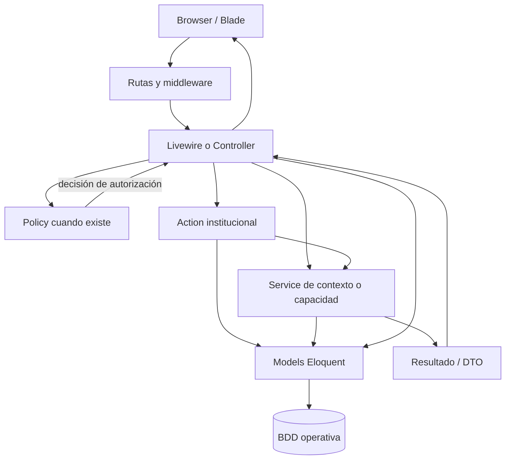

# Arquitectura vigente de RememberMind

Revisión estática de Fase 2 sobre el commit base y el árbol de trabajo con cambios previos sin commit. Aquella fase no ejecutó migraciones, seed, suites, build ni una BDD real. La actualización del 2026-10-08 enlaza la evidencia técnica del sistema experto V1; no certifica otras áreas. CURRENT identifica esta compilación vigente; no aprueba reglas nuevas. `verified_against_commit` no certifica runtime.

Autoridad: [instrucciones institucionales](../../AGENTS.md), [baseline V2.1](../../docs/base-de-datos/REMEMBERMIND_BDD_BASELINE_CONGELADO.md), [diccionario](../../docs/base-de-datos/REMEMBERMIND_BDD_70_TABLAS.md), [decisión V2.2](../../docs/base-de-datos/DECISION_OBJETIVOS_SIGNOS_VITALES_V2_2.md) y [roles aprobados](../../docs/arquitectura/REMEMBERMIND_ROLES_BASELINE_CONGELADO.md). Estructura declarada: 70 tablas núcleo + extensión aprobada = 71; evidencia estática, no esquema instalado comprobado.

## 1. Contexto

**APPROVED CONTRACT.** Sistema institucional Laravel. Residente es la entidad central de información. La formalización de admisión coordina varias entidades; no se observa un único aggregate DDD que encapsule todo el expediente. No se impone Clean Architecture, Repository, CQRS ni servicios por estética.

## 2. Stack verificado

**OBSERVED IMPLEMENTATION — archivos lock, no proceso ejecutado.**

| Componente | Versión en lock |
|---|---|
| PHP requerido | ^8.3 |
| Laravel | 13.33.0 |
| Jetstream / Sanctum | 5.5.3 / 4.3.3 |
| Livewire | 4.4.6 |
| Spatie Permission / Activitylog | 7.4.2 / 4.12.3 |
| PHPUnit | 12.5.36 |
| Tailwind / Vite | 3.4.19 / 8.3.1 |
| Alpine | Integración frontend; no paquete independiente localizado en package-lock |

Fuentes: [composer.json](../../composer.json), [composer.lock](../../composer.lock), [package-lock.json](../../package-lock.json). Requisitos AGENTS no sustituyen versiones resueltas; no se comprobó versión PHP del servidor ni bundles servidos.

## 3. Arquitectura general

| Etiqueta | Trayectoria real |
|---|---|
| OBSERVED IMPLEMENTATION | PreadmisionesPanel/AdmisionController → FormalizarAdmision → transacción + Models |
| OBSERVED IMPLEMENTATION | MisPacientes → SignosVitalesService → RegistrarSignosVitalesAction → evaluator + decisión de alerta + Models |
| OBSERVED IMPLEMENTATION | MedicacionController → Policy/AutorizacionClinicaService → registro o administración |
| EXCEPTION / OBSERVED IMPLEMENTATION | AlertasPanel escribe Models directamente; CuidadoController::registrarPase crea EMITIDO; no pasan por un único Service común |
| TARGET / APPROVED CONTRACT | Reglas críticas accesibles desde todas las entradas, controles backend y atomicidad donde corresponde; no exige una clase de cada capa |

Fuentes: [app/Frontend/Livewire/Admisiones/PreadmisionesPanel.php](../../app/Frontend/Livewire/Admisiones/PreadmisionesPanel.php), [app/Http/Controllers/Admisiones/AdmisionController.php](../../app/Http/Controllers/Admisiones/AdmisionController.php), [app/Backend/Modulos/Admisiones/Acciones/FormalizarAdmision.php](../../app/Backend/Modulos/Admisiones/Acciones/FormalizarAdmision.php), [app/Frontend/Livewire/Enfermeria/Cuidados/MisPacientes.php](../../app/Frontend/Livewire/Enfermeria/Cuidados/MisPacientes.php), [app/Http/Controllers/Medicacion/MedicacionController.php](../../app/Http/Controllers/Medicacion/MedicacionController.php), [app/Frontend/Livewire/Compartido/Alertas/AlertasPanel.php](../../app/Frontend/Livewire/Compartido/Alertas/AlertasPanel.php), [app/Http/Controllers/Cuidados/CuidadoController.php](../../app/Http/Controllers/Cuidados/CuidadoController.php).

## 4. Responsabilidad de cada capa

**APPROVED CONTRACT** para debe/no debe; ejemplos **OBSERVED IMPLEMENTATION**, no certificación de conformidad universal.

| Capa | Responsabilidad / debe contener | No debe contener | Ejemplo real |
|---|---|---|---|
| Blade | Presentación, componentes, estados visibles | SQL, autorización decisiva, regla institucional | [Pase](../../resources/views/livewire/cuidados/pase-turno-panel.blade.php) |
| Livewire | Interacción, forma de entrada, coordinación UI | Único control de una regla crítica | [MisPacientes](../../app/Frontend/Livewire/Enfermeria/Cuidados/MisPacientes.php) |
| Controller | Entrada HTTP, validación/delegación, salida segura | Flujo complejo duplicado | [AdmisionController](../../app/Http/Controllers/Admisiones/AdmisionController.php) |
| Request | Normalización y forma técnica | Competencia clínica inferida del formulario | [UpdateUsuarioRequest](../../app/Http/Requests/Identidad/UpdateUsuarioRequest.php) (`authorize=true`; control externo necesario) |
| Policy | Capacidad contextual por recurso | Persistencia clínica | [ResidentePolicy](../../app/Policies/ResidentePolicy.php), [PrescripcionPolicy](../../app/Policies/PrescripcionPolicy.php) |
| Action | Operación institucional explícita, transacción | Presentación | [FormalizarAdmision](../../app/Backend/Modulos/Admisiones/Acciones/FormalizarAdmision.php) |
| Service | Capacidad/coordinación reutilizable | Dependencia en UI, éxito ficticio | [TurnoEnfermeriaService](../../app/Backend/Modulos/Enfermeria/Servicios/TurnoEnfermeriaService.php) |
| Model | Relaciones, casts, scopes e invariantes locales | Coordinación de todo el sistema | [OcupacionCama](../../app/Models/OcupacionCama.php) |
| Event Laravel | Señal entre componentes cuando se justifica | Sustituir registro clínico | NONE OBSERVED: no app/Events en este árbol; EventoAlerta es un Model persistido |
| Listener Laravel | Reacción a una señal | Afirmar trabajo realizado antes del commit | NONE OBSERVED: no app/Listeners en este árbol |
| Job | Trabajo en cola y errores reportados | Asumir cola activa por existir clase | [EnviarFichaUsuarioJob](../../app/Jobs/EnviarFichaUsuarioJob.php) |
| Notification | Comunicación de un hecho | Sustituir alerta/evento de dominio | [ResetPasswordNotification](../../app/Notifications/ResetPasswordNotification.php) |
| DTO | Resultado explícito de capacidad | Escritura o decisión UI | [RegistroSignosVitales](../../app/Backend/Modulos/Clinica/SignosVitales/Resultados/RegistroSignosVitales.php) |

## 5. Dependencias permitidas

**APPROVED CONTRACT.** UI/HTTP puede delegar en Action/Service y consultar Models para presentación autorizada. Action/Service puede usar Models y otras capacidades; Model mantiene invariantes locales. Backend no depende de Frontend/Http. No se observa obligación universal Policy → Action → Service ni se añaden interfaces vacías. [Reglas backend](../../app/AGENTS.md).

Ubicaciones observadas: `app/Frontend/Livewire/`, `app/Backend/Modulos/`, `app/Models/`, `app/Policies/`, `app/Http/`. Backend contiene también Administración, además de identidad, admisiones, residentes, clínica, enfermería, medicación, alertas, documentos y reportes.

## 6. Manejo transaccional

[Mapa de límites](../../docs/sistema/INVARIANTES_NEGOCIO.md) distingue operación real, rollback SQL y efectos externos. FormalizarAdmision usa transaction con reintentos y bloquea preadmisión/cama. RegistrarSignosVitalesAction guarda medición + alerta automática + evento dentro de la misma transacción. Administración programada bloquea prescripción/horario y comprueba duplicado; PRN no muestra transaction propia ni identidad de reintento aprobada.

Pase: procesarPase y confirmarRecepcion usan transaction; generar y anularPase difieren. No equiparar las entradas. Locks leídos no prueban carreras PostgreSQL.

## 7. Auditoría

**APPROVED CONTRACT.** Activitylog registra auditoría aprobada; procedencia clínica vive en cod_personal, fecha, residente/jornada/atención y registros de dominio. [Admisión](../../app/Backend/Modulos/Admisiones/Acciones/FormalizarAdmision.php) y [Pase](../../app/Backend/Modulos/Enfermeria/Servicios/PaseTurnoService.php) llaman activity. [EventoAlerta](../../app/Models/EventoAlerta.php) conserva acciones asistenciales. No se crea otra tabla corporativa ni se confunde dispatch Livewire con evento clínico persistido.

## 8. Manejo de archivos

[DocumentoController](../../app/Http/Controllers/Documentos/DocumentoController.php) almacena en disco local con MIME/hash y reautoriza descarga. [Estudio clínico](../../app/Http/Controllers/Clinica/EstudioClinicoController.php) enlaza documentación clínica al residente/atención/estudio. **NOT VERIFIED:** exposición real del disco, enlaces desplegados y limpieza de huérfanos; escribir archivo y crear metadata SQL no forma una transacción conjunta.

**EXCEPTION:** EnviarFichaUsuarioJob usa un temporal en disco public, envía correo y elimina después; no hay garantía de limpieza tras fallo del envío. La clase relanza excepción; su presencia no acredita funcionamiento de colas/correo. Alcance de documentos familiares pendiente en TECH-001; no toda descarga vinculada publica clínica.

## 9. Seguridad

[Bootstrap](../../bootstrap/app.php) registra middleware cuenta.activa, Spatie y prevención de escrituras durante preview de rol. [Provider](../../app/Providers/AppServiceProvider.php) limita bypass Gate de Superadmin a lectura; [modelo](../../docs/seguridad/MODELO_AUTORIZACION.md) explica competencia/scope. Conceder todos los permisos en seed no concede todas las profesiones. Excepción temporal local/testing: TECH-004.

## 10. Frontend / Livewire

Blade, Tailwind, Livewire y scripts `resources/frontend/`; Vite compila assets. Paneles específicos y compartidos consumen expediente; nombres de clase AdultoMayor permanecen como evidencia heredada, no nomenclatura para código nuevo. Registrar signos en MisPacientes tiene preview y confirmación de críticos; no todas las entradas HTTP tienen esa interacción.

[Consumidor de signos](../../resources/frontend/scripts/modules/signos-vitales-registro.js) distingue medición, evaluación y gráfico; no es fuente clínica. [Reglas UI](../../resources/AGENTS.md) y contrato UX siguen gobernando; sin QA visual/build ejecutados.

## 11. Convenciones

PK string cod_usuario/cod_residente; Eloquent operativo sin timestamps automáticos en [ModeloOperativo](../../app/Models/ModeloOperativo.php). Usuario, personal, contacto y residente no son sinónimos. Fecha clínica no se sustituye por updated_at. El bloqueo de delete del Model no impide SQL directo ni borrado masivo mediante Query Builder.

## 12. Excepciones y deuda técnica

**TECHNICAL DEBT / CONFLICT:** [TECH-001..011](../../docs/DEUDA_TECNICA.md). Variantes de autorización, eventos y proyección de pase están evidenciadas; la falta de Action por sí sola no constituye deuda. [DEC-OPEN-001..006](../../docs/DECISIONES_PENDIENTES.md) conserva significados aprobados del registro. Sistema experto cognitivo: módulo técnico implementado en `app/Backend/Modulos/SistemaExperto`, con 23 modelos/migraciones y consulta Livewire de Superadministración; no tiene conocimiento institucional cargado ni activación clínica. Los árboles locales siguen **PROPOSED**. El evaluador operativo de signos es un flujo diferente. [Evidencia técnica V1](../../docs/sistema-experto/IMPLEMENTACION_V1.md).
