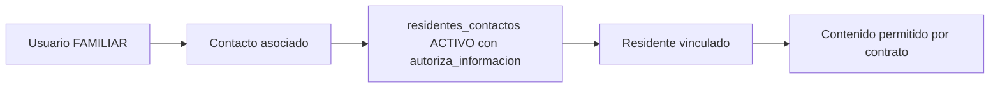

# Modelo de autorización

Fase 2 fue contraste estático del commit base y cambios previos. Fase 3 acredita casos acotados en PostgreSQL aislado según TRAZABILIDAD. CURRENT no aprueba reglas nuevas; verified_against_commit identifica base, no commit de correcciones; runtime_verified=false no certifica autorización universal.

Fuentes rectoras: [AGENTS](../../AGENTS.md), [baseline](../../docs/base-de-datos/REMEMBERMIND_BDD_BASELINE_CONGELADO.md), [diccionario](../../docs/base-de-datos/REMEMBERMIND_BDD_70_TABLAS.md), [extensión aprobada V2.2](../../docs/base-de-datos/DECISION_OBJETIVOS_SIGNOS_VITALES_V2_2.md), [roles](../../docs/arquitectura/REMEMBERMIND_ROLES_BASELINE_CONGELADO.md). Inventario 70+1=71 es evidencia estática del repositorio, no BDD instalada comprobada.

## Contrato compuesto

**APPROVED CONTRACT:** sesión autenticada + cuenta ACTIVO + permiso explícito + Policy aplicable + regla de negocio + scope/relación/competencia. Policy aplicable no significa que cada módulo tenga una clase Policy; una operación debe protegerse en backend por el mecanismo existente adecuado.

| Nivel | Significado y evidencia observada |
|---|---|
| AUTHENTICATION | Fortify verifica correo/contrasena y estado; [Provider](../../app/Providers/FortifyServiceProvider.php), [config](../../config/fortify.php). Registro público deshabilitado; no crear usuario fallback |
| AUTHORIZATION | Decisión completa para acción/recurso/contexto; no se demuestra ocultando un botón |
| ROLE | Agrupación Spatie; 10 roles activos en [seed](../../database/seeders/RolesAndPermissionsSeeder.php) |
| PERMISSION | Capacidad explícita recurso.acción; asignación en seed no prueba grants en BDD desplegada |
| POLICY | [Residente](../../app/Policies/ResidentePolicy.php), [Prescripción](../../app/Policies/PrescripcionPolicy.php), [Administración](../../app/Policies/AdministracionMedicacionPolicy.php), [Valoración preadmisión](../../app/Policies/ValoracionEnfermeriaPreadmisionPolicy.php); no Policy de pase/signos/admisión localizada |
| SCOPE | Residente accesible en esa jornada/vínculo, no cualquier código enviado |
| OWNERSHIP | Registro pertenece al residente y el autor es personal de la cuenta autenticada; no personal del input |
| PROFESSIONAL COMPETENCE | Profesión autorizada para acto; administrar cuidado no habilita prescribir |

## Middleware y rutas

[Web](../../routes/web.php) aplica auth, cuenta.activa, roles y permission por grupos/acciones. [Bootstrap](../../bootstrap/app.php) registra alias Spatie/cuenta.activa y PreventWritesDuringRolePreview; [middleware preview](../../app/Http/Middleware/PreventWritesDuringRolePreview.php) protege escrituras en simulación. **OBSERVED IMPLEMENTATION:** Bootstrap carga web/console; presencia de routes/api.php no acredita registro de sus rutas.

Las mutaciones Livewire deben revalidar al invocarse; mount/read permiso no equivale a permiso de guardar. Las validaciones exists son forma de entrada, no scope ni profesión.

## Superadministrador

**APPROVED CONTRACT:** lectura global ≠ competencia clínica global. [Gate::before](../../app/Providers/AppServiceProvider.php) bypass solo view/viewAny/.ver. [Seed](../../database/seeders/RolesAndPermissionsSeeder.php) asigna todos los permisos web al rol; **OBSERVED IMPLEMENTATION:** [User::checkPermissionTo](../../app/Models/User.php) veta escritura clínica por nombre cuando solo Superadmin y sin sustitución temporal. No interpretar grants de seed aislados como autorización efectiva.

[Excepción](../../docs/arquitectura/PERMISOS_TEMPORALES_SUPERADMIN.md) restringe propósito a local/testing. [Service](../../app/Backend/Modulos/Clinica/Servicios/AccesoClinicoTemporalService.php) exige local/testing + cuenta/personal activos + flag + ausencia de preview. TECH-004 corregido: test con production y flag true deniega sustitución. Usuario con rol profesional adicional se evalúa por esa competencia; no por Superadmin automático. Configuración y explotación en producción **NOT VERIFIED**.

## Enfermería y jornada

[autorizarMutacionPaciente](../../app/Backend/Modulos/Enfermeria/Servicios/TurnoEnfermeriaService.php) comprueba cuenta activa, rol admitido, permiso, personal activo, residente admitido y asignación en contexto de turno. Ventana de turno y fecha, incluidas jornadas que cruzan medianoche, son reglas de operación leídas; fixtures/testing no demuestran ventana real.

[Autorización clínica](../../app/Backend/Modulos/Clinica/Servicios/AutorizacionClinicaService.php) delega a contexto de enfermería cuando corresponde y resuelve personal/área propios. No imponer jornada de Enfermería a todo acto médico por extrapolación.

## Familiar

ResidentePolicy::view exige cuenta/permiso, contacto y vínculo activos/autoriza_informacion. viewAny rechaza Familiar. Fase 3 restringe detalle a identidad y visitas propias, bloquea clínica/PDF/documentos del residente y listas globales no publicadas; TECH-001 corregido con Fase3SeguridadNucleoTest. El vínculo no publica el expediente completo. **OPEN DECISION:** DEC-OPEN-006 únicamente sobre publicación clínica adicional, sin negar información ya autorizada. Datos de otro residente siguen denegados.

## Controles por entrada

| Entrada | Controles observados | Límite |
|---|---|---|
| HTTP revisar/formalizar ingreso | Middleware permiso; validator/estado; Action transaccional | Action y panel exigen cuenta activa, rol/permiso propio; formalizar mantiene transacción |
| Prescribir/suspender | Policy + AutorizacionClinicaService + atención/orden del residente | No inferir cobertura de todas las entradas heredadas |
| Administración HTTP | AutorizacionClinicaService Enfermería + Service contextual | No llama AdministracionMedicacionPolicy; Policy contempla otros roles, no equivalencia entre entradas |
| Signos primarios | Action exige Auth==usuario y autor/jornada/residente coherentes | Rectificación y método anular son otras entradas; anular no localizado como ruta activa |
| Alertas | Panel permiso por acción; scope enfermería; HTTP contexto/permiso según rol | Panel/HTTP delegan estados y eventos a Service, preservando autorización distinta por entrada; detector actor/scope reales |
| Pase Panel | Lectura reautorizada y Service exige permiso/cuenta/contexto | Evidencia acotada; no normalizar GENERADO/EMITIDO/ENTREGADO |
| Pase HTTP | Permiso crear + AutorizacionClinicaService | Jornadas/receptor revalidados por validarContextoEmision; conserva EMITIDO, no ciclo panel |

## Gaps y pruebas

**AUTHORIZATION GAP — HIGH:** TECH-009, con localizadores en [deuda](../../docs/DEUDA_TECNICA.md). Contrato completo no equivale a protección demostrada en cada entrada. Métodos no enrutados se reportan como frontera de clase; no como ataque desplegado confirmado.

[Roles](../../tests/Feature/RolesBaselineCongeladoTest.php), [BDD V2](../../tests/Feature/BddOperativaV2Test.php), [Medicación](../../tests/Feature/ModalesMedicacionSeguridadClinicaTest.php), [Pase](../../tests/Feature/PaseTurnoReconstruidoTest.php): **TESTED EXPECTATION** en el mapeo histórico de Fase 2. Fase 3 ejecuta gates y negativos específicos descritos en TRAZABILIDAD; no acredita todas las variantes. [Matriz accionable](../../docs/seguridad/MATRIZ_ROLES_PERMISOS.md) y [cobertura](../../docs/TRAZABILIDAD.md) distinguen evidencia estática original, casos runtime acotados y negativos todavía pendientes.
