# RememberMind — Árboles de decisión del área de Medicina

**Estado:** diseño funcional y técnico para revisión profesional
**Área propietaria:** Médico General / Geriatra
**Alcance:** todos los formularios, registros, alertas y transiciones médicas identificadas en el repositorio
**Restricción:** sistema de apoyo a la decisión; no diagnostica, prescribe, admite, deriva ni da de alta de forma autónoma

## 1. Objetivo

Definir un flujo médico único, trazable y explicable que conecte:

1. cola de pacientes;
2. valoración médica de admisión;
3. atención médica;
4. nota clínica y evolución;
5. antecedentes;
6. diagnósticos;
7. alergias;
8. signos vitales;
9. dolor;
10. antropometría;
11. indicaciones clínicas;
12. prescripciones y suspensiones;
13. estudios, resultados e informes;
14. documentos clínicos;
15. derivaciones e interconsultas;
16. valoración geriátrica y cognitiva;
17. seguimiento longitudinal;
18. alertas médicas;
19. egreso o cierre de seguimiento.

Los árboles definen cuándo el sistema puede guardar, cuándo debe advertir, cuándo debe bloquear por inconsistencia y cuándo debe solicitar revisión humana.

## 2. Inventario real de formularios y persistencia

| Formulario o acción | Implementación actual | Tablas principales | Árbol |
|---|---|---|---|
| Dashboard y cola médica | `DashboardMedico`, `PacientesSeguimientoPanel` | residentes, alertas, atenciones, signos_vitales, prescripciones | `MED-COLA-001` |
| Valoración médica de admisión | `ValoracionMedicaModal`, `ValoracionMedicaPanel` | atenciones, notas_clinicas, signos_vitales, historial_estados_residente | `MED-ADM-001` |
| Apertura de atención | `ExpedienteClinicoController::crearAtencion` | atenciones | `MED-ATE-001` |
| Nota/evolución médica | `NotaEvolucionMedicaModal`, registro `nota` | notas_clinicas, atenciones | `MED-NOT-001` |
| Antecedente clínico | registro `antecedente` | antecedentes_clinicos | `MED-ANT-001` |
| Diagnóstico | registro `diagnostico` | diagnosticos, atenciones | `MED-DIA-001` |
| Alergia | registro `alergia` | alergias | `MED-ALE-001` |
| Signos vitales | modal de evolución, expediente y panel de signos | signos_vitales | `MED-SV-001` |
| Dolor | registro `dolor` | valoraciones_dolor | `MED-DOL-001` |
| Antropometría | registro `antropometria` | mediciones_antropometricas | `MED-ANTRO-001` |
| Indicación clínica | registro `indicacion` | indicaciones_clinicas | `MED-IND-001` |
| Prescripción | `MedicacionAdultoModal`, `MedicacionController` | medicamentos, prescripciones, horarios_prescripcion | `MED-PRE-001` |
| Suspensión de prescripción | `MedicacionController::suspender` | prescripciones | `MED-SUS-001` |
| Solicitud de estudio | `EstudioClinicoController::solicitar` | estudios_clinicos | `MED-EST-001` |
| Resultados de estudio | `EstudioClinicoController::resultados` | resultados_estudio | `MED-RES-001` |
| Informe del estudio | `EstudioClinicoController::informar` | informes_estudio | `MED-INF-001` |
| Documento clínico | `EstudioClinicoController::documento` y expediente | documentos_clinicos | `MED-DOC-001` |
| Derivación | `EstudioClinicoController::derivar` | derivaciones | `MED-DER-001` |
| Interconsulta | nota `INTERCONSULTA` y panel de seguimiento | atenciones, notas_clinicas, derivaciones | `MED-INT-001` |
| Cognición y riesgo | módulo compartido de evaluaciones | instrumentos, aplicaciones_instrumento, respuestas_instrumento | `MED-GER-001` |
| Alerta manual/automática | alertas y eventos | alertas, eventos_alerta | `MED-ALT-001` |
| Egreso o cierre | nota `EGRESO`, estado del residente y atención | notas_clinicas, atenciones, historial_estados_residente | `MED-EGR-001` |

## 3. Reglas generales para todos los formularios

Antes de evaluar el contenido clínico, todos los árboles deben comprobar:

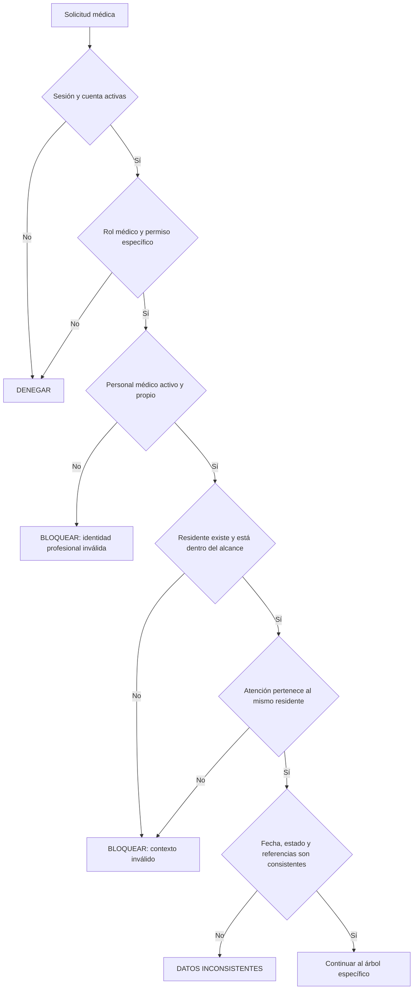

### Invariantes

- Nunca utilizar el primer personal disponible como responsable.
- Nunca utilizar códigos fijos como `ARE_0001` sin validar la asignación real.
- El backend obtiene el profesional autenticado; el formulario no permite suplantarlo.
- Un registro médico siempre pertenece al residente y, cuando corresponda, a una atención.
- Una corrección crea trazabilidad; no elimina la versión anterior.
- Un borrador no genera alertas clínicas definitivas.
- Datos referidos por terceros se identifican como `REFERIDOS`, no como diagnósticos confirmados.
- Todo resultado puede ser `NO_EVALUABLE` si faltan entradas esenciales.

## 4. Árbol maestro del área médica

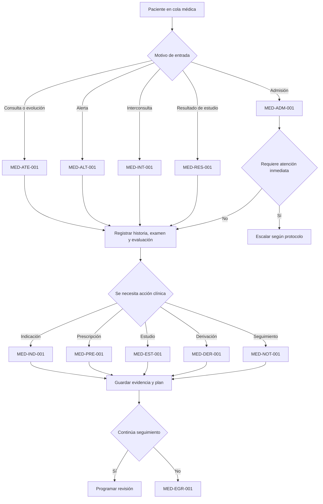

---

## 5. Cola médica y priorización

### `MED-COLA-001` — Orden de revisión médica

**Objetivo:** ordenar el trabajo médico sin diagnosticar ni ocultar pacientes.

**Entradas:** estado del residente, alertas abiertas, incidentes, signos vigentes, notas recientes, derivaciones, estudios e indicaciones pendientes.

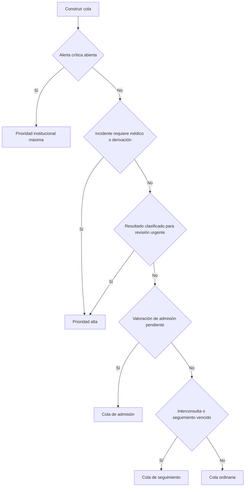

**Salida:** prioridad, causa visible y enlaces al registro que la justifica. La fecha de llegada nunca debe ocultarse; se utiliza como desempate dentro de la misma prioridad.

---

## 6. Valoración médica de admisión

### `MED-ADM-001` — Recomendación médica para admisión

**Objetivo:** producir una recomendación médica estructurada. La formalización administrativa continúa siendo una decisión separada.

**Formularios actuales:** `ValoracionMedicaModal` y `ValoracionMedicaPanel`. Deben converger en un único formulario y servicio.

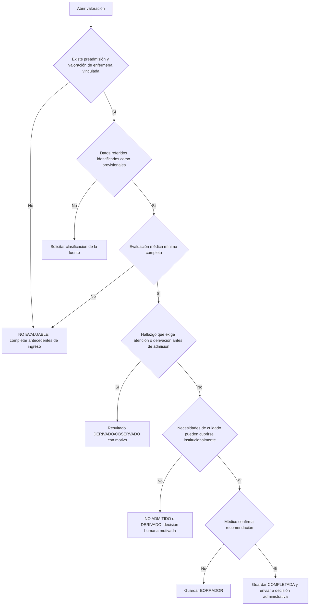

### Datos mínimos

- condición médica general;
- fuente y vigencia de diagnósticos, antecedentes, alergias y medicación referida;
- examen físico general;
- estado neurológico y cognitivo aparente;
- dependencia y riesgo funcional;
- necesidades de monitoreo;
- recomendación y motivo;
- profesional, fecha y atención.

### Alertas asociadas

- dato referido grave sin verificación;
- posible alergia relevante;
- signos que cumplen criterio de escalamiento aprobado;
- necesidad institucional no cubierta;
- recomendación completada sin motivo;
- discrepancia entre decisión médica y estado del residente.

---

## 7. Atención médica

### `MED-ATE-001` — Apertura, desarrollo y cierre de atención

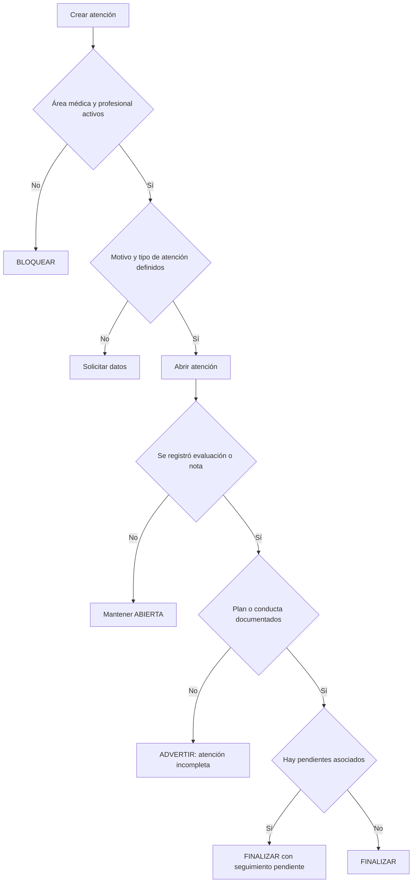

Una atención no debe finalizarse si no existe al menos una nota o resultado clínico y una conducta documentada.

---

## 8. Nota clínica y evolución

### `MED-NOT-001` — Nota médica estructurada

**Tipos existentes:** `EVOLUCION`, `INGRESO`, `EGRESO`, `INTERCONSULTA`, `URGENCIA`, `PROCEDIMIENTO`.

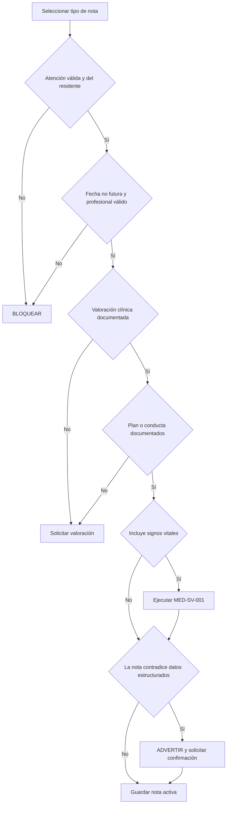

### Reglas por tipo

| Tipo | Requisitos adicionales |
|---|---|
| INGRESO | resumen de problemas, datos referidos, examen y plan inicial |
| EVOLUCIÓN | cambio desde la nota previa, respuesta y plan actualizado |
| URGENCIA | hora, motivo, evaluación, acción inmediata y destino |
| PROCEDIMIENTO | indicación, consentimiento cuando corresponda, ejecución y resultado |
| INTERCONSULTA | pregunta clínica, área destinataria y urgencia |
| EGRESO | condición de salida, conciliación, recomendaciones y seguimiento |

Las secciones SOAP pueden conservarse, pero diagnósticos, alergias, indicaciones y prescripciones confirmadas deben almacenarse también en sus tablas estructuradas.

---

## 9. Antecedentes clínicos

### `MED-ANT-001` — Registro de antecedente

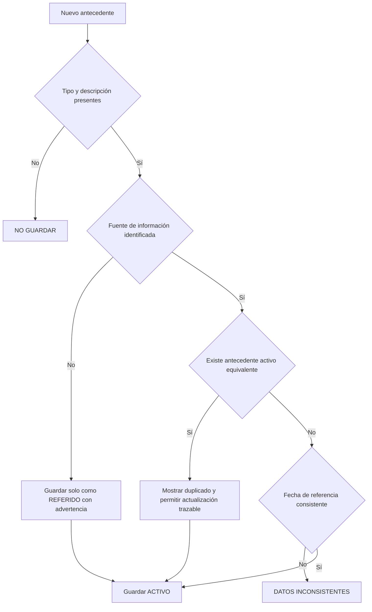

**Alertas:** duplicidad contradictoria, antecedente relevante no considerado en plan y fuente desconocida presentada como confirmada.

---

## 10. Diagnósticos

### `MED-DIA-001` — Registro y seguimiento diagnóstico

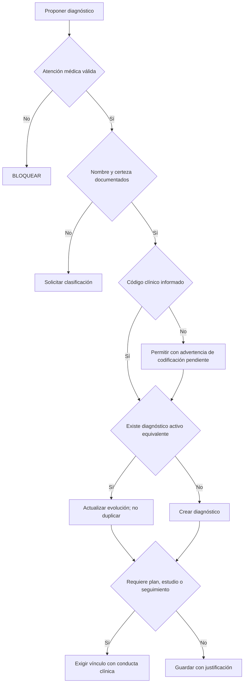

**Límite:** el sistema experto puede detectar incompatibilidades y pendientes, pero no generar diagnósticos a partir de signos o texto libre.

---

## 11. Alergias

### `MED-ALE-001` — Registro y reconciliación de alergia

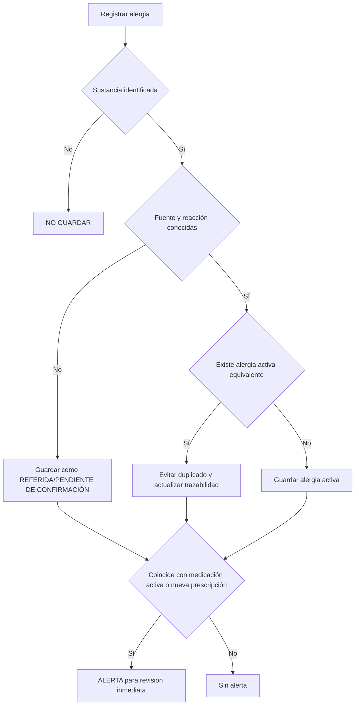

La comparación medicamento–alergia necesita un catálogo normalizado. Una coincidencia de texto libre no debe suspender medicamentos automáticamente.

---

## 12. Signos vitales

### `MED-SV-001` — Validación técnica, tendencia y alerta

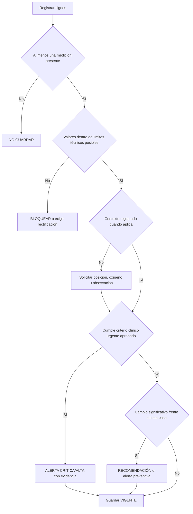

### Reglas

- Los límites de validación del formulario son límites técnicos, no umbrales de alarma.
- La regla debe considerar contexto, tendencia, oxígeno suplementario y condiciones conocidas.
- Una rectificación conserva el registro original como anulado o sustituido con motivo.
- Todas las reglas de signos deben estar fuera de componentes Livewire y dentro del dominio clínico.

---

## 13. Dolor

### `MED-DOL-001` — Dolor, intervención y respuesta

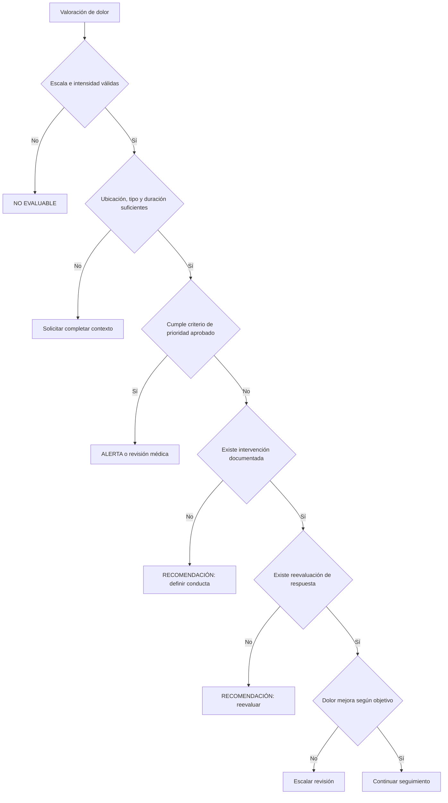

---

## 14. Antropometría

### `MED-ANTRO-001` — Coherencia y tendencia antropométrica

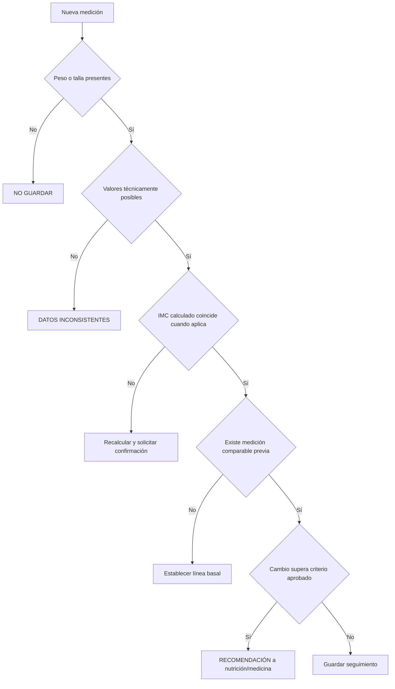

---

## 15. Indicaciones clínicas

### `MED-IND-001` — Creación y seguimiento de indicación

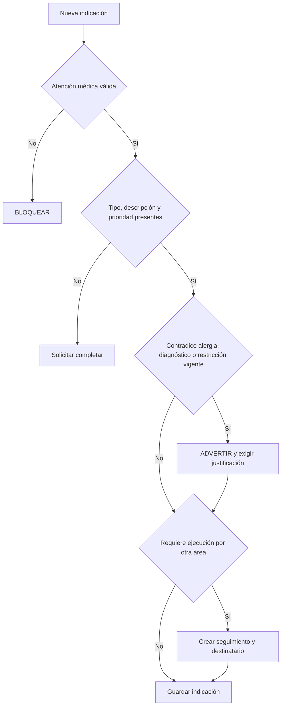

Una indicación debe tener estado, responsable destinatario, vigencia y criterio de finalización cuando produzca tareas asistenciales.

---

## 16. Prescripción y suspensión

### `MED-PRE-001` — Prescripción segura

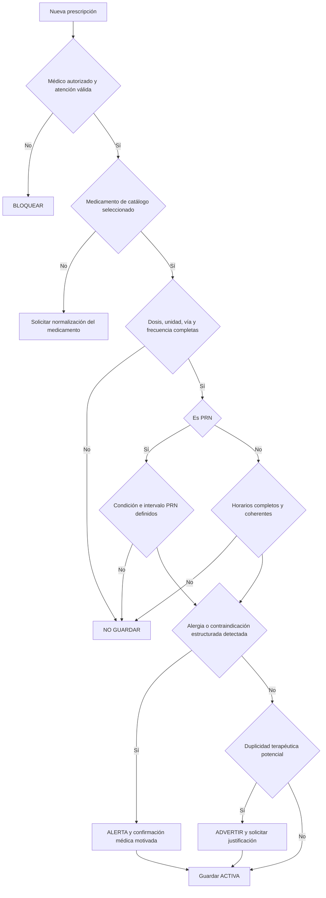

### `MED-SUS-001` — Suspensión

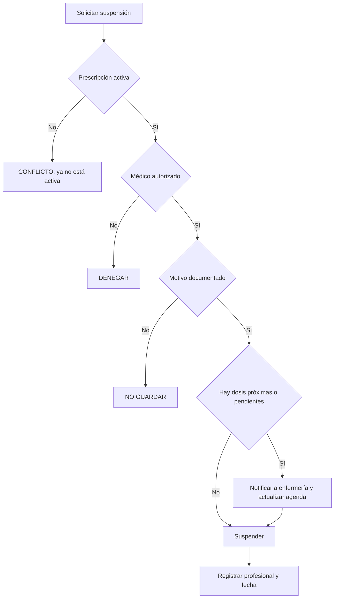

La propuesta se alinea con la separación existente entre prescripción, horario y administración. El sistema no debe crear automáticamente medicamentos de catálogo a partir de texto sin una revisión del catálogo institucional.

---

## 17. Estudios clínicos, resultados e informes

### `MED-EST-001` — Solicitud de estudio

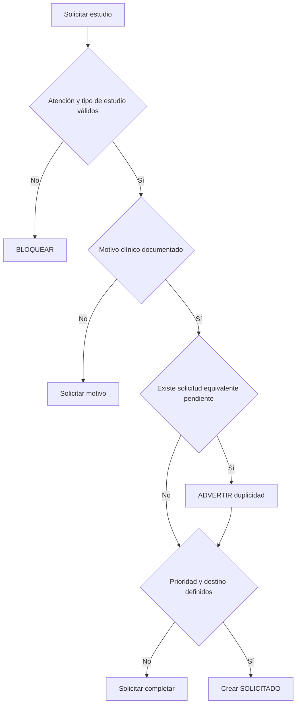

### `MED-RES-001` — Carga y clasificación del resultado

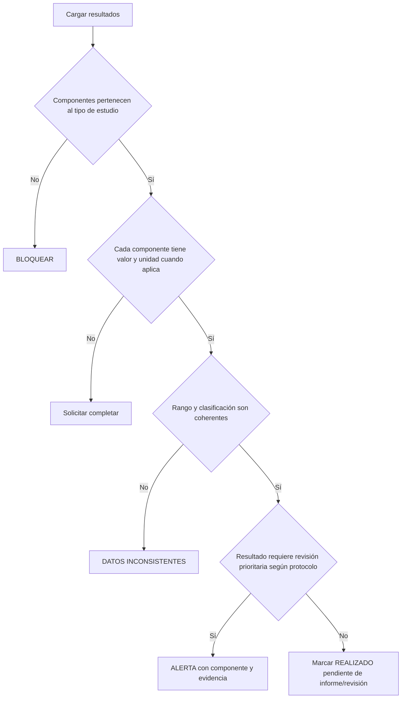

### `MED-INF-001` — Informe y cierre del estudio

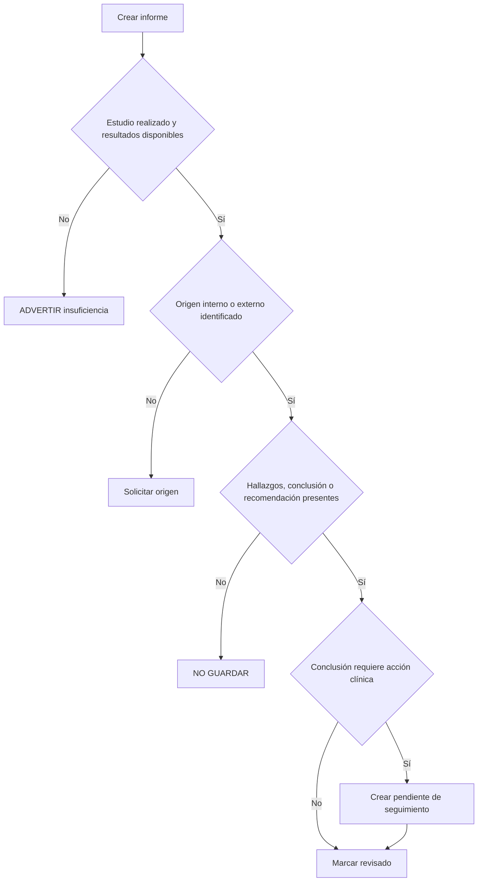

---

## 18. Documento clínico

### `MED-DOC-001` — Incorporación segura al expediente

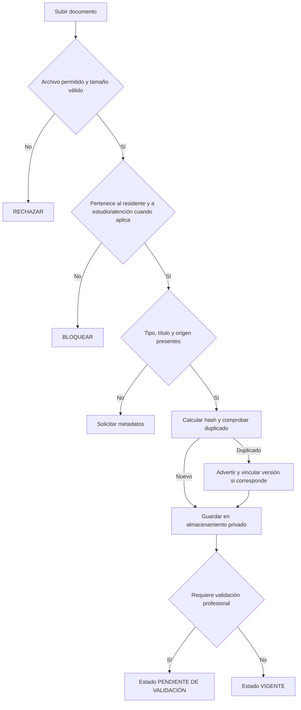

El contenido del archivo no se convierte automáticamente en diagnóstico ni resultado estructurado.

---

## 19. Derivación e interconsulta

### `MED-DER-001` — Derivación

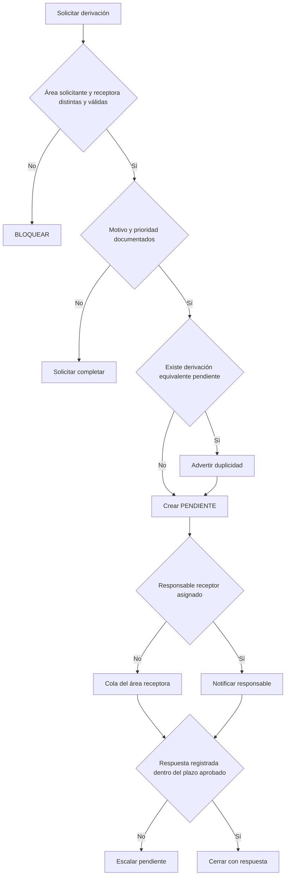

### `MED-INT-001` — Interconsulta

La nota de tipo `INTERCONSULTA` debe vincularse a una derivación o solicitud estructurada, contener pregunta clínica concreta, destinatario, prioridad y respuesta. No debe depender únicamente de buscar una palabra en una nota.

---

## 20. Valoración geriátrica, cognición y riesgo

### `MED-GER-001` — Integración de instrumentos y dominios

```mermaid
flowchart TD
    A[Revisión geriátrica] --> B{Instrumentos autorizados y vigentes}
    B -->|No| X[NO EVALUABLE: programar instrumento]
    B -->|Sí| C{Aplicación completa y respuestas válidas}
    C -->|No| Y[DATOS INCONSISTENTES]
    C -->|Sí| D{Clasificación cumple criterio de seguimiento}
    D -->|Sí| E[Crear recomendación por dominio]
    D -->|No| F{Existe cambio respecto a evaluación previa}
    F -->|Sí| E
    F -->|No| G[SIN HALLAZGO]
    E --> H{Dominio afectado}
    H -->|Cognitivo/psicológico| I[Interconsulta correspondiente]
    H -->|Funcional/caídas| J[Fisioterapia/enfermería]
    H -->|Nutricional| K[Nutrición]
    H -->|Médico| L[Seguimiento médico]
```

Los instrumentos deben estar autorizados, versionados y cargados con sus reglas metodológicas. No se debe reproducir contenido protegido sin verificar derechos de uso.

---

## 21. Alertas médicas

### `MED-ALT-001` — Generación, atención y cierre

```mermaid
flowchart TD
    A[Hallazgo del motor o alerta manual] --> B{Evidencia válida y residente identificado}
    B -->|No| X[NO CREAR]
    B -->|Sí| C{Existe alerta activa con misma huella}
    C -->|Sí| D[Actualizar evidencia; no duplicar]
    C -->|No| E{Prioridad calculada por regla aprobada}
    E -->|No| F[Solicitar prioridad manual motivada]
    E -->|Sí| G[Crear ABIERTA]
    F --> G
    D --> H{Profesional reconoce y revisa fundamento}
    G --> H
    H -->|Rechaza| I[Registrar descarte/override y motivo]
    H -->|Acepta| J[Asignar responsable y pasar a EN ATENCIÓN]
    J --> K{Intervención y resultado documentados}
    K -->|No| L[Mantener abierta o escalar por plazo]
    K -->|Sí| M{Criterio de cierre cumplido}
    M -->|No| L
    M -->|Sí| N[Cerrar con evento auditable]
```

### Contenido obligatorio de una alerta

- regla y versión;
- fecha de evaluación;
- residente;
- prioridad;
- datos que activaron la regla;
- registros fuente y fechas;
- datos faltantes o desconocidos;
- explicación en lenguaje claro;
- acción sugerida;
- profesional destinatario;
- estado y plazo;
- validación, rechazo o cierre profesional.

### Familias iniciales de alertas médicas

| Código | Familia | Evidencia principal |
|---|---|---|
| `ALT-MED-SV` | Signos y tendencia | signos_vitales |
| `ALT-MED-DOL` | Dolor sin respuesta o seguimiento | valoraciones_dolor |
| `ALT-MED-ALE` | Alergia y medicación | alergias, prescripciones |
| `ALT-MED-PRE` | Prescripción inconsistente | prescripciones, horarios |
| `ALT-MED-REA` | Reacción adversa | administraciones_medicacion |
| `ALT-MED-EST` | Resultado que requiere revisión | resultados_estudio, informes_estudio |
| `ALT-MED-DER` | Derivación sin respuesta | derivaciones |
| `ALT-MED-GER` | Deterioro por instrumento | aplicaciones_instrumento |
| `ALT-MED-SEG` | Seguimiento vencido | atenciones, notas, indicaciones |
| `ALT-MED-DAT` | Datos clínicos contradictorios | múltiples fuentes |

Los umbrales y plazos quedan pendientes de aprobación médica e institucional.

---

## 22. Seguimiento, revisión y egreso

### `MED-SEG-001` — Seguimiento longitudinal

```mermaid
flowchart TD
    A[Cerrar atención o emitir conducta] --> B{Existen pendientes clínicos}
    B -->|No| C[Seguimiento ordinario según plan]
    B -->|Sí| D{Cada pendiente tiene responsable y fecha}
    D -->|No| E[ADVERTIR: seguimiento incompleto]
    D -->|Sí| F[Programar revisión]
    F --> G{Llegó fecha sin registro de cumplimiento}
    G -->|Sí| H[ALERTA de seguimiento vencido]
    G -->|No| I[Esperar o registrar resultado]
    I --> J{Resultado resuelve el pendiente}
    J -->|No| K[Reevaluar plan]
    J -->|Sí| L[Cerrar pendiente con evidencia]
```

### `MED-EGR-001` — Egreso o cierre médico

```mermaid
flowchart TD
    A[Proponer egreso/cierre] --> B{Atención y nota de egreso completas}
    B -->|No| X[BLOQUEAR]
    B -->|Sí| C{Alertas críticas abiertas}
    C -->|Sí| Y[No cerrar hasta resolución o justificación autorizada]
    C -->|No| D{Resultados, derivaciones y seguimientos pendientes}
    D -->|Sí| E[Asignar continuidad y responsable]
    D -->|No| F{Conciliación de medicación completa}
    E --> F
    F -->|No| G[Solicitar conciliación]
    F -->|Sí| H{Recomendaciones y signos de alarma documentados}
    H -->|No| I[Solicitar completar]
    H -->|Sí| J[Confirmación profesional]
    J -->|Sí| K[Registrar egreso/cierre e historial de estado]
```

El cambio institucional definitivo de estado debe respetar el flujo de admisión/egreso autorizado y no depender únicamente de una nota.

## 23. Flujo transaccional recomendado

Toda acción médica seguirá este patrón:

```text
Autorizar
→ validar identidad profesional y residente
→ validar datos y relaciones
→ guardar registro clínico en transacción
→ emitir evento de dominio después del commit
→ evaluar reglas relacionadas
→ persistir resultado y evidencias
→ proyectar alerta si corresponde
→ notificar al rol responsable
```

Las vistas solo consultan y presentan información. El motor no se ejecuta desde `render()`.

## 24. Cambios arquitectónicos necesarios antes de implementar

1. Unificar `ValoracionMedicaModal` y `ValoracionMedicaPanel`.
2. Crear un `ValoracionMedicaService` o Action único.
3. Separar datos referidos de antecedentes, diagnósticos y alergias confirmados.
4. Eliminar fallback a cualquier personal y códigos de área fijos.
5. Evitar que la valoración médica formalice por sí misma una admisión.
6. Centralizar notas médicas en un servicio con corrección versionada.
7. Usar un único flujo de prescripción; actualmente hay modal y controlador paralelos.
8. No crear medicamentos de catálogo automáticamente desde texto libre.
9. Vincular interconsulta con derivación estructurada.
10. Mover reglas de signos fuera de Livewire.
11. Centralizar creación y ciclo de vida de alertas.
12. Crear permisos médicos específicos por acción; no usar solo `valoracion_medica.ver` como puerta para todo el módulo.

## 25. Pruebas requeridas

Cada árbol debe cubrir:

- profesional sin permiso;
- personal inactivo o ausente;
- residente inexistente o fuera de alcance;
- atención de otro residente;
- formulario incompleto;
- borrador;
- registro confirmado;
- dato en límite técnico;
- criterio clínico activado y no activado;
- ausencia de datos que produce `NO_EVALUABLE`;
- evidencia contradictoria;
- ejecución repetida sin duplicar alertas;
- cambio de evidencia que actualiza el resultado;
- aceptación y rechazo profesional;
- cierre con evidencia;
- corrección sin destrucción del historial;
- autorización por rol;
- compatibilidad PostgreSQL y SQLite.

## 26. Orden de construcción

### Etapa 1 — Unificación del registro

1. Atención médica.
2. Nota clínica.
3. Antecedentes, diagnósticos y alergias.
4. Signos y dolor.
5. Valoración médica de admisión.

### Etapa 2 — Conducta clínica

6. Indicaciones.
7. Prescripción y suspensión.
8. Estudios y resultados.
9. Derivaciones e interconsultas.

### Etapa 3 — Inteligencia explicable

10. Cola priorizada.
11. Alertas médicas versionadas.
12. Seguimiento vencido.
13. Integración geriátrica.
14. Egreso y continuidad.

### Etapa 4 — Validación

15. Modo sombra.
16. Revisión médica de resultados.
17. Ajuste mediante nuevas versiones.
18. Piloto controlado.

## 27. Referencias marco

- WHO, *Integrated care for older people (ICOPE): guidance for person-centred assessment and pathways in primary care*, 2.ª ed.: https://www.who.int/publications/i/item/9789240103726
- WHO, *Medication Without Harm*: https://www.who.int/initiatives/medication-without-harm
- FDA, *Clinical Decision Support Software*: https://www.fda.gov/regulatory-information/search-fda-guidance-documents/clinical-decision-support-software
- WHO, *Ethics and governance of artificial intelligence for health*: https://www.who.int/publications/i/item/9789240029200
- HL7, *CDS Hooks 2.0*: https://cds-hooks.hl7.org/2.0/

Estas referencias proporcionan principios de seguridad, revisión independiente, seguimiento y gobernanza. Los umbrales clínicos y protocolos finales deben ser aprobados para el contexto institucional y regulatorio aplicable.
