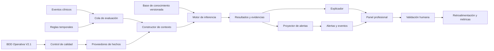
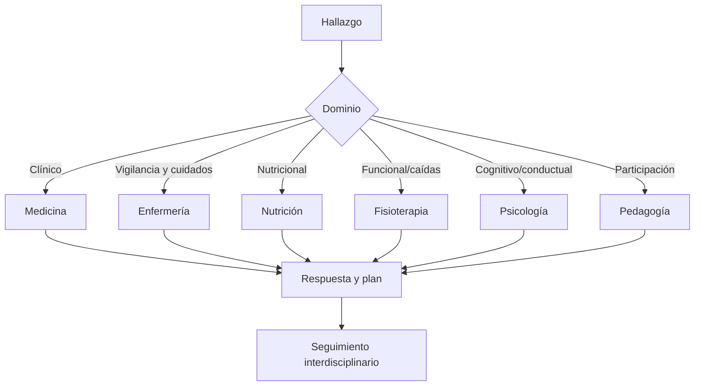

# RememberMind — Arquitectura completa del sistema experto

**Estado:** propuesta maestra para revisión clínica, institucional y técnica
**Producto:** RememberMind
**Tipo:** Sistema de Apoyo a la Decisión Clínica y Asistencial
**Enfoque inicial:** reglas deterministas, explicables, versionadas y supervisadas
**Restricción:** no diagnostica, prescribe, suspende tratamientos ni sustituye decisiones profesionales

## 1. Propósito

El sistema experto de RememberMind debe convertir información clínica y asistencial ya registrada en:

- advertencias explicables;
- recomendaciones de revisión;
- prioridades de trabajo;
- detección de datos faltantes o inconsistentes;
- recordatorios de seguimiento;
- alertas clínicas y operativas;
- coordinación interdisciplinaria;
- evidencia para auditoría y mejora continua.

Su función es apoyar al profesional. La decisión final permanece en la persona autorizada.

## 2. Documentos relacionados

- [Diseño de árboles para todas las áreas](./DISENO_ARBOLES_DECISION_TODAS_AREAS.md)
- [Árboles completos del área de Medicina](./ARBOLES_DECISION_AREA_MEDICINA.md)
- [BDD Operativa V2.1 — 70 tablas](../base-de-datos/REMEMBERMIND_BDD_70_TABLAS.md)
- [Baseline congelado de la BDD](../base-de-datos/REMEMBERMIND_BDD_BASELINE_CONGELADO.md)

El sistema experto está fuera del baseline congelado de 70 tablas. Toda extensión persistente requiere aprobación y una nueva versión documentada del esquema.

## 3. Principios de seguridad

1. El profesional mantiene el control de la decisión.
2. Toda recomendación debe ser explicable.
3. La ausencia de información produce `NO_EVALUABLE`, nunca “normal”.
4. Cada resultado identifica regla, versión y evidencias.
5. Las reglas publicadas son inmutables.
6. Un cambio de criterio crea una nueva versión.
7. Ninguna regla modifica directamente datos clínicos fuente.
8. Ninguna recomendación crea diagnósticos o prescripciones.
9. Las alertas automáticas pueden ser aceptadas, descartadas o corregidas por un profesional.
10. Toda acción sensible requiere autenticación, permiso, competencia y contexto válido.
11. La información clínica no debe enviarse a servicios externos sin autorización y garantías aplicables.
12. Los resultados del sistema experto no deben ocultar datos faltantes, limitaciones o contradicciones.

## 4. Diferencia entre detector de alertas y sistema experto

### Detector simple

```text
Condición
→ alerta
```

### Sistema experto

```text
Datos clínicos
→ validación de calidad
→ hechos clínicos normalizados
→ contexto longitudinal
→ reglas versionadas
→ resultado explicable
→ evidencia persistida
→ recomendación o alerta
→ decisión profesional
→ retroalimentación
→ mejora de la regla
```

El servicio actual de detección puede reutilizarse como prototipo funcional, pero sus reglas deben separarse de la consulta de datos y de la creación de alertas.

## 5. Arquitectura general



## 6. Componentes principales

### 6.1 Base de conocimiento

Almacena la definición gobernada de las reglas:

- código;
- nombre;
- área;
- objetivo;
- población;
- propietario clínico;
- versión;
- vigencia;
- entradas requeridas;
- exclusiones;
- condiciones;
- resultado posible;
- prioridad;
- acción sugerida;
- referencia o protocolo;
- estado de aprobación.

En la primera etapa, las condiciones deben implementarse como clases PHP revisadas en Git. No se recomienda un editor libre de reglas clínicas ni almacenar las condiciones principales como JSON o EAV.

### 6.2 Proveedores de hechos

Transforman tablas específicas en hechos que las reglas puedan utilizar sin depender de detalles de Eloquent o de la interfaz.

Ejemplos:

| Hecho canónico | Fuente |
|---|---|
| `residente.estado_actual` | residentes |
| `signos.ultima_medicion` | signos_vitales |
| `signos.tendencia` | signos_vitales históricos |
| `dolor.ultima_valoracion` | valoraciones_dolor |
| `medicacion.prescripcion_activa` | prescripciones |
| `medicacion.dosis_vencida` | horarios_prescripcion y administraciones_medicacion |
| `medicacion.reaccion_adversa` | administraciones_medicacion |
| `caidas.incidente_reciente` | incidentes |
| `funcional.ultima_valoracion` | valoraciones_funcionales |
| `nutricion.ultima_valoracion` | valoraciones_nutricionales |
| `cuidados.intervencion_pendiente` | ejecuciones_cuidado |
| `estudios.resultado_pendiente_revision` | estudios, resultados e informes |
| `derivacion.pendiente` | derivaciones |
| `alerta.abierta` | alertas |

Cada hecho debe incluir:

- residente;
- código del hecho;
- valor y unidad;
- fecha clínica;
- fecha de consulta;
- tabla y registro fuente;
- estado de vigencia;
- calidad o completitud;
- responsable del dato.

### 6.3 Constructor de contexto

Reúne los hechos necesarios para evaluar un residente en una fecha de corte.

```text
Contexto del residente
├── identidad y estado institucional
├── línea basal
├── signos y dolor
├── antecedentes, diagnósticos y alergias
├── medicación
├── valoraciones profesionales
├── instrumentos
├── incidentes
├── planes y cuidados
├── estudios y derivaciones
├── alertas
└── datos faltantes o contradictorios
```

El contexto es inmutable durante una ejecución para que la explicación coincida con los datos evaluados.

### 6.4 Motor de inferencia

Responsabilidades:

1. seleccionar reglas aplicables;
2. validar entradas requeridas;
3. evaluar las reglas;
4. producir resultados deterministas;
5. calcular una huella idempotente;
6. persistir ejecución y evidencia;
7. solicitar proyección hacia una alerta cuando corresponda.

Contrato conceptual:

```php
interface ReglaClinica
{
    public function codigo(): string;
    public function version(): string;
    public function aplica(ContextoClinico $contexto): bool;
    public function evaluar(ContextoClinico $contexto): ResultadoRegla;
}
```

Resultados admitidos:

- `SIN_HALLAZGO`;
- `RECOMENDACION`;
- `ALERTA_BAJA`;
- `ALERTA_MEDIA`;
- `ALERTA_ALTA`;
- `ALERTA_CRITICA`;
- `NO_EVALUABLE`;
- `DATOS_INCONSISTENTES`;
- `ERROR_EJECUCION`.

### 6.5 Explicador

Convierte el resultado técnico en una explicación revisable:

```text
Qué detectó
→ por qué se activó
→ qué datos utilizó
→ qué datos faltan
→ qué regla y versión aplicó
→ qué recomienda
→ quién debe revisarlo
→ qué no puede concluir
```

La explicación debe permitir abrir los registros fuente.

### 6.6 Proyector de alertas

Decide si un resultado debe reflejarse en `alertas`.

El proyector:

- evita duplicados mediante una huella estable;
- actualiza evidencia cuando el riesgo continúa;
- respeta el ciclo de vida de la alerta;
- no cierra alertas automáticamente;
- registra la relación entre resultado experto y alerta;
- conserva eventos de creación, reconocimiento, asignación, atención, descarte y cierre.

### 6.7 Validación profesional

El profesional puede:

- aceptar;
- atender;
- solicitar más información;
- descartar;
- corregir clasificación;
- derivar;
- cerrar con resultado.

Cada decisión registra usuario, rol, fecha y motivo.

## 7. Funciones que aportará el sistema experto

### 7.1 Resumen clínico inteligente

Al abrir un residente mostrará:

- problemas activos;
- antecedentes relevantes;
- diagnósticos vigentes;
- alergias;
- medicación activa;
- últimas mediciones;
- tendencias;
- valoraciones profesionales;
- estudios pendientes;
- derivaciones abiertas;
- planes e intervenciones;
- alertas;
- información faltante.

Cada elemento tendrá fuente y fecha. El resumen no reemplaza el expediente completo.

### 7.2 Lista priorizada por rol

Cada rol verá una cola diferente.

#### Medicina

1. alertas clínicas críticas;
2. incidentes que requieren médico;
3. resultados pendientes de revisión;
4. derivaciones e interconsultas;
5. valoraciones de admisión;
6. seguimientos vencidos;
7. consultas ordinarias.

#### Enfermería

1. residentes críticos asignados;
2. medicación vencida u omitida;
3. cuidados prioritarios pendientes;
4. signos que requieren revisión;
5. heridas y curaciones;
6. seguimiento ordinario.

#### Nutrición, Psicología, Fisioterapia y Pedagogía

Cada cola se construye con derivaciones, riesgos del dominio, planes pendientes y seguimiento vencido.

### 7.3 Asistente de formularios

Antes de guardar verifica:

- campos requeridos;
- relación correcta con residente y atención;
- identidad del profesional;
- fechas y estados;
- duplicados;
- contradicciones;
- datos referidos frente a confirmados;
- plan o seguimiento faltante;
- necesidad de justificar una excepción.

No autocompleta conclusiones clínicas.

### 7.4 Conciliación de medicación

Compara:

- medicación referida al ingreso;
- prescripciones activas;
- horarios;
- administraciones;
- omisiones;
- reacciones adversas;
- alergias;
- suspensiones;
- cambios durante transiciones de atención.

El resultado es una lista de diferencias para revisión médica. No suspende ni modifica medicación.

### 7.5 Vigilancia longitudinal

Analiza evolución, no solo un valor aislado:

```text
valor actual
+ línea basal
+ mediciones anteriores
+ intervenciones previas
+ contexto clínico
= resultado explicable
```

Dominios:

- signos vitales;
- dolor;
- peso y antropometría;
- movilidad;
- cognición;
- conducta;
- sueño;
- ingesta;
- hidratación;
- eliminación;
- heridas;
- instrumentos geriátricos.

### 7.6 Control de pendientes

Detecta:

- estudio solicitado sin resultado;
- resultado sin informe;
- informe sin revisión;
- derivación sin respuesta;
- indicación sin seguimiento;
- plan sin intervención;
- intervención sin programación;
- cuidado omitido;
- alerta sin responsable;
- valoración vencida;
- seguimiento sin resultado;
- egreso con pendientes no resueltos.

### 7.7 Coordinación interdisciplinaria



Toda derivación incluye motivo, prioridad, evidencia, destinatario, fecha esperada y respuesta.

### 7.8 Perfil dinámico de riesgo

El residente tendrá perfiles separados:

- clínico;
- medicación;
- caídas;
- funcional;
- nutricional;
- cognitivo;
- conductual;
- integridad de piel;
- continuidad del cuidado;
- calidad de información.

No se recomienda resumir todos los dominios en una puntuación única. Cada riesgo debe mostrar sus propios datos y limitaciones.

### 7.9 Seguimiento programado

Cada recomendación puede definir:

- responsable;
- fecha esperada;
- dato que debe controlarse;
- criterio de cumplimiento;
- condición de escalamiento;
- estado actual.

El motor evalúa vencimientos mediante reglas temporales.

### 7.10 Aprendizaje institucional

La retroalimentación permite conocer:

- reglas activadas;
- recomendaciones aceptadas;
- descartes y motivos;
- alertas repetitivas;
- tiempos de respuesta;
- seguimientos vencidos;
- datos frecuentemente ausentes;
- eventos no detectados inicialmente;
- diferencias entre áreas o turnos.

La mejora se hace publicando nuevas versiones de reglas.

## 8. Cobertura por área

| Área | Funciones principales |
|---|---|
| Medicina | priorización, revisión clínica, prescripción, estudios, derivaciones, seguimiento y egreso |
| Enfermería | vigilancia por turno, signos, medicación administrada, cuidados, heridas e incidentes |
| Nutrición | valoración, antropometría, ingesta, hidratación y plan nutricional |
| Fisioterapia | movilidad, dolor funcional, dispositivos, dependencia y caídas |
| Psicología | cognición, conducta, sueño, instrumentos y seguimiento |
| Pedagogía | participación, objetivos y adaptación de actividades |
| Admisiones | expediente, valoración previa, documentación y capacidad institucional |
| Administración | camas, jornadas, cobertura, asignaciones y documentos |
| Familia | vínculo, autorización, consentimiento y visitas |
| Equipo interdisciplinario | planes, intervenciones, derivaciones y continuidad |

## 9. Modelo de persistencia propuesto

La extensión requiere aprobación porque la BDD V2.1 está congelada.

### 9.1 `reglas_expertas`

- `cod_regla_experta`;
- `codigo`;
- `nombre`;
- `area`;
- `objetivo`;
- `propietario_clinico`;
- `estado`.

### 9.2 `versiones_regla_experta`

- `cod_version_regla`;
- `cod_regla_experta`;
- `version`;
- `clase_implementacion`;
- `checksum`;
- `referencia`;
- `fecha_vigencia_desde`;
- `fecha_vigencia_hasta`;
- `cod_usuario_aprobacion`;
- `fecha_aprobacion`;
- `estado`.

### 9.3 `evaluaciones_expertas`

- `cod_evaluacion_experta`;
- `cod_residente`;
- `disparador`;
- `fecha_corte`;
- `fecha_inicio`;
- `fecha_fin`;
- `estado`;
- `error` nullable.

### 9.4 `resultados_expertos`

- `cod_resultado_experto`;
- `cod_evaluacion_experta`;
- `cod_version_regla`;
- `cod_alerta` nullable;
- `resultado`;
- `prioridad` nullable;
- `titulo`;
- `explicacion`;
- `accion_sugerida` nullable;
- `huella` única;
- `fecha_hora`.

### 9.5 `evidencias_resultado_experto`

- `cod_evidencia_experta`;
- `cod_resultado_experto`;
- `codigo_hecho`;
- `tabla_fuente`;
- `cod_registro_fuente`;
- `campo_fuente` nullable;
- `valor_observado`;
- `unidad` nullable;
- `fecha_hecho`;
- `calidad_dato`.

La evidencia no sustituye al registro clínico; guarda la referencia y el valor evaluado para reproducibilidad.

### 9.6 `validaciones_resultado_experto`

- `cod_validacion_experta`;
- `cod_resultado_experto`;
- `cod_usuario`;
- `decision`;
- `motivo` nullable;
- `fecha_hora`.

Decisiones sugeridas:

- `ACEPTADA`;
- `DESCARTADA`;
- `CORREGIDA`;
- `REQUIERE_DATOS`;
- `DERIVADA`.

## 10. Organización del código

```text
app/Backend/ApoyoDecision/SistemaExperto/
├── Contratos/
│   ├── ReglaClinica.php
│   ├── ProveedorHechos.php
│   └── ProyectorResultado.php
├── Dominio/
│   ├── ContextoClinico.php
│   ├── HechoClinico.php
│   ├── EvidenciaClinica.php
│   ├── ResultadoRegla.php
│   └── Prioridad.php
├── Aplicacion/
│   ├── EvaluarResidente.php
│   ├── MotorInferencia.php
│   ├── ReconciliarEvaluaciones.php
│   └── ValidarResultado.php
├── Fuentes/
│   ├── ResidenteProvider.php
│   ├── SignosVitalesProvider.php
│   ├── MedicacionProvider.php
│   ├── CuidadosProvider.php
│   ├── IncidentesProvider.php
│   ├── EstudiosProvider.php
│   ├── ValoracionesProvider.php
│   └── PlanesProvider.php
├── Reglas/
│   ├── Medicina/
│   ├── Enfermeria/
│   ├── Medicacion/
│   ├── Nutricion/
│   ├── Fisioterapia/
│   ├── Psicologia/
│   ├── Pedagogia/
│   ├── Admision/
│   └── Operacion/
├── Persistencia/
│   ├── RepositorioEvaluaciones.php
│   └── RepositorioEvidencias.php
└── Proyecciones/
    ├── ProyectarAlerta.php
    └── ConstruirExplicacion.php
```

## 11. Disparadores

### 11.1 Eventos clínicos

- signo vital registrado o rectificado;
- dolor valorado;
- diagnóstico registrado;
- alergia registrada;
- prescripción creada o suspendida;
- administración omitida o con reacción;
- incidente registrado;
- valoración completada;
- instrumento aplicado;
- resultado o informe incorporado;
- derivación creada o respondida;
- cuidado ejecutado u omitido;
- plan actualizado.

### 11.2 Reglas temporales

- dosis vencida;
- cuidado atrasado;
- seguimiento vencido;
- estudio sin resultado;
- informe sin revisión;
- derivación sin respuesta;
- valoración periódica pendiente;
- alerta sin responsable;
- documento próximo a revisión según política.

### 11.3 Evaluación manual

Un profesional autorizado puede solicitar reevaluación. La nueva ejecución no borra resultados anteriores.

## 12. Idempotencia y concurrencia

La huella de un resultado debe considerar:

```text
regla
+ versión
+ residente
+ ventana temporal
+ evidencias relevantes
= huella única
```

El motor debe:

- bloquear o serializar la evaluación necesaria;
- usar transacciones;
- impedir alertas duplicadas;
- actualizar evidencia de una condición persistente;
- preservar evaluaciones anteriores;
- reconciliar periódicamente eventos perdidos.

## 13. Calidad de datos

Antes de activar reglas clínicas deben corregirse:

- estados incompatibles como `NORMAL`, `VIGENTE` y `ACTIVO` usados con significados diferentes;
- prioridades `MEDIA`, `MEDIO`, `ALTA`, `ALTO`, `CRITICA` y `CRITICO`;
- alias legacy;
- creación automática de residentes o personal;
- responsables obtenidos por fallback;
- información clínica confirmada almacenada únicamente en texto libre;
- reglas clínicas dentro de componentes frontend;
- alertas creadas desde múltiples flujos sin servicio central.

## 14. Seguridad y privacidad

- Aplicar permisos específicos por acción y dominio.
- Mantener Policy contextual por residente.
- Evitar exponer datos clínicos a familiares sin autorización.
- Cifrar transporte y proteger almacenamiento clínico.
- Mantener documentos en almacenamiento privado.
- Auditar lectura sensible cuando sea requerido.
- No incluir información identificable en logs técnicos innecesarios.
- No enviar expedientes a un LLM o API externa por defecto.
- Separar reglas clínicas de configuración administrativa ordinaria.

## 15. Uso futuro de modelos predictivos

Los modelos estadísticos o de aprendizaje automático solo deben estudiarse cuando existan:

- suficiente volumen de casos;
- resultados clínicos etiquetados;
- representatividad de la población;
- calidad y completitud demostradas;
- separación de datos de entrenamiento y validación;
- evaluación de sesgo;
- validación clínica;
- monitoreo posterior al despliegue.

Posibles usos futuros:

- riesgo de caída;
- deterioro funcional;
- riesgo nutricional;
- reingreso o derivación;
- patrones de omisión de medicación;
- demanda asistencial.

Un modelo predictivo complementa las reglas, pero no reemplaza la evidencia ni el criterio profesional.

## 16. Papel posible de un LLM

Un modelo de lenguaje podría utilizarse más adelante para:

- redactar un resumen basado en resultados ya calculados;
- traducir una explicación técnica a lenguaje claro;
- ayudar a localizar registros;
- organizar una línea temporal;
- preparar un borrador que el profesional debe revisar.

No debe utilizarse para:

- decidir la prioridad clínica;
- generar diagnósticos;
- modificar medicación;
- inventar información faltante;
- reemplazar reglas aprobadas;
- operar con información sensible en servicios no autorizados.

## 17. Pruebas

### 17.1 Unitarias

- límites de cada condición;
- datos faltantes;
- exclusiones;
- resultados esperados;
- explicación;
- huella idempotente.

### 17.2 Integración

- evento clínico → evaluación;
- evaluación → evidencia;
- resultado → alerta;
- alerta → evento de ciclo de vida;
- validación profesional;
- reejecución sin duplicado.

### 17.3 Seguridad

- permisos por rol;
- acceso por residente;
- profesional autenticado;
- familiar restringido;
- no modificación de registros fuente;
- documentos privados.

### 17.4 Compatibilidad

- PostgreSQL en desarrollo/producción;
- SQLite en pruebas;
- fechas y zonas horarias;
- concurrencia;
- ejecución de colas;
- scheduler.

### 17.5 Validación clínica

- casos positivos;
- casos negativos;
- casos ambiguos;
- información insuficiente;
- contradicciones;
- comparación con revisión profesional;
- falsos positivos;
- situaciones omitidas;
- usabilidad de la explicación.

## 18. Implementación por fases

### Fase 0 — Preparación

- consolidar el repositorio;
- corregir vulnerabilidades;
- normalizar estados y prioridades;
- eliminar fallbacks peligrosos;
- centralizar alertas;
- aprobar modelo de extensión de BDD;
- definir comité y responsables clínicos.

### Fase 1 — Núcleo

- contratos de hechos y reglas;
- contexto clínico;
- motor de inferencia;
- persistencia de ejecución y evidencia;
- explicación;
- idempotencia.

### Fase 2 — Primera ola

- medicación omitida o vencida;
- reacción adversa;
- signos que requieren revisión;
- incidente con requerimiento médico;
- riesgo de caída;
- cuidado crítico omitido;
- seguimiento vencido.

### Fase 3 — Modo sombra

- ejecutar sin generar alertas visibles;
- comparar con revisión profesional;
- medir discrepancias;
- corregir reglas mediante nuevas versiones.

### Fase 4 — Piloto

- activar pocas reglas;
- limitar población y roles;
- monitorear tiempos, descartes y errores;
- mantener reversión rápida.

### Fase 5 — Expansión

- nutrición;
- psicología;
- fisioterapia;
- pedagogía;
- admisión;
- operación;
- coordinación interdisciplinaria.

### Fase 6 — Analítica avanzada

- evaluar calidad y volumen;
- diseñar estudios predictivos;
- validación independiente;
- piloto separado de las reglas productivas.

## 19. Gobernanza

Cada regla necesita:

- propietario clínico;
- revisor técnico;
- aprobador institucional;
- versión;
- referencia;
- fecha de entrada en vigor;
- población y exclusiones;
- plan de prueba;
- plan de retirada;
- revisión periódica;
- registro de cambios.

Ninguna persona debería poder editar una regla publicada directamente desde producción.

## 20. Métricas

### Operación

- ejecuciones;
- tiempo de evaluación;
- errores;
- duplicados evitados;
- trabajos atrasados.

### Calidad

- datos faltantes;
- contradicciones;
- reglas no evaluables;
- cobertura por área.

### Uso profesional

- recomendaciones aceptadas;
- descartadas;
- corregidas;
- motivos;
- tiempo hasta reconocimiento;
- tiempo hasta cierre.

### Seguridad

- resultados de alta prioridad sin atención;
- alertas vencidas;
- eventos sin responsable;
- fallos de autorización;
- accesos sensibles.

Las métricas no deben interpretarse como desempeño clínico sin metodología aprobada.

## 21. Criterios de finalización

El sistema experto inicial se considera preparado para un piloto cuando:

1. estados y prioridades están normalizados;
2. reglas clínicas no dependen del frontend;
3. todas las reglas están versionadas;
4. cada resultado conserva evidencia;
5. existe idempotencia;
6. las alertas usan un servicio central;
7. los profesionales pueden revisar el fundamento;
8. existe aceptación y descarte con motivo;
9. permisos y alcance por residente están probados;
10. la suite funciona en SQLite y PostgreSQL;
11. el modo sombra fue revisado clínicamente;
12. existe un procedimiento de desactivación y reversión.

## 22. Acciones prohibidas

El sistema experto no debe:

- crear residentes;
- crear personal para completar relaciones;
- modificar una prescripción automáticamente;
- emitir un diagnóstico como hecho confirmado;
- aprobar admisiones;
- dar altas institucionales;
- cerrar alertas sin profesional;
- borrar historia clínica;
- ocultar datos faltantes;
- usar texto libre como única evidencia de una decisión crítica;
- utilizar reglas sin propietario ni versión;
- entrenar modelos con la base actual insuficiente;
- enviar datos clínicos a servicios externos no autorizados.

## 23. Referencias marco

- WHO, *Integrated care for older people (ICOPE): guidance for person-centred assessment and pathways in primary care*, 2.ª ed.: https://www.who.int/publications/i/item/9789240103726
- WHO, *Medication Without Harm*: https://www.who.int/initiatives/medication-without-harm
- CDC, *STEADI — Older Adult Fall Prevention*: https://www.cdc.gov/steadi/
- FDA, *Clinical Decision Support Software*: https://www.fda.gov/regulatory-information/search-fda-guidance-documents/clinical-decision-support-software
- WHO, *Ethics and governance of artificial intelligence for health*: https://www.who.int/publications/i/item/9789240029200
- HL7, *CDS Hooks 2.0*: https://cds-hooks.hl7.org/2.0/

Estas fuentes se utilizan como marcos de diseño, seguridad, explicabilidad y gobernanza. No reemplazan protocolos institucionales, validación clínica ni evaluación regulatoria local.
