# RememberMind — Diseño de árboles de decisión para todas las áreas

**Estado:** propuesta para revisión clínica y técnica
**Alcance:** sistema de apoyo a la decisión; no diagnostica, prescribe ni reemplaza al profesional
**Base de datos:** BDD Operativa V2.1 (70 tablas) + extensión de trazabilidad del sistema experto pendiente de aprobación

## 1. Objetivo

Definir árboles de decisión explicables para las áreas clínicas, asistenciales y operativas presentes en RememberMind. Los árboles transforman hechos registrados en la BDD en una de estas salidas:

- `SIN_HALLAZGO`;
- `RECOMENDACION`;
- `ALERTA_BAJA`;
- `ALERTA_MEDIA`;
- `ALERTA_ALTA`;
- `ALERTA_CRITICA`;
- `NO_EVALUABLE`;
- `DATOS_INCONSISTENTES`.

Los niveles clínicos, ventanas temporales y umbrales se representan como parámetros aprobados. Desarrollo no debe inventarlos ni modificarlos sin una nueva versión de la regla.

## 2. Principios obligatorios

1. Una ausencia de datos produce `NO_EVALUABLE`, nunca “normal”.
2. Cada resultado identifica regla, versión, hechos, fuentes, fecha de corte y datos faltantes.
3. Las recomendaciones clínicas requieren validación humana.
4. Ningún árbol modifica una prescripción, diagnóstico o plan por sí mismo.
5. Las reglas usan datos estructurados; el texto libre solo se muestra como contexto.
6. Una versión de regla publicada es inmutable.
7. Cada activación es idempotente mediante una huella de regla, versión, residente y evidencia.
8. Las vistas no ejecutan reglas ni escriben alertas.
9. Toda regla tiene propietario clínico y población objetivo.
10. Los criterios urgentes requieren un flujo institucional de respuesta aprobado y probado.

## 3. Contrato común de un árbol

Cada árbol debe declarar:

| Campo | Contenido |
|---|---|
| Código | Identificador estable, por ejemplo `ENF-SV-001` |
| Versión | Versión clínica inmutable |
| Área | Área propietaria |
| Objetivo | Pregunta concreta que responde |
| Población | Residentes a los que aplica |
| Disparadores | Evento, horario o ejecución manual |
| Entradas | Hechos clínicos requeridos |
| Exclusiones | Situaciones donde no debe ejecutarse |
| Decisiones | Condiciones aprobadas |
| Salida | Hallazgo, prioridad y acción sugerida |
| Evidencias | Registros exactos que justifican la salida |
| Responsable | Rol que debe revisar o actuar |
| Referencia | Protocolo o guía y su versión |

---

## 4. Preadmisión y admisión

### Árbol `ADM-ING-001` — Aptitud documental y asistencial para continuar el ingreso

**Objetivo:** detectar impedimentos, datos faltantes o necesidades de revisión antes de la admisión formal. El árbol no aprueba ni rechaza una preadmisión.

**Entradas:** `preadmisiones`, `valoraciones_enfermeria_preadmision`, `documentos`, `contactos`, `camas`, `ocupaciones_cama`, `consentimientos`.

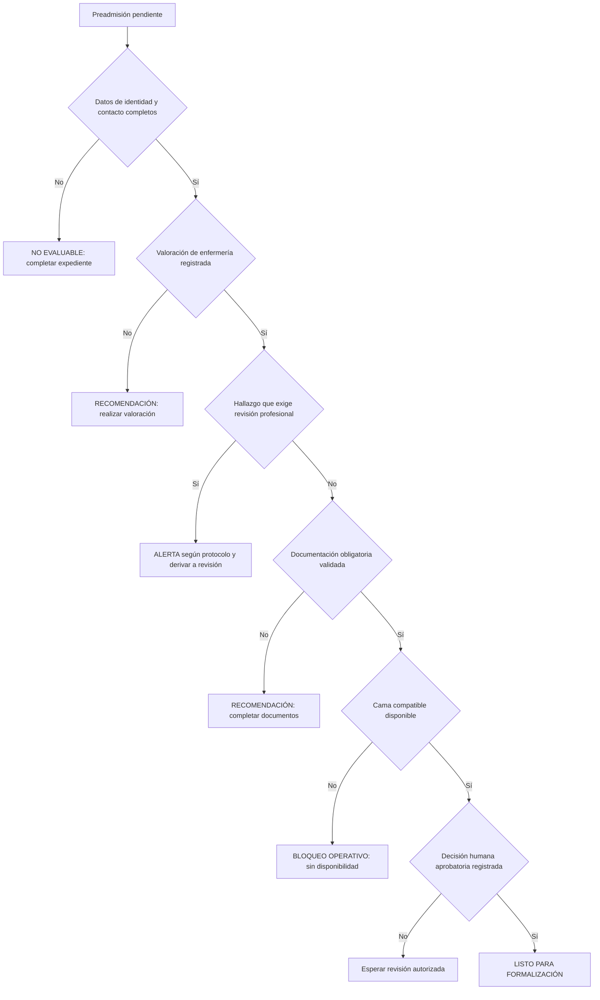

**Subreglas:** documentación incompleta, valoración ausente, dolor o riesgo informado, incompatibilidad cama/ocupación, ausencia de consentimiento y duplicidad de identidad.

---

## 5. Medicina general y geriatría

### Árbol `MED-REV-001` — Necesidad de revisión médica

**Objetivo:** priorizar residentes que necesitan valoración médica utilizando información ya registrada, sin generar diagnósticos.

**Entradas:** `signos_vitales`, `valoraciones_dolor`, `incidentes`, `diagnosticos`, `alergias`, `estudios_clinicos`, `resultados_estudio`, `informes_estudio`, `indicaciones_clinicas`, `prescripciones`, `notas_clinicas`, `derivaciones`.

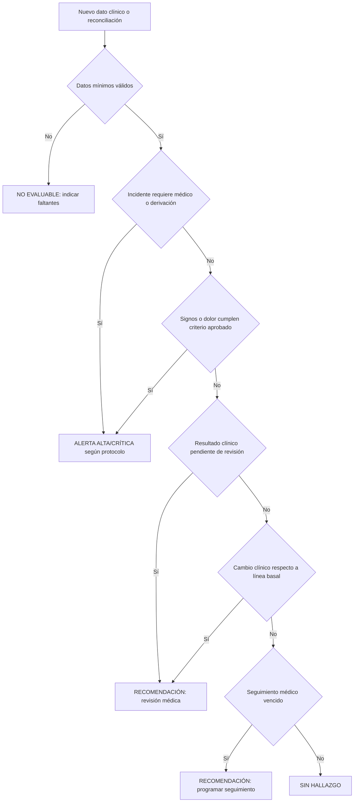

**Subreglas:** deterioro de signos, dolor persistente, resultado crítico informado, incidente con requerimiento médico, derivación pendiente, revisión de diagnóstico y control posterior a cambio terapéutico.

**Prohibiciones:** no inferir diagnósticos desde texto libre; no generar ni suspender prescripciones; no interpretar estudios sin criterios aprobados.

---

## 6. Enfermería

### Árbol `ENF-VIG-001` — Vigilancia integral por turno

**Objetivo:** detectar riesgos de cuidado inmediato durante la jornada asignada.

**Entradas:** `jornadas`, `asignaciones_personal`, `asignaciones_residente_jornada`, `signos_vitales`, `registros_ingesta`, `registros_hidratacion`, `registros_eliminacion`, `registros_sueno`, `registros_conductuales`, `registros_movilidad`, `heridas`, `curaciones_herida`, `ejecuciones_cuidado`, `pases_turno`.

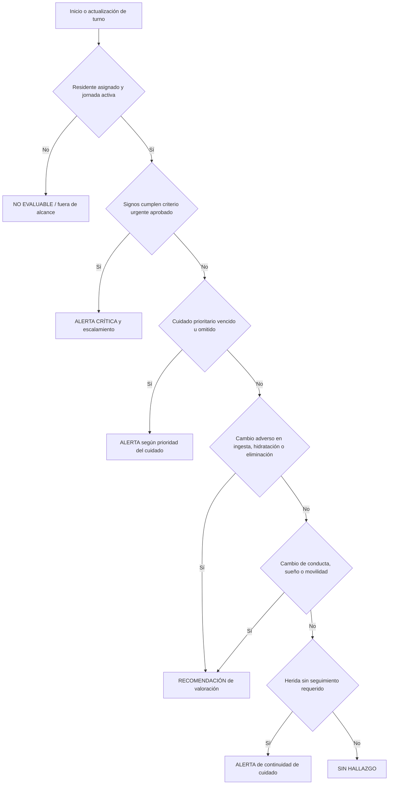

**Subreglas:** control requerido ausente, tendencia de signos, cuidado omitido, balance insuficiente, cambio de eliminación, alteración conductual, curación pendiente, pase de turno incompleto y residente sin cobertura de jornada.

---

## 7. Seguridad de medicación

### Árbol `MEDIC-SEG-001` — Dosis programada, administración y reacción

**Objetivo:** diferenciar dosis futura, administrada, omitida, vencida, rechazada o asociada a una reacción documentada.

**Entradas:** `medicamentos`, `prescripciones`, `horarios_prescripcion`, `administraciones_medicacion`, `alergias`, `indicaciones_clinicas`, `jornadas`.

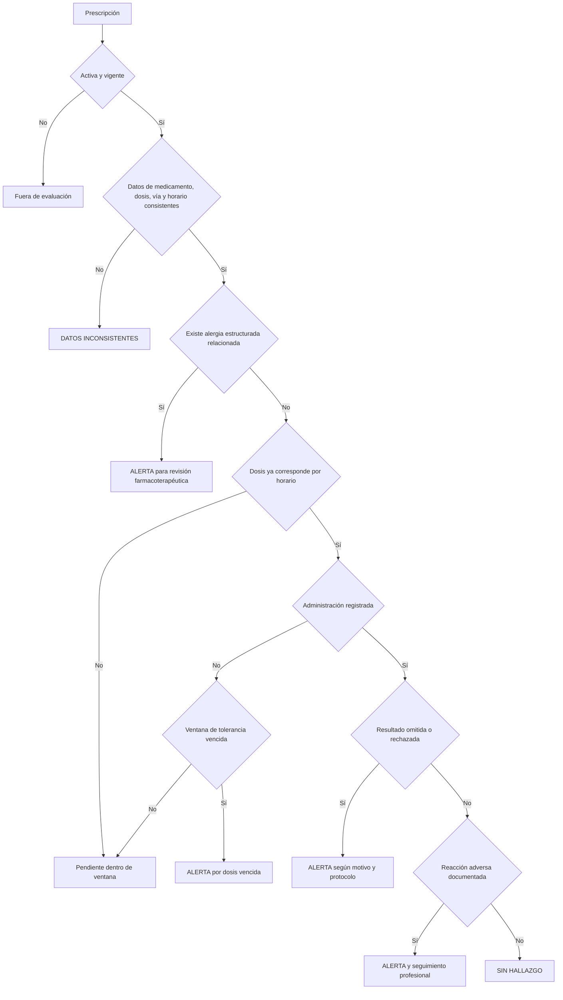

**Subreglas:** prescripción incompleta, posible alergia, dosis vencida, omisiones repetidas, reacción adversa, transición de ingreso y conciliación. Las reglas no deben usar coincidencia libre de nombres como única prueba de alergia; se requiere normalización o revisión humana.

---

## 8. Nutrición

### Árbol `NUT-RIE-001` — Riesgo nutricional y necesidad de intervención

**Objetivo:** detectar ausencia de valoración, deterioro antropométrico, ingesta insuficiente o problemas de deglución.

**Entradas:** `valoraciones_nutricionales`, `mediciones_antropometricas`, `registros_ingesta`, `registros_hidratacion`, `registros_eliminacion`, `alergias`, `diagnosticos`, `indicaciones_clinicas`, `planes_cuidado`.

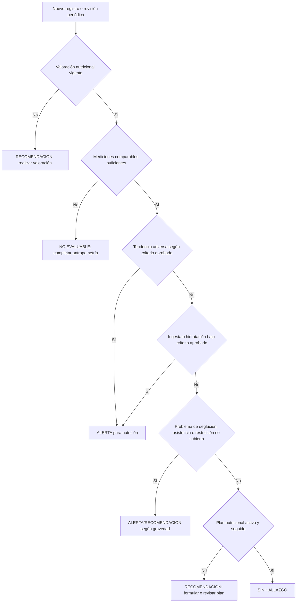

**Subreglas:** valoración vencida, cambio de peso, riesgo de desnutrición, baja ingesta persistente, hidratación insuficiente, dificultad de deglución, restricción/alergia y plan no ejecutado.

---

## 9. Fisioterapia y funcionalidad

### Árbol `FIS-MOV-001` — Movilidad, dependencia y riesgo de caída

**Objetivo:** identificar necesidad de evaluación, intervención o escalamiento funcional.

**Entradas:** `valoraciones_funcionales`, `registros_movilidad`, `valoraciones_dolor`, `incidentes`, `dispositivos_clinicos`, `ejecuciones_cuidado`, `planes_cuidado`, `aplicaciones_instrumento`.

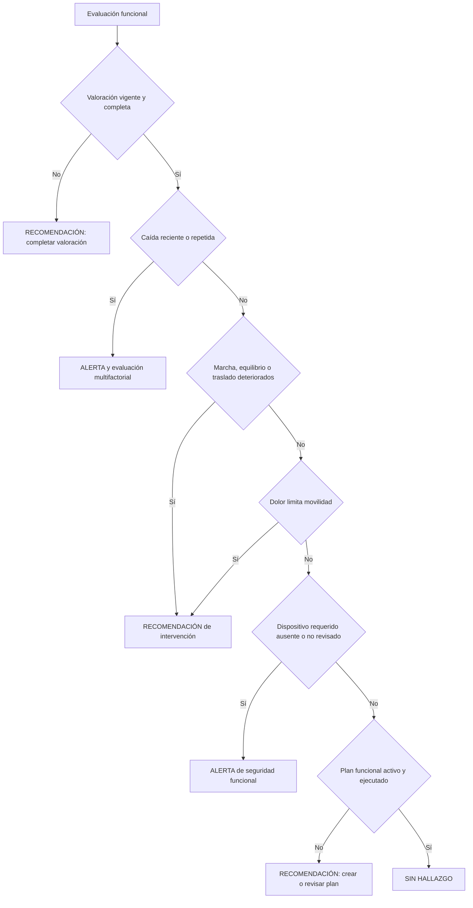

**Subreglas:** caída reciente, caídas recurrentes, deterioro funcional, asistencia insuficiente, dolor limitante, dispositivo pendiente y plan sin ejecución. El flujo recomendado sigue el principio de detectar, evaluar e intervenir, sujeto a adaptación institucional.

---

## 10. Psicología, cognición, conducta y sueño

### Árbol `PSI-CAM-001` — Cambio psicológico o conductual relevante

**Objetivo:** detectar cambios estructurados que requieren evaluación psicológica o interdisciplinaria.

**Entradas:** `valoraciones_psicologicas`, `controles_cognitivos`, `registros_conductuales`, `registros_sueno`, `aplicaciones_instrumento`, `notas_clinicas`, `incidentes`, `planes_cuidado`.

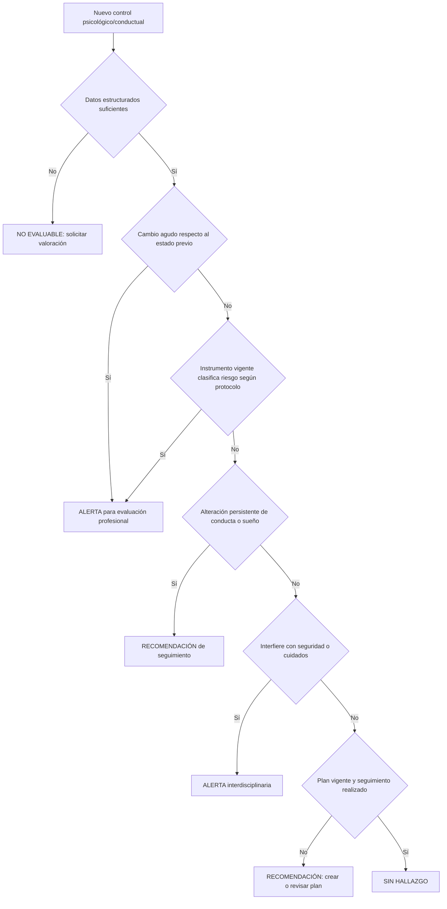

**Subreglas:** cambio cognitivo, agitación, agresividad, aislamiento, alteración del sueño, instrumento con clasificación relevante y seguimiento vencido.

**Límite:** el texto libre no debe usarse para inferir ideación autolesiva ni diagnósticos. Si el sistema necesita evaluar riesgos de seguridad psicológica, debe incorporarse una valoración estructurada aprobada y un protocolo de respuesta específico.

---

## 11. Pedagogía y participación

### Árbol `PED-PAR-001` — Participación y adecuación de actividades

**Objetivo:** detectar baja participación, falta de seguimiento o necesidad de adaptación pedagógica.

**Entradas:** `seguimientos_pedagogicos`, `actividades`, `participantes_actividad`, `controles_cognitivos`, `registros_conductuales`, `planes_cuidado`, `indicaciones_clinicas`.

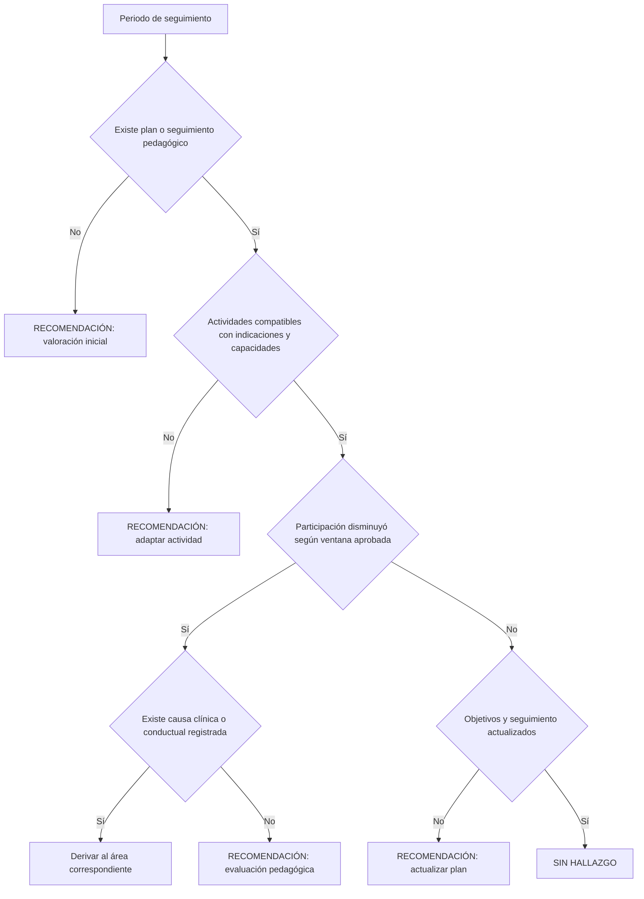

**Subreglas:** ausencia de plan, baja participación, actividad incompatible, cambio cognitivo que exige adaptación, objetivo sin seguimiento y necesidad de coordinación interdisciplinaria.

---

## 12. Planes de cuidado interdisciplinarios

### Árbol `PLAN-CUM-001` — Vigencia y cumplimiento del plan

**Objetivo:** comprobar que un riesgo identificado tenga intervención, programación, ejecución y revisión.

**Entradas:** `planes_cuidado`, `intervenciones_cuidado`, `programaciones_cuidado`, `ejecuciones_cuidado`, `alertas`, `eventos_alerta`, valoraciones del área propietaria.

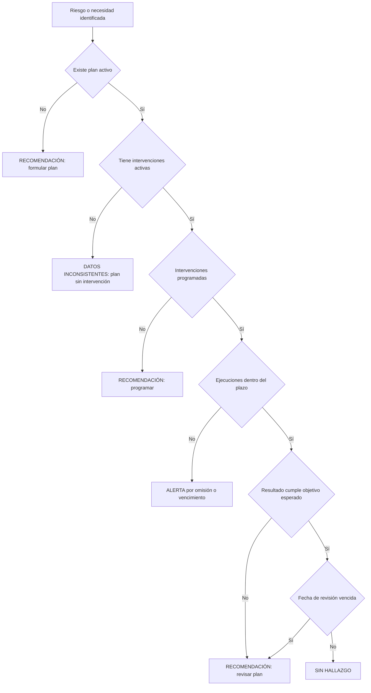

**Subreglas:** riesgo sin plan, plan sin intervención, programación ausente, ejecución omitida, objetivo no alcanzado y revisión vencida.

---

## 13. Incidentes y alertas

### Árbol `INC-ESC-001` — Escalamiento y seguimiento de incidentes

**Objetivo:** asegurar respuesta, asignación y cierre trazable del incidente.

**Entradas:** `incidentes`, `alertas`, `eventos_alerta`, `jornadas`, `asignaciones_residente_jornada`, `atenciones`, `derivaciones`.

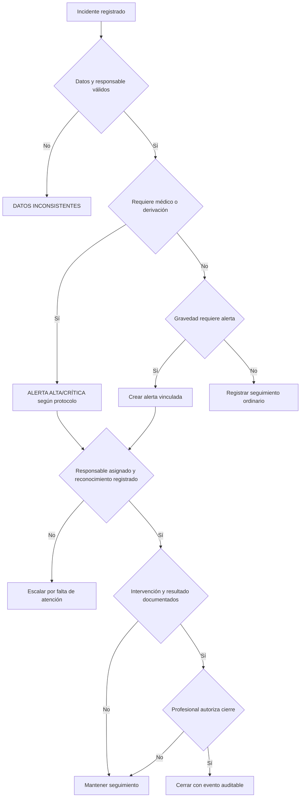

**Subreglas:** incidente sin alerta correspondiente, alerta sin responsable, reconocimiento vencido, intervención pendiente, derivación no cerrada y cierre sin evidencia.

---

## 14. Administración y operación institucional

### Árbol `OPE-COB-001` — Cobertura operativa y consistencia institucional

**Objetivo:** detectar problemas de cama, jornada, personal o asignación. No emite decisiones clínicas.

**Entradas:** `habitaciones`, `camas`, `ocupaciones_cama`, `turnos`, `jornadas`, `asignaciones_personal`, `asignaciones_residente_jornada`, `personal`, `areas`, `documentos`.

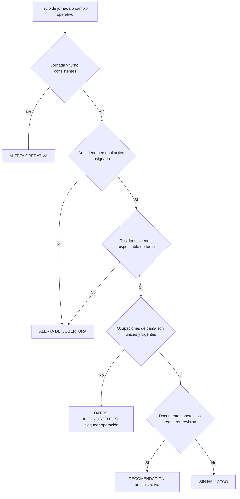

**Subreglas:** jornada duplicada, área sin cobertura, residente sin asignación, cama con ocupación conflictiva, personal inactivo asignado y documento próximo a revisión según política institucional.

---

## 15. Familia, contactos y visitas

### Árbol `FAM-ACC-001` — Acceso y participación autorizada

**Objetivo:** garantizar que familiares y contactos solo accedan o actúen dentro de la relación y autorización registradas.

**Entradas:** `contactos`, `residentes_contactos`, `consentimientos`, `visitas`, `documentos`, usuarios y permisos.

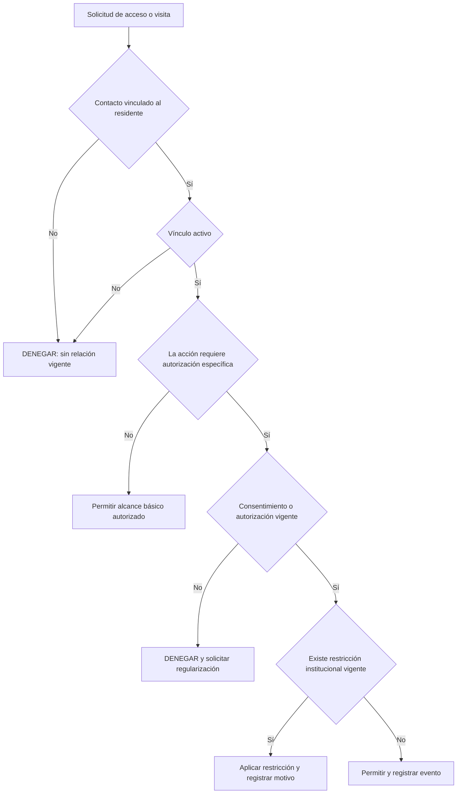

**Subreglas:** contacto no vinculado, vínculo inactivo, acceso clínico no autorizado, visita sin autorización, consentimiento ausente y contacto de emergencia faltante.

---

## 16. Matriz de propietarios y destinatarios

| Familia de reglas | Propietario que aprueba | Destinatario principal |
|---|---|---|
| Preadmisión/admisión | Dirección + Enfermería + Administración | Administración/admisiones |
| Revisión médica | Médico responsable | Medicina |
| Vigilancia por turno | Jefatura de enfermería | Enfermería |
| Medicación | Medicina + Enfermería | Médico/enfermería según evento |
| Nutrición | Nutricionista | Nutrición y enfermería |
| Movilidad/caídas | Fisioterapia + Medicina + Enfermería | Fisioterapia/enfermería |
| Psicología/conducta | Psicología + Medicina | Psicología/equipo clínico |
| Pedagogía | Pedagogía | Pedagogía/equipo interdisciplinario |
| Planes de cuidado | Área propietaria + Enfermería | Área propietaria |
| Incidentes/alertas | Dirección clínica + Enfermería | Responsable asignado |
| Operación institucional | Administración | Administración |
| Familia/visitas | Administración + responsable de privacidad | Administración/contacto |

## 17. Orden recomendado de implementación

### Ola 1 — Seguridad inmediata

1. `MEDIC-SEG-001` — medicación.
2. `ENF-VIG-001` — vigilancia de enfermería.
3. `INC-ESC-001` — incidentes y escalamiento.
4. `FIS-MOV-001` — caída y movilidad.
5. `PLAN-CUM-001` — cuidados omitidos.

### Ola 2 — Seguimiento clínico

6. `MED-REV-001` — revisión médica.
7. `NUT-RIE-001` — nutrición e hidratación.
8. `PSI-CAM-001` — cognición, conducta y sueño.

### Ola 3 — Institucional e interdisciplinaria

9. `ADM-ING-001` — preadmisión/admisión.
10. `OPE-COB-001` — cobertura operativa.
11. `PED-PAR-001` — pedagogía y participación.
12. `FAM-ACC-001` — familia, autorizaciones y visitas.

## 18. Pruebas mínimas por árbol

Cada regla debe tener:

- caso positivo;
- caso negativo;
- dato requerido ausente;
- dato inválido o contradictorio;
- valor exactamente en el límite;
- evento fuera de la ventana temporal;
- reejecución idempotente;
- nueva evidencia que cambia el resultado;
- compatibilidad PostgreSQL y SQLite;
- autorización por rol;
- persistencia de evidencia;
- validación o descarte profesional;
- prueba de que no modifica datos clínicos fuente.

## 19. Validación antes de producción

1. Revisión técnica de las fuentes y consultas.
2. Revisión clínica de cada decisión y exclusión.
3. Aprobación formal de versión.
4. Ejecución en modo sombra.
5. Comparación con revisión humana.
6. Análisis de alertas innecesarias y omisiones.
7. Ajuste mediante nueva versión, nunca sobrescritura.
8. Piloto limitado por área.
9. Monitoreo continuo de aceptación, descarte, tiempo de respuesta y resultados.

## 20. Referencias marco

- WHO, *Integrated care for older people (ICOPE): guidance for person-centred assessment and pathways in primary care*, 2.ª ed.: https://www.who.int/publications/i/item/9789240103726
- WHO, *Medication Without Harm*: https://www.who.int/initiatives/medication-without-harm
- CDC, *STEADI — Older Adult Fall Prevention*: https://www.cdc.gov/steadi/
- FDA, *Clinical Decision Support Software*: https://www.fda.gov/regulatory-information/search-fda-guidance-documents/clinical-decision-support-software
- WHO, *Ethics and governance of artificial intelligence for health*: https://www.who.int/publications/i/item/9789240029200
- HL7, *CDS Hooks 2.0*: https://cds-hooks.hl7.org/2.0/

Estas referencias son marcos de diseño y candidatos para la gobernanza. No sustituyen la adaptación al contexto institucional, la revisión clínica ni la evaluación regulatoria aplicable.
