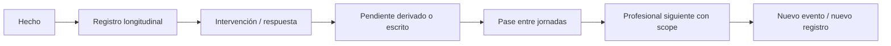

# Continuidad asistencial

Fase 2 fue revisión estática sobre el commit base y cambios previos. Fase 3 ejecutó pruebas/BDD acotadas según TRAZABILIDAD. Metadatos identifican esa base y no certifican runtime global; CURRENT no aprueba reglas nuevas.

## Contrato y modelo conceptual

**APPROVED CONTRACT:** nuevo evento clínico → nuevo registro con residente/autor/fecha/contexto. El siguiente profesional consulta historia autorizada y pase; el resumen no reemplaza la fuente ni certifica que todas las obligaciones se ejecutaron. [AGENTS.md](../../AGENTS.md), [baseline](../../docs/base-de-datos/REMEMBERMIND_BDD_BASELINE_CONGELADO.md).

| Categoría | Significado / origen | Persistencia / lector |
|---|---|---|
| Dato histórico | Medición/administración/observación ya documentada | Tablas clínicas; expediente e historial con permiso/relación |
| Dato pendiente | Ocurrencia programada sin ejecución o texto de pendiente | Agenda deriva ausencia de administración; pase guarda texto. No toda ausencia es fila PENDIENTE |
| Alerta activa | Condición con estado/origen y eventos | alertas + eventos_alerta; lector debe incluir estados activos pertinentes |
| Acción futura | Prescripción/horario o programación de intervención | planes/intervenciones/programaciones y prescripciones/horarios; no crear nueva entidad tarea |
| Resumen de continuidad | Selección del profesional sobre hechos/pendientes/vigilancia/recomendación | pases_turno; no reemplaza autoría ni registros fuente |

## Orígenes, lectores y contexto

| Origen | Producción observada | Lectores / permiso contextual | Transferencia |
|---|---|---|---|
| Jornadas/asignaciones_personal | Turno por fecha y plaza/área/profesional | Gestión institucional; personal propio para contexto clínico | No equivalen a asignación de cada residente |
| asignaciones_residente_jornada | Relación residente-profesional-jornada | Enfermería asignada; lectura global SA según recurso | Pase resuelve emisor/receptor y siguiente jornada existente |
| Signos/dolor/registros | Actions/Services/Controllers nuevos eventos | Profesional con permiso; Enfermería asignada | Histórico, basal reciente o último dato; filtros de validez no uniformes |
| Medicación | Orden médica + horarios; administración/omisión propia | Enfermería con orden activa y jornada, médico lectura/seguimiento | Agenda calcula pendientes; Pase distingue resultado/estado y omisión real (corrección Fase 3) |
| Planes/ejecuciones | Planificar distinto de ejecutar | Profesión/permiso para plan; Enfermería ejecución | Proyección de resultados no uniforme; no bandeja universal |
| Incidentes/heridas | Incidente y acciones; herida/curaciones | Enfermería contextual y profesionales permitidos | Abiertos/seguimiento, últimos registros; alertas asociadas |
| Alertas | Manual/detección y eventos | Permiso por acción, scope según entrada | MiTurno y Pase incluyen RECONOCIDA/ASIGNADA tras corrección Fase 3 |
| Pase | Panel borrador/entrega/recepción | Emisor/receptor legítimos; permisos/cuenta/jornada exacta revalidados Fase 3 | Campos textuales con fecha de recepción; no ejecución automática de pendientes |

Fuentes: [MiTurno](../../app/Backend/Modulos/Enfermeria/Servicios/MiTurnoService.php), [Pase](../../app/Backend/Modulos/Enfermeria/Servicios/PaseTurnoService.php), [Agenda](../../app/Backend/Modulos/Medicacion/Servicios/AgendaMedicacionService.php), [Contexto](../../app/Backend/Modulos/Enfermeria/Servicios/TurnoEnfermeriaService.php), [Autorización](../../docs/seguridad/MODELO_AUTORIZACION.md).

## Longitudinalidad por entidad

**OBSERVED IMPLEMENTATION:** entidades separadas y entradas de creación; no una guardia universal contra update. Baseline/AGENTS exige preservar historia. Corrección por entidad debe investigarse antes de editar; no se normalizan mecanismos diferentes.

| Tabla | Model / fuente | Dato longitudinal y límite |
|---|---|---|
| signos_vitales | [SignoVital](../../app/Models/SignoVital.php) | Fecha clínica y siete mediciones; Action agrega, rectificación preserva original |
| valoraciones_dolor | [ValoracionDolor](../../app/Models/ValoracionDolor.php) | Nuevo evento con intensidad/fecha/autor; no sustituir dolor anterior |
| mediciones_antropometricas | [MedicionAntropometrica](../../app/Models/MedicionAntropometrica.php) | Serie de peso/talla y fecha; no trasladar a signos |
| controles_cognitivos | [ControlCognitivo](../../app/Models/ControlCognitivo.php) | Observación longitudinal; no diagnóstico experto automático |
| registros_conductuales | [RegistroConductual](../../app/Models/RegistroConductual.php) | Conducta, intervención/respuesta por evento |
| registros_sueno | [RegistroSueno](../../app/Models/RegistroSueno.php) | Fecha y duración/observación; no inferir normal por ausencia |
| registros_ingesta | [RegistroIngesta](../../app/Models/RegistroIngesta.php) | Comida y consumo en jornada |
| registros_hidratacion | [RegistroHidratacion](../../app/Models/RegistroHidratacion.php) | Cantidad/unidad y jornada |
| registros_eliminacion | [RegistroEliminacion](../../app/Models/RegistroEliminacion.php) | Tipo/característica y jornada |
| registros_movilidad | [RegistroMovilidad](../../app/Models/RegistroMovilidad.php) | Marcha/apoyos/traslado en contexto |
| aplicaciones_instrumento | [AplicacionInstrumento](../../app/Models/AplicacionInstrumento.php) | Instrumento y respuestas de la aplicación; nueva aplicación no altera anterior |
| valoraciones_psicologicas | [ValoracionPsicologica](../../app/Models/ValoracionPsicologica.php) | Profesional y atención propios; valoración nueva |
| valoraciones_nutricionales | [ValoracionNutricional](../../app/Models/ValoracionNutricional.php) | Profesional y medición vinculados; valoración nueva |
| valoraciones_funcionales | [ValoracionFuncional](../../app/Models/ValoracionFuncional.php) | Autoría/atención y contenido funcional |
| seguimientos_pedagogicos | [SeguimientoPedagogico](../../app/Models/SeguimientoPedagogico.php) | Registro propio con fecha, conclusión/recomendación |

Entradas concretas: [registrar/definiciones](../../app/Http/Controllers/Cuidados/CuidadoController.php), [valoración profesional](../../app/Http/Controllers/Valoraciones/ValoracionProfesionalController.php), [aplicar](../../app/Http/Controllers/Instrumentos/InstrumentoController.php). **TESTED EXPECTATION:** TEST-CLI-001/INS-001 y tests por módulo, sin ejecución.

## Corrección y cierre observados

| Entidad | Mecanismo | Límite |
|---|---|---|
| Signos | Rectificación marca original RECTIFICADO y crea nuevo ACTIVO | Conserva mediciones; motivo en observación, sin FK de compensación nueva ni reevaluación de alerta en método |
| Prescripción | Suspensión con motivo, autor y fecha | Conserva administraciones; Enfermería no cambia la orden |
| Alerta | Seguimiento/eventos, cierre/anulación por entrada | Evento inicial manual y automático agregado en transacción Fase 3; no borrar trayectoria |
| Incidente | Append texto en observación al seguir/cerrar | No tabla de eventos nueva; granularidad de cada autor no equivalente a EventoAlerta |
| Herida | Curaciones separadas y cierre lógico | Catálogo final pendiente DEC-OPEN-002 |
| Pase | Entrega y recepción con timestamps; anulación lógica | Anulación revalida emisor/permiso/ARJ y conserva observación de recepción (Fase 3) |
| Objetivos individuales | Nueva versión REEMPLAZADO, retiro ANULADO | Decisión V2.2; historial y autor propio |
| Models operativos | ModeloOperativo::boot veta delete de instancia | No bloquea todo SQL/Query Builder; INV-CLI-003 PARTIAL |

Fuentes: [app/Backend/Modulos/Clinica/Servicios/SignosVitalesService.php](../../app/Backend/Modulos/Clinica/Servicios/SignosVitalesService.php), [app/Backend/Modulos/Enfermeria/Servicios/IncidentesEnfermeriaService.php](../../app/Backend/Modulos/Enfermeria/Servicios/IncidentesEnfermeriaService.php), [app/Backend/Modulos/Enfermeria/Servicios/LesionesEnfermeriaService.php](../../app/Backend/Modulos/Enfermeria/Servicios/LesionesEnfermeriaService.php), [app/Models/ModeloOperativo.php](../../app/Models/ModeloOperativo.php), [V2.2](../../docs/base-de-datos/DECISION_OBJETIVOS_SIGNOS_VITALES_V2_2.md).

## Hallazgo histórico Fase 2 — TECH-008 (corregido en Fase 3)

**Contrato:** hechos y pendientes relevantes deben sobrevivir a la jornada y conservar significado de resultado/estado.
**Observado:** obtenerContextoClinicoResidente filtra administración por estado ADMINISTRADA o PENDIENTE/OMITIDA, pero registrarProgramada escribe estado REGISTRADA y resultado ADMINISTRADA/OMITIDA. Agenda deriva pendientes desde horarios sin registro; pendientes() del pase no incluye medicación. Cuidado HTTP escribe EJECUTADA y Pase busca REALIZADA. Alertas RECONOCIDA/ASIGNADA no entran en el filtro de Pase.
**Impacto/riesgo:** proyección puede omitir hechos o pendientes; no se confirmó un incidente real.
**Archivo:** PaseTurnoService::obtenerContextoClinicoResidente/pendientes, RegistrarAdministracionMedicacionService y CuidadoController::ejecutar.
**Test:** tests de pase/ciclo definidos no acreditan equivalencia completa de datos clínicos. Tests específicos de esta proyección NOT_FOUND en el mapeo.
**Acción futura:** corregir filtros/consumidores conforme contratos actuales y comprobar proyección por entrada/fecha; no añadir tabla/bandeja ni usar ausencia de datos como estabilidad.

[TECH-008/009](../../docs/DEUDA_TECNICA.md) y [contrato de pase](../../docs/modulos/pase-turno/README.md). El campo pendientes es TEXT; una entrada generar serializa JSON dentro de ese texto por compatibilidad. No se propone JSON/EAV nuevo ni se afirma una bandeja estructurada implementada.

## Evidencia Fase 3 — lote D

TECH-008 / FLOW-PAS-001 / INV-MED-001 / INV-ALT-001: PaseTurnoService proyecta administraciones mediante resultado y estado del registro, distingue omisión documentada de ausencia, y deriva pendientes/vencidas desde AgendaMedicacionService. No crea administraciones ficticias ni una tabla de pendientes. Incluye cuidados EJECUTADA y REALIZADA, pendientes previos aún abiertos y alertas RECONOCIDA/ASIGNADA; conserva incidentes, heridas e historia reciente en sus fuentes. Resumen manual del pase conserva su semántica. Último signo del contexto excluye anulados/rectificados.

PostgreSQL aislado: 46 tests / 203 aserciones PASS, 13.310 s (PaseTurnoReconstruidoTest, AgendaMedicacionTest, MiTurnoServiceTest). Dos casos de proyección dieron RED antes de corregir; escritor real de administración registra ADMINISTRADA/OMITIDA con REGISTRADA y la lectura no cambia sus filas. Semántica global de estados DEC-OPEN-001/002 y PRN/reintentos DEC-OPEN-004 permanecen abiertas. runtime_verified: false no certifica todo el módulo; resultados acotados en [trazabilidad](../TRAZABILIDAD.md). Sin commit.

## Auditoría de navegación de Enfermería — 2026-10-07

Orden aprobado: Mi turno → Mis residentes → Cuidados → Medicación → Alertas → Incidentes → Pase de turno. Es orden de navegación; no impone prerrequisitos para atender una alerta o un incidente.

| Acceso de Cuidados | Capacidad existente y continuidad |
|---|---|
| Signos | Directorio asignado → registro rápido → último signo vigente en pase |
| Dolor | Directorio asignado → valoración rápida → intensidad canónica en pase |
| Cognición | Residente seleccionado → seguimiento diario completo → último control vigente en pase; observación, no diagnóstico |
| Conducta | Residente seleccionado → seguimiento diario completo → descripción guardada en pase |
| Sueño | Residente seleccionado → registros de sueño; consulta individual si falta permiso de crear → calidad guardada en pase |
| Ingesta | Directorio asignado → registro rápido → porcentaje guardado en pase |
| Hidratación | Residente seleccionado → historial y registro existente → cantidad_ml en pase |
| Eliminación | Directorio asignado → registro rápido → tipo guardado en pase |
| Movilidad | Directorio asignado → registro rápido → marcha guardada en pase |
| Heridas | Residente seleccionado → heridas activas y curaciones existentes → última curación en pase |

Se corrigieron: acceso deshabilitado a heridas/controles; omisión de Cognición en el lector del pase; Conducta/Movilidad consultadas pero no representadas; uso de escala_eva/volumen_ml en vez de intensidad/cantidad_ml; unidades añadidas a ausencia de datos; contador de alertas que omitía ASIGNADA/RECONOCIDA/PENDIENTE. RegistrosEnfermeria reautoriza el residente antes de renderizar, además de al mutar; crear curación exige curaciones_herida.crear y el contexto vigente. El cierre conserva su autorización existente atenciones.crear; no se inventa un permiso heridas.editar inexistente en el catálogo.

Límites: Cognición y Conducta reutilizan una captura diaria agrupada, no formularios independientes; el pase proyecta últimos hechos guardados, no una medición garantizada de la jornada. No se conectó el listado clínico global SaludSeguimientoListPanel a estos accesos: su alcance necesita una revisión independiente. Seis lecturas autorizadas expresamente por la propietaria constan en [matriz](../seguridad/MATRIZ_ROLES_PERMISOS.md). La aprobación no altera DEC-OPEN-001..006, metodología experta ni la BDD V2.1+V2.2. Evidencia automatizada y visual acotada en [trazabilidad](../TRAZABILIDAD.md).
