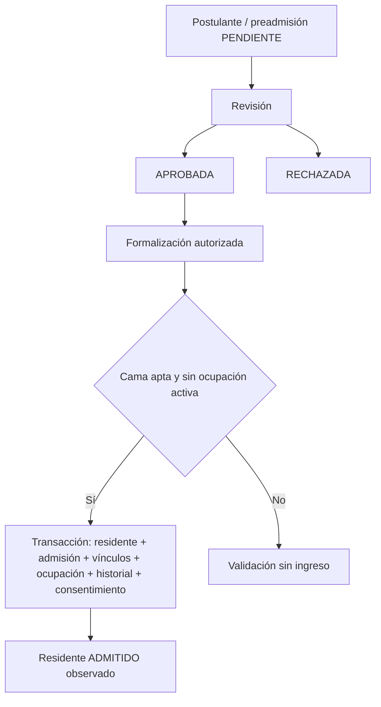
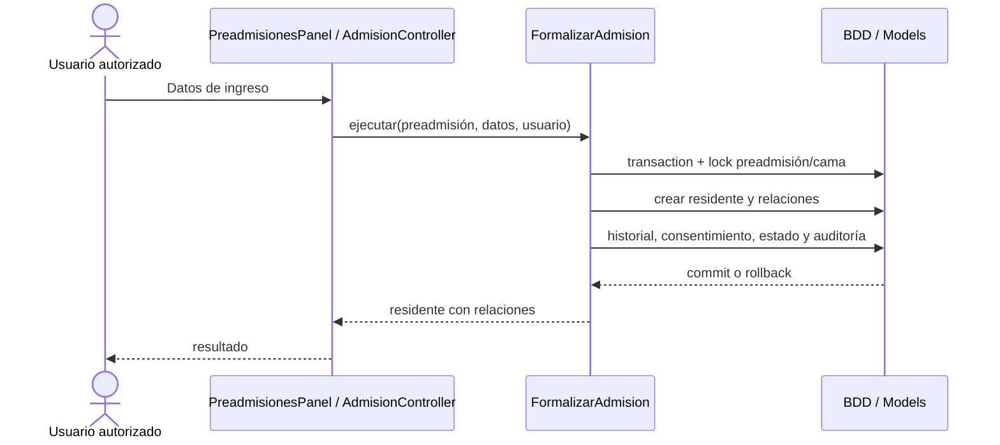
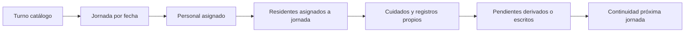
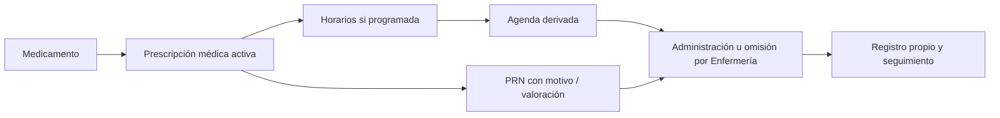
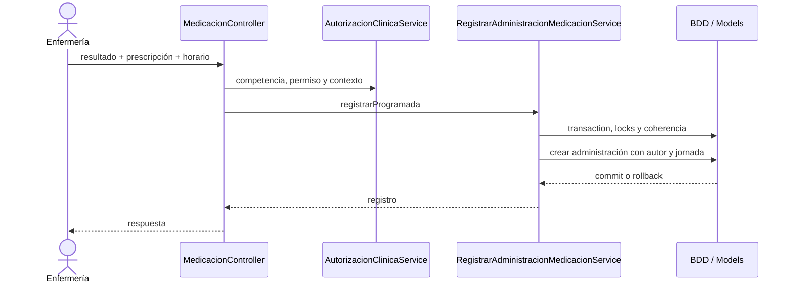
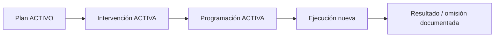
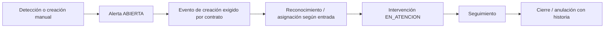
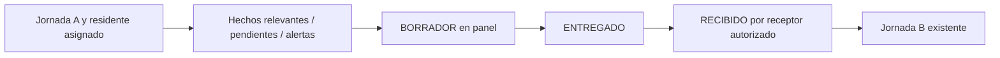
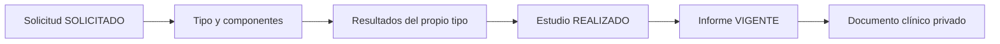
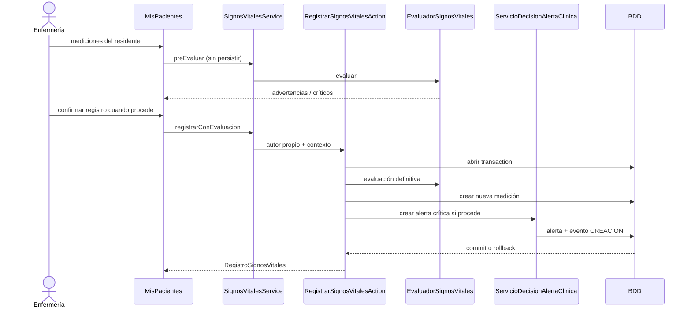

# Flujos geriátricos

Revisión estática del commit base y del árbol de trabajo con cambios previos sin commit. No se ejecutaron migraciones, seed, suites, build ni una BDD real. CURRENT identifica esta compilación vigente; no aprueba reglas nuevas. `verified_against_commit` no certifica runtime.

Autoridad: [instrucciones institucionales](../../AGENTS.md), [baseline V2.1](../../docs/base-de-datos/REMEMBERMIND_BDD_BASELINE_CONGELADO.md), [diccionario](../../docs/base-de-datos/REMEMBERMIND_BDD_70_TABLAS.md), [decisión V2.2](../../docs/base-de-datos/DECISION_OBJETIVOS_SIGNOS_VITALES_V2_2.md) y [roles aprobados](../../docs/arquitectura/REMEMBERMIND_ROLES_BASELINE_CONGELADO.md). Estructura declarada: 70 tablas núcleo + extensión aprobada = 71; evidencia estática, no esquema instalado comprobado.

Los diagramas distinguen **APPROVED CONTRACT** de trayectorias **OBSERVED IMPLEMENTATION**. Las ramas con deuda no son flujos autorizados nuevos. TESTED EXPECTATION significa test definido, sin ejecución. [Cobertura](../../docs/TRAZABILIDAD.md).

## FLOW-ADM-001 — Ingreso

| Actor / precondición | Inicial / operación | Transacción / entidades | Errores / rollback / final |
|---|---|---|---|
| Administración autorizada; preadmisión aprobada, cama válida, contacto/consentimiento coherente | PENDIENTE → revisión APROBADA/RECHAZADA; aprobar no crea residente | FormalizarAdmision: lock preadmisión/cama; residente, admisión, contacto cuando procede, vínculo, ocupación, historial, consentimiento, seguro opcional, activity | Ocupada/ya admitida/no aprobada: rechazo. Fallo SQL revierte operaciones en transaction. ADMITIDO en Action; ACTIVO en baseline físico: CONFLICT DEC-OPEN-001 |

[Revisión](../../app/Http/Controllers/Admisiones/PreadmisionController.php), [Formalización](../../app/Backend/Modulos/Admisiones/Acciones/FormalizarAdmision.php). DecisionAdmisionModal sobre residente existente es entrada heredada con PENDIENTE_ASIGNACION/DERIVADO, no sustituto canónico.

No se dibuja una Policy de admisión inexistente. Los controles de entrada no están dentro de la Action.

## FLOW-JOR-001 — Jornada y asignaciones

| Actor / precondición | Inicial / operación | Transacción / entidades | Errores / rollback / final |
|---|---|---|---|
| Gerente planifica; Administrador opera; Enfermería actúa sobre asignados y jornada aplicable | Contrato/contexto clínico requiere turno/jornada aplicables; ABIERTA HTTP / ACTIVA en panel | InstitucionalController crea jornada y asignación laboral sin transaction conjunta; panel asigna plaza en transaction; CuidadoController::asignarJornada bloquea jornada para asignación de residente | Panel/ARJ/contexto clínico deniegan personal inactivo o jornada/relación inválida cuando los comprueban. InstitucionalController::abrirJornada solo valida turno existente/fecha; asignarPersonal valida exists personal/área sin revalidar estados/vigencia. Rollback solo en boundaries observados; asignación ACTIVA |

[app/Http/Controllers/Identidad/InstitucionalController.php](../../app/Http/Controllers/Identidad/InstitucionalController.php), [app/Frontend/Livewire/Administracion/Identidad/TurnosAsignacionesPanel.php](../../app/Frontend/Livewire/Administracion/Identidad/TurnosAsignacionesPanel.php), [app/Http/Controllers/Cuidados/CuidadoController.php](../../app/Http/Controllers/Cuidados/CuidadoController.php), [app/Backend/Modulos/Enfermeria/Servicios/TurnoEnfermeriaService.php](../../app/Backend/Modulos/Enfermeria/Servicios/TurnoEnfermeriaService.php). Cierre administrativo integral de jornada: NOT VERIFIED en estos segmentos; no inventar transición.

## FLOW-MED-001 — Medicación

| Actor / precondición | Inicial / operación | Transacción / entidades | Errores / rollback / final |
|---|---|---|---|
| Médico prescribe con competencia/permiso/atención del residente. Enfermería administra con contexto propio | Prescripción ACTIVA; horario ACTIVO o PRN sin horario | Prescripción + horarios transaction; administración programada transaction y locks; PRN create sin transaction propia observada | Orden suspendida, residente/horario ajeno, duplicado o ausencia de jornada: rechazo. Omisión con motivo; administración resultado ADMINISTRADA/OMITIDA y estado REGISTRADA. Reintentos PRN DEC-OPEN-004 |

[app/Http/Controllers/Medicacion/MedicacionController.php](../../app/Http/Controllers/Medicacion/MedicacionController.php), [app/Backend/Modulos/Medicacion/Servicios/RegistrarAdministracionMedicacionService.php](../../app/Backend/Modulos/Medicacion/Servicios/RegistrarAdministracionMedicacionService.php). Administrar no altera la orden médica.

## FLOW-PLAN-001 — Plan de cuidado

Actores: profesional con permiso/área para planificar; Enfermería para ejecutar vía CuidadoController. Plan/intervención activos y jornada válida. Se crean registros separados; no se observa transaction única para todo el ciclo. HTTP ejecutar acepta PENDIENTE/EJECUTADA/OMITIDA/CANCELADA; exige motivo al omitir. Rollback de una secuencia completa no acreditado. Otros lectores buscan REALIZADA: **CONFLICT**, TECH-008. [app/Http/Controllers/Cuidados/CuidadoController.php](../../app/Http/Controllers/Cuidados/CuidadoController.php), [app/Models/EjecucionCuidado.php](../../app/Models/EjecucionCuidado.php). Catálogo definitivo DEC-OPEN-002.

## FLOW-ALT-001 — Alerta

**APPROVED CONTRACT:** conservar origen, autor, acciones y eventos. **OBSERVED IMPLEMENTATION:** Controller crea CREADA, decisión de signos CREACION; Panel/AlertasService manual no crea evento inicial. Panel asigna responsable sin cambiar a ASIGNADA; HTTP admite ese estado y RECONOCIDA/ATENDIDA. No son etapas obligatorias idénticas en todas las entradas. TECH-002.

Actor/contexto: Enfermería asignada para creación/intervención; Administración dispone de reconocimiento/asignación/seguimiento/cierre por permiso en HTTP. mutarActiva/transiciones bloquean y usan transaction; Panel creación simple sin evento/transaction multientidad. Cerrada/anulada: terminal en HTTP; Panel/Service solo mutan ABIERTA/EN_ATENCION. Fallo revierte evento+estado dentro de transaction cuando existe. [app/Http/Controllers/Alertas/AlertaController.php](../../app/Http/Controllers/Alertas/AlertaController.php), [app/Backend/Modulos/Alertas/Servicios/AlertasService.php](../../app/Backend/Modulos/Alertas/Servicios/AlertasService.php), [app/Frontend/Livewire/Compartido/Alertas/AlertasPanel.php](../../app/Frontend/Livewire/Compartido/Alertas/AlertasPanel.php).

## FLOW-PAS-001 — Pase de turno

Panel/Service observado: resumen mínimo, resolución de receptor por residente cuando existe asignación entrante, jornada entrante ya planificada, procesarPase con transaction y protección contra edición tras entrega/recepción; confirmarRecepcion con lock. procesarPase permite cod_personal_entrante null; no exigir receptor previo como regla universal de esa entrada. **EXCEPTION:** generar exige otro enfermero activo y crea GENERADO sin transaction propia; HTTP crea EMITIDO con receptor opcional; anularPase actual no valida todas las condiciones. TECH-009.

Errores por entrada: jornada ausente, emisor sin asignación, resumen vacío o doble recepción; generar también rechaza receptor inválido. confirmarRecepcion exige receptor por designación o asignación entrante; ausencia de receptor previo no impide por sí sola procesarPase. Rollback solo en transaction observada. Estado final no ejecutado. La proyección de medicación/cuidados/alertas tiene gaps TECH-008; pase no garantiza hoy que cada pendiente haya sido transferido. [app/Backend/Modulos/Enfermeria/Servicios/PaseTurnoService.php](../../app/Backend/Modulos/Enfermeria/Servicios/PaseTurnoService.php), [app/Frontend/Livewire/Enfermeria/Cuidados/PaseTurnoPanel.php](../../app/Frontend/Livewire/Enfermeria/Cuidados/PaseTurnoPanel.php), [docs/sistema/CONTINUIDAD_ASISTENCIAL.md](../../docs/sistema/CONTINUIDAD_ASISTENCIAL.md).

## FLOW-EST-001 — Estudio clínico

Médico autorizado y atención del mismo residente. Componentes distintos, propios del tipo, sin duplicar resultado existente. Resultados + actualización REALIZADO en transaction; informe create no cambia automáticamente a INFORMADO. Archivo y metadata no comparten atomicidad SQL/almacenamiento; huérfanos NOT VERIFIED. Error por componente ajeno/duplicado/estado inválido; rollback de resultados observado. [app/Http/Controllers/Clinica/EstudioClinicoController.php](../../app/Http/Controllers/Clinica/EstudioClinicoController.php).

## Secuencia complementaria — Registrar signos

Fuentes: [app/Backend/Modulos/Clinica/Acciones/RegistrarSignosVitalesAction.php](../../app/Backend/Modulos/Clinica/Acciones/RegistrarSignosVitalesAction.php), [app/Backend/Modulos/Clinica/Servicios/SignosVitalesService.php](../../app/Backend/Modulos/Clinica/Servicios/SignosVitalesService.php), [app/Backend/Modulos/Clinica/SignosVitales/ServicioDecisionAlertaClinica.php](../../app/Backend/Modulos/Clinica/SignosVitales/ServicioDecisionAlertaClinica.php). No se inventa Policy específica de signos; control backend está en Action/Services.
