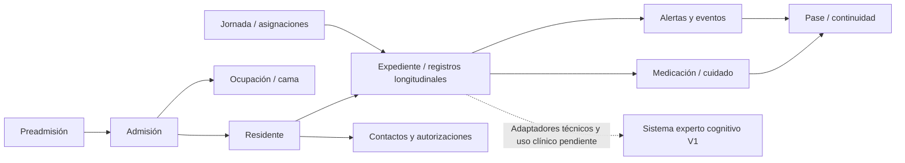

# Mapa funcional y límites de RememberMind

Mapa consolidado de Fase 2; sustituye el descubrimiento inicial de esta misma ruta, sin duplicar catálogo. Aquella fase describe el commit base y árbol de trabajo con cambios previos; no ejecutó migraciones, seed, suites, build ni BDD real. La actualización del 2026-10-08 enlaza la implementación y evidencia técnica del experto V1, sin certificar las otras áreas. CURRENT no declara módulos completos.

Fuentes **APPROVED CONTRACT**: [AGENTS.md](../../AGENTS.md), [baseline](../../docs/base-de-datos/REMEMBERMIND_BDD_BASELINE_CONGELADO.md), [diccionario](../../docs/base-de-datos/REMEMBERMIND_BDD_70_TABLAS.md), [V2.2](../../docs/base-de-datos/DECISION_OBJETIVOS_SIGNOS_VITALES_V2_2.md) y [roles](../../docs/arquitectura/REMEMBERMIND_ROLES_BASELINE_CONGELADO.md). Inventario 70+1=71 es evidencia estática, no BDD instalada verificada. [Terminología](../../docs/GLOSARIO_DOMINIO.md) diferencia postulante/residente/usuario/personal/contacto.

## Residente: entidad central de información

**CENTRAL DOMAIN ENTITY:** fuentes asistenciales referencian cod_residente directamente o a través de atención, prescripción, intervención/aplicación. **DDD AGGREGATE:** no se observa un aggregate único que encapsule toda la persistencia, transacciones e invariantes de esos dominios. Las raíces siguientes son anclas funcionales, no declaración de aggregate técnico implementado.

## Dominios: propósito y ownership

**OBSERVED IMPLEMENTATION** en entidades/salidas/clases; responsabilidades aprobadas se limitan a AGENTS/roles. Los nombres de clase heredados son localizadores, no nomenclatura para código nuevo.

| Dominio | Propósito | Raíz funcional / relacionadas | Actores / ownership | Fuente real |
|---|---|---|---|---|
| Identidad y acceso | Autenticar/autorizar | usuario / personal/contacto, roles/permisos | Gestión de cuentas autorizada; usuario es titular de sesión | [fuente](../../app/Models/User.php) |
| Personal | Organizar equipo | personal / areas/asignaciones_personal | Gerente gestiona; profesional conserva autoría propia | [fuente](../../app/Backend/Modulos/Identidad/Servicios/ContextoLaboralService.php) |
| Preadmisión | Revisar postulante | preadmisión / contacto, valoraciones de preadmisión | Revisor según permiso/entrada, responsabilidad institucional | [fuente](../../app/Http/Controllers/Admisiones/PreadmisionController.php) |
| Admisión | Formalizar ingreso | admisión / preadmisión/residente/vínculo/ocupación/consentimiento | Operador autorizado de ingreso | [fuente](../../app/Backend/Modulos/Admisiones/Acciones/FormalizarAdmision.php) |
| Residente | Identidad central residencial | residente / expediente/ocupaciones/contactos | Institución; lectura profesional/familiar por ámbito | [fuente](../../app/Models/Residente.php) |
| Alojamiento | Disponibilidad y ocupación | ocupación de cama / habitación/cama/admisión | Administración opera; planificación institucional | [fuente](../../app/Models/OcupacionCama.php) |
| Jornadas y asignaciones | Contexto por fecha/profesional | jornada / turno/asignación laboral/asistencial | Gerente planifica, Admin opera, Enfermería asignada actúa | [fuente](../../app/Backend/Modulos/Enfermeria/Servicios/TurnoEnfermeriaService.php) |
| Expediente clínico | Integrar fuentes longitudinales | residente como índice; atención como acto / notas/antecedentes/diagnósticos/alergias/derivaciones | Profesional con permiso y competencia; no ownership total del lector | [fuente](../../app/Models/Atencion.php) |
| Enfermería / cuidado continuo | Documentar cuidado de asignados | registro asistencial / signos/dolor/sueño/ingesta/hidratación/eliminación/movilidad/incidentes/heridas | Enfermería propia jornada/residente | [fuente](../../app/Http/Controllers/Cuidados/CuidadoController.php) |
| Medicación | Orden y administración separadas | prescripción; administración es otro registro / medicamento/horarios/administraciones | Médico ordena; Enfermería registra cuidado | [fuente](../../app/Http/Controllers/Medicacion/MedicacionController.php) |
| Estudios clínicos | Solicitar y conservar resultados | estudio / tipo/componentes/resultados/informe/documentación | Médico responsable y autor propio | [fuente](../../app/Http/Controllers/Clinica/EstudioClinicoController.php) |
| Planes de cuidado | Planificar distinto de ejecutar | plan / intervención/programación/ejecución | Profesión con permiso/área planifica; Enfermería ejecuta | [fuente](../../app/Models/PlanCuidado.php) |
| Instrumentos | Aplicar versión estructurada | aplicación / instrumento/preguntas/opciones/respuestas | Profesión aplicadora+permiso; derechos/método no inferidos | [fuente](../../app/Http/Controllers/Instrumentos/InstrumentoController.php) |
| Psicología | Valoración y seguimiento propio | valoración psicológica / atención/conducta/instrumentos | Psicología autor competente | [fuente](../../app/Http/Controllers/Valoraciones/ValoracionProfesionalController.php) |
| Nutrición | Valoración nutricional | valoración nutricional / medición/ingesta/hidratación/plan | Nutricionista con permiso/área | [fuente](../../app/Models/ValoracionNutricional.php) |
| Fisioterapia | Valorar función y movilidad | valoración funcional / movilidad/dolor/planes | Fisioterapeuta por competencia | [fuente](../../app/Models/ValoracionFuncional.php) |
| Pedagogía | Seguimiento y actividad por competencia | seguimiento pedagógico / atenciones/actividades/planes | Pedagogo con permiso propio | [fuente](../../app/Models/SeguimientoPedagogico.php) |
| Actividades | Planificar y registrar participación | actividad / participantes/residente/área/personal | Operador/profesional autorizado; autor propio | [fuente](../../app/Frontend/Livewire/Administracion/Actividades/ParticipacionPanel.php) |
| Visitas / contactos | Vínculos y acceso a información permitido | contacto/vínculo; visita separada / residentes_contactos/consentimientos/documentos | Administración gestiona; familiar vinculado lee contenido permitido | [fuente](../../app/Http/Controllers/Residentes/RelacionResidenteController.php) |
| Alertas | Condición y trayectoria asistencial | alerta / eventos/responsable/origen | Enfermería contextual; coordinación Admin por acción | [fuente](../../app/Http/Controllers/Alertas/AlertaController.php) |
| Auditoría | Trazar operación aprobada | actividad técnica de Activitylog / usuario/objeto de dominio | Sistema registra actor; no autoría clínica sustituta | [fuente](../../app/Backend/Modulos/Admisiones/Acciones/FormalizarAdmision.php) |
| Sistema experto cognitivo | Inferencia técnica versionada; activación clínica pendiente | Evaluación / evidencia / criterio / resultado / traza; 23 tablas separadas del núcleo operativo | Superadministrador consulta; validación profesional del conocimiento pendiente | [fuente](../../docs/sistema-experto/IMPLEMENTACION_V1.md) |

## Contratos de interacción

| Dominio | Entradas / salidas | Eventos relevantes | Dependencias |
|---|---|---|---|
| Identidad y acceso | correo/credenciales → sesión/denegación | Autenticación/reset; no evento clínico | Contexto laboral y seguridad |
| Personal | datos laborales/plaza → contexto de área/profesión | Asignar/desvincular laboral | Identidad, jornadas |
| Preadmisión | solicitud → APROBADA/RECHAZADA | Revisión con autor/fecha; no crea residente | Admisión |
| Admisión | aprobación+cama/contacto → residente formal | Historial y activity; atomicidad | Preadmisión, alojamiento, documentación |
| Residente | ingreso → entidad central/historia | Cambios institucionales en historial | Todas las fuentes asistenciales referencian residente directa/indirectamente |
| Alojamiento | cama apta + ingreso → ocupación | Asignación/liberación, detalle no completamente verificado | Admisión, residente |
| Jornadas y asignaciones | turno/fecha/personal → contexto real | Alta/reasignación laboral; cierre integral NOT VERIFIED | Personal, residente, cuidado/pase |
| Expediente clínico | acto/registros → consulta autorizada | Nuevos registros, corrección según módulo | Residente, personal/área, seguridad |
| Enfermería / cuidado continuo | observación/intervención → nuevo registro/continuidad | Medición, administración, ejecución | Jornadas, planes, medicación, alertas/pase |
| Medicación | orden/horario → agenda; acto → administración/omisión | Suspensión; nuevo evento asistencial | Atención, residente, jornadas |
| Estudios clínicos | solicitud → resultados/informe/archivo | Estudio REALIZADO tras resultados | Atención, clínica, documentos |
| Planes de cuidado | objetivo/indicación → programación; acto → ejecución | Nuevo resultado/omisión | Personal/área, residente, jornada |
| Instrumentos | respuestas propias → puntaje/registro | Aplicación COMPLETA | Clínica, profesional; adaptador experto exige componente, versión y método explícitos; COMPLETA/puntaje no bastan |
| Psicología | observación → valoración/recomendación | Nuevo registro, no motor diagnóstico autónomo | Expediente, instrumentos, cuidado |
| Nutrición | medición/observación → valoración/plan | Registro longitudinal | Expediente/antropometría/cuidados |
| Fisioterapia | observación → valoración/intervención | Evento clínico nuevo | Expediente/planes/jornada cuando aplica |
| Pedagogía | observación/programación → seguimiento/actividad | Nuevo seguimiento/asistencia | Expediente, actividades |
| Actividades | programación → participación/asistencia | Cancelación/conclusión por entrada | Personal, residente, permisos sociales |
| Visitas / contactos | vínculo/autorización → scope; visita → registro | Firma/visita, no admisión ni publicación clínica automática | Residente, seguridad/documentos |
| Alertas | hecho/regla → alerta; acción → evento | Creación/intervención/seguimiento/cierre | Clínica, seguridad, continuidad |
| Auditoría | operación → log técnico | Activitylog; evento clínico vive en su tabla | Operaciones/seguridad, sin segunda tabla corporativa |
| Sistema experto cognitivo | Fuentes tipadas y contratos explícitos → resultados por criterio y trazas | Ejecuciones artificiales aisladas; sin eventos clínicos ni alertas expertas automáticas | O.R.I.O.N. D-123/D-131/D-137/D-143/D-144; DEC-OPEN-005 conserva pendientes clínicos |

Eventos de negocio listados son hechos/cambios observados; no implican Event/Listener Laravel. Eventos de alerta son registros persistidos; Activitylog es auditoría técnica. [Arquitectura](../../docs/arquitectura/ARQUITECTURA_VIGENTE.md) detalla capas reales y excepciones.

## Entradas documentales y contratos núcleo

- [Ingreso institucional](../../docs/modulos/ingreso-institucional/README.md).
- [Residentes y alojamiento](../../docs/modulos/residentes-alojamiento/README.md).
- [Jornadas y asignaciones](../../docs/modulos/jornadas-asignaciones/README.md).
- [Medicación](../../docs/modulos/medicacion/README.md).
- [Signos vitales](../../docs/modulos/signos-vitales/README.md).
- [Alertas](../../docs/modulos/alertas/README.md).
- [Pase de turno y continuidad](../../docs/modulos/pase-turno/README.md).

[Flujos](../../docs/sistema/FLUJOS_GERIATRICOS.md), [Estados](../../docs/sistema/ESTADOS_Y_CICLOS_DE_VIDA.md), [Invariantes](../../docs/sistema/INVARIANTES_NEGOCIO.md), [Continuidad](../../docs/sistema/CONTINUIDAD_ASISTENCIAL.md), [Matriz](../../docs/seguridad/MATRIZ_ROLES_PERMISOS.md) y [Trazabilidad](../../docs/TRAZABILIDAD.md) conectan evidencia y tests definidos. Los otros dominios quedan mapeados, no tienen contrato completo entregado por esta fase.

## Frontera del sistema experto

**OBSERVED IMPLEMENTATION:** [núcleo técnico V1](../../docs/sistema-experto/IMPLEMENTACION_V1.md), red semántica versionada, memoria aislada, mapeos explícitos, compuertas COG-MEM, resolución D-131 y trazabilidad. Las 23 tablas expertas están instaladas vacías en PostgreSQL con autorización, separadas de las 71 operativas. Guardado y reconstrucción se verificaron exclusivamente con datos artificiales en bases desechables. No hay escritura clínica HTTP ni conocimiento institucional cargado o activo. **PROPOSED:** los tres diseños de árboles del [índice experto](../../docs/sistema-experto/README.md). **OPEN DECISION:** DEC-OPEN-005 conserva contenido, derechos, validación profesional y gobernanza clínica pendientes. El evaluador operativo de signos no acredita validación clínica del experto.

## Conflictos y límites

**CONFLICT / TECHNICAL DEBT:** estados y entradas de ingreso DEC-OPEN-001/TECH-006; catálogos DEC-OPEN-002; publicación familiar DEC-OPEN-006/TECH-001; eventos alerta TECH-002; proyección continuidad TECH-008 y permisos por entrada TECH-009. [Deuda](../../docs/DEUDA_TECNICA.md) y [Decisiones](../../docs/DECISIONES_PENDIENTES.md) preservan IDs y significado. Responsable de área se muestra desde asignaciones; no se añade columna ni edición ficticia. **TESTED EXPECTATION** en tests enlazados no es validación runtime ni aprobación de regla clínica.
